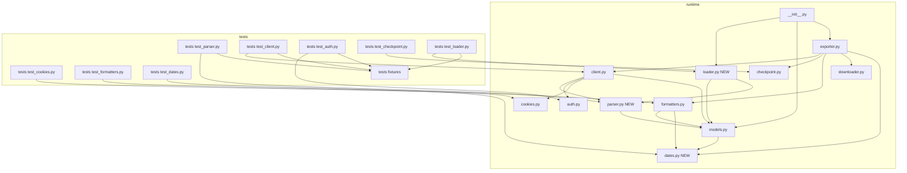

# Design Document

## Overview

This spec puts a real safety net under the X Likes Exporter library. Today every change is validated by running `scrape.sh` against a real account and reading the output. That works for a single maintainer with valid cookies on hand, and it does not work for anything else: it cannot be CI'd, it cannot detect the kinds of breakage seen in practice (an X response shape change, a regex that no longer matches, a parser exception swallowed by a broad `try/except`), and it forces every external consumer to reach into the package internals through `XLikesExporter`, which validates cookies before doing anything.

The fix has three pieces. First, a `pytest`-based test suite that runs from a clean checkout with no cookies and no network, using the `responses` library to mock HTTP and a small set of recorded-and-scrubbed fixtures for the actual response shapes. Second, two narrow refactors: extract the parser logic in `client.py` into a pure module so it can be tested directly with a fixture dict, and add a `loader.py` module that loads an existing `likes.json` into `Tweet` objects without going through the `XLikesExporter` constructor. Third, a single `dates.py` helper that replaces the four near-identical date-parse-with-fallback blocks, which is the main lever for moving the sentrux redundancy axis.

The downstream consumer of all this is `mcp-pageindex` (Spec 2). The read API defined here is the contract Spec 2 builds against.

### Goals

- A `pytest` invocation on a fresh checkout, with no `cookies.json` and no network, that passes and exercises every requirement in this spec.
- A public read API (`load_export`, `iter_monthly_markdown`) importable from the package top level, callable without cookies, that returns the same `Tweet` objects an in-memory scrape would.
- One date-parse helper, four callsites collapsed into it.
- Sentrux signal goes up on overall quality (baseline 6469) and the redundancy axis improves relative to its pre-spec value (baseline 7625, fewer duplicated patterns expected after the date-parse helper consolidation). The redundancy axis is the lever I expect to move; modularity is a small-project artifact and is not the target.

### Non-Goals

- New scraper features, new formats, async, logging framework. Out per the brief.
- Test coverage of `cli.py`, `download_media.py`, `split_md_by_month.py`, `update_json_with_local_paths.py`, `examples/`. These are integration glue.
- Re-fetching from X under any code path other than `fetch_likes`. The read API is read-only.
- A coverage-percentage threshold. The success bar is "the functions that matter have tests that catch the kinds of breakage seen recently."

## Boundary Commitments

### This Spec Owns

- The `tests/` tree at the repository root, including `tests/fixtures/`, fixture scrubbing instructions, and the test files themselves.
- A new `x_likes_exporter/parser.py` module containing the pure parsing functions extracted from `client.py`.
- A new `x_likes_exporter/dates.py` module containing the single `parse_x_datetime` helper.
- A new `x_likes_exporter/loader.py` module containing `load_export(path)` and `iter_monthly_markdown(path)`.
- The `[dependency-groups]` `dev` block in `pyproject.toml` that pins test-only packages.
- The package's `__all__` and top-level re-exports needed to expose the read API at `from x_likes_exporter import load_export, iter_monthly_markdown`.
- Mechanical edits in `client.py`, `models.py`, `exporter.py`, and `formatters.py` to route through the new modules. Behavior must not change.

### Out of Boundary

- Anything `mcp-pageindex` does on top of the read API. PageIndex itself, the LLM call, the MCP stdio server: all Spec 2.
- `cli.py`, `scrape.sh`, `download_media.py`, `split_md_by_month.py`, `update_json_with_local_paths.py`, `examples/`. Tests do not cover these and this spec does not refactor them.
- New runtime dependencies. The `[project.dependencies]` list does not change.
- Performance work. If a parser change accidentally makes things faster, fine, but speed is not measured here.
- Network resilience features (retries, backoff schedules beyond what already exists in `fetch_all_likes`). Out.

### Allowed Dependencies

- Existing runtime deps: `requests`, `pandas`, `beautifulsoup4`, `Pillow`, `tqdm`, `python-dateutil`. The parser already uses `dateutil` indirectly via `Tweet.get_created_datetime`; the new `parse_x_datetime` helper is allowed to keep using `datetime.strptime` (which is what the formatter uses today) so we don't introduce a new dependency surface.
- New dev-only deps: `pytest`, `responses`. Both go under `[dependency-groups].dev` in `pyproject.toml`.
- The test suite may use Python's standard library freely (`pathlib`, `tempfile`, `json`, `pickle`, `unittest.mock`).
- The read API may use only stdlib plus the existing runtime deps. It must not pull anything from the test layer.

### Revalidation Triggers

The downstream consumer (`mcp-pageindex`) re-checks if any of these change:

- The signature or return type of `load_export(path)` or `iter_monthly_markdown(path)`.
- The shape of the `Tweet` dataclass or its `to_dict` output.
- The directory layout `iter_monthly_markdown` walks (currently `output/by_month/likes_YYYY-MM.md`).
- Whether the read API requires a cookies file (it must not).
- The package's top-level exports (`__init__.py` `__all__`).

## Architecture

### Existing Architecture Analysis

The package today is nine files in a single flat namespace. `client.py` does HTTP, parsing, and pagination in one class. `exporter.py` orchestrates; it instantiates `CookieManager` (which validates cookies) before allowing any operation. `formatters.py` and `exporter.py` each carry their own copy of the `datetime.strptime(..., "%a %b %d %H:%M:%S %z %Y")` block. `models.py:Tweet.get_created_datetime` calls `dateutil.parser.parse` instead. That is the redundancy the brief flags.

The codebase is small enough that the modularity axis of the sentrux signal is going to stay low regardless of what I do here; that is a function of size, not of design quality. The redundancy axis is the one I can move, and the lever is `dates.py`.

### Architecture Pattern and Boundary Map



The architecture pattern stays exactly what it was: a flat package with one class or set of functions per concern. The two new modules slot in as leaves (`parser.py`, `dates.py`) plus one shallow consumer (`loader.py`). `loader.py` depends on `parser.py` so that loading from disk and parsing from a live API response go through the same code path; this is the property Spec 2 needs.

Dependency direction: `dates.py` and `models.py` are the leaves. `parser.py` depends on `models.py`. `cookies.py`, `auth.py`, `checkpoint.py`, `downloader.py` are independent leaves of `exporter.py`. `client.py` depends on `cookies.py`, `auth.py`, `parser.py`, `models.py`. `formatters.py` depends on `models.py`, `dates.py`, `downloader.py`. `loader.py` depends on `parser.py`, `models.py`. `exporter.py` depends on everything except `loader.py`. Tests depend on whatever they test, plus fixtures.

### Technology Stack

| Layer | Choice / Version | Role in Feature | Notes |
|-------|------------------|-----------------|-------|
| Runtime (unchanged) | Python >= 3.12 | Language baseline. | No version bump. |
| Test runner (new, dev only) | `pytest >= 8.0` | Test discovery, assertions, fixtures. | `[dependency-groups].dev` in `pyproject.toml`. |
| HTTP mocking (new, dev only) | `responses >= 0.25` | Patches `requests` at the adapter level so the real network never gets touched. | Same dependency group. |
| Existing runtime deps | `requests`, `pandas`, `beautifulsoup4`, `Pillow`, `tqdm`, `python-dateutil` | No change. | The new code path uses `datetime.strptime`, not `dateutil`, to avoid widening the runtime surface. `dateutil` stays only because `Tweet.get_created_datetime` still uses it; `dates.py` will replace that call. |

`responses` is chosen over `requests-mock` and `vcrpy` because the project already uses `requests` directly (the patch target is right), recorded fixtures here are JSON / HTML strings (no cassette format buys us anything), and `responses` has a `assert_all_requests_are_fired` flag plus a default behavior that makes any unregistered URL raise, which is exactly the "fail loudly on real network" guarantee Requirement 1.4 wants.

## File Structure Plan

### New files

```
x_likes_exporter/
  dates.py            # parse_x_datetime helper, single home for the four duplicates
  parser.py           # pure response-parsing functions extracted from client.py
  loader.py           # load_export, iter_monthly_markdown — public read API

tests/
  __init__.py
  conftest.py         # shared pytest fixtures, network-blocking guard
  fixtures/
    README.md         # how to record and scrub a fixture
    likes_page_success.json   # one full Likes page, scrubbed
    likes_page_empty.json     # Likes timeline with zero entries, scrubbed
    likes_page_malformed.json # response missing the expected timeline chain
    home_page.html    # x.com/home with a recognized main-script <link>, scrubbed
    main_script.js    # main.js body containing a Bearer token and a Likes queryId
    cookies_valid.json
    cookies_missing_ct0.json
    likes_export.json # a small valid export, what load_export consumes
  test_dates.py
  test_parser.py
  test_client.py
  test_auth.py
  test_cookies.py
  test_checkpoint.py
  test_formatters.py
  test_loader.py
```

### Modified files

- `x_likes_exporter/__init__.py` — add `load_export` and `iter_monthly_markdown` to imports and `__all__`.
- `x_likes_exporter/client.py` — `_extract_tweets`, `_parse_tweet`, `_extract_cursor` become thin wrappers that call into `parser.py`. The HTTP / rate-limit / pagination code stays.
- `x_likes_exporter/models.py` — `Tweet.get_created_datetime` calls `dates.parse_x_datetime`. The signature stays the same (returns `datetime`); the helper raises only if the existing behavior also raised, otherwise the helper returns `None` and `get_created_datetime` raises so the existing contract is preserved.
- `x_likes_exporter/exporter.py` — the `datetime.strptime` block in `export_markdown` (lines ~206-212) becomes a call to `dates.parse_x_datetime`.
- `x_likes_exporter/formatters.py` — the two `datetime.strptime` and `tweet.get_created_datetime` blocks (lines ~144-153 and ~184-188) route through `dates.parse_x_datetime`.
- `pyproject.toml` — add `[dependency-groups].dev` with `pytest` and `responses`. No change to `[project.dependencies]`.

Each new module has one responsibility. `dates.py` is the date helper. `parser.py` is the pure parser. `loader.py` is the public read API. The tests are organized one-test-file-per-source-module so failures point at the module under test without further bisection.

## Components and Interfaces

| Component | Domain/Layer | Intent | Req Coverage | Key Dependencies | Contracts |
|-----------|--------------|--------|--------------|------------------|-----------|
| `dates` | Utility leaf | One date-parse helper for the X `created_at` format. | 8.1, 8.2, 8.3, 8.4, 10.1 | stdlib only | Service |
| `parser` | Pure parser | Turn a Likes-API response dict into `Tweet` list and next cursor. | 4.1, 4.2, 4.3, 4.4, 4.5, 3.1, 3.2 | `models`, `dates` | Service |
| `loader` | Public read API | Load an existing `likes.json` into `Tweet` objects, walk `output/by_month/`. | 7.1, 7.2, 7.3, 7.4, 7.5, 7.6 | `models`, `parser` | Service |
| `client` (modified) | HTTP + pagination | HTTP, rate-limit handling, pagination. Parser logic moved out. | 3.1, 3.2, 3.3, 3.4, 3.5, 3.6 | `cookies`, `auth`, `parser`, `models` | Service |
| `auth` (covered) | Credential extraction | Extract bearer token and operation query id from X home page + main.js. | 5.3, 5.4, 5.5, 5.6 | `cookies` | Service |
| `cookies` (covered) | Credential file | Load and validate a `cookies.json` file. | 5.1, 5.2 | stdlib | Service |
| `checkpoint` (covered) | State persistence | Save and load fetch progress to disk so a fetch can resume. | 6.1, 6.2, 6.3, 6.4, 6.5 | `models`, stdlib `pickle`/`json` | Service, State |
| `formatters` (covered) | Output rendering | Render `Tweet` lists to JSON, CSV, Markdown, HTML. | 9.1, 9.2, 9.3, 9.4, 9.5 | `models`, `dates`, `downloader` | Service |
| Test infrastructure | Tests | `pytest` config, fixture loaders, network guard. | 1.1, 1.2, 1.3, 1.4, 1.5, 2.1, 2.2, 2.3, 2.4, 11.1, 11.2 | dev deps | Service |
| `pyproject.toml` change | Project config | Declare dev dependency group, leave runtime deps alone. | 11.3 | n/a | n/a |

### Utility Layer

#### `dates`

| Field | Detail |
|-------|--------|
| Intent | Parse the X-format `created_at` string in one place. |
| Requirements | 8.1, 8.2, 8.3, 8.4, 10.1 |

**Responsibilities and constraints**
- Exactly one implementation of the `"%a %b %d %H:%M:%S %z %Y"` parse exists in the package.
- Returns `datetime` on success, `None` on failure. Does not raise on bad input.
- No side effects, no I/O.

**Service interface**

```python
# x_likes_exporter/dates.py
from datetime import datetime
from typing import Optional

X_CREATED_AT_FORMAT = "%a %b %d %H:%M:%S %z %Y"

def parse_x_datetime(value: str) -> Optional[datetime]:
    """Parse an X created_at string. Returns None on any failure."""
```

- Preconditions: `value` is a string (may be empty).
- Postconditions: returns a timezone-aware `datetime` or `None`. Never raises.
- Invariants: stateless.

**Implementation notes**
- The four current callsites are: `models.py:Tweet.get_created_datetime` (via `dateutil`), `exporter.py:export_markdown` per-month grouping (via `strptime`), `formatters.py:export` per-month grouping (via `tweet.get_created_datetime`), `formatters.py:_format_tweet` per-tweet date string (via `tweet.get_created_datetime`). All four become `parse_x_datetime(...)`. `Tweet.get_created_datetime` keeps its existing public contract (raises on unparseable) by translating `None` to a raise locally; the helper itself stays non-raising so other callers can branch on `None`.

### Parsing Layer

#### `parser`

| Field | Detail |
|-------|--------|
| Intent | Pure functions that turn a Likes-API JSON response into `Tweet` objects and a next cursor. |
| Requirements | 4.1, 4.2, 4.3, 4.4, 4.5, 3.1, 3.2 |

**Responsibilities and constraints**
- No HTTP, no I/O, no globals. Input is a `dict`, output is `(list[Tweet], Optional[str])` or `list[Tweet]` for `extract_tweets` alone.
- Defensive against missing intermediate keys: a malformed response yields `[]`, not an exception.
- Defensive against per-entry breakage: a tweet entry that fails to parse is skipped, the rest still come back.

**Service interface**

```python
# x_likes_exporter/parser.py
from typing import Optional
from .models import Tweet

def extract_tweets(response: dict) -> list[Tweet]: ...
def extract_cursor(response: dict) -> Optional[str]: ...
def parse_tweet(tweet_data: dict) -> Optional[Tweet]: ...
def parse_response(response: dict) -> tuple[list[Tweet], Optional[str]]:
    """Convenience: extract_tweets and extract_cursor in one call."""
```

- Preconditions: `response` is a `dict` (possibly empty).
- Postconditions: pure functions, no state.
- Invariants: idempotent; calling twice on the same input returns equal results.

**Implementation notes**
- The bodies are lifted essentially verbatim from `client.py:_extract_tweets`, `_parse_tweet`, `_extract_cursor`. The only change is removing `self`.
- `client.py:XAPIClient._extract_tweets` etc. become two-line wrappers calling into `parser`. Keeping them on the class avoids a wider blast radius from the refactor and preserves any external code that reaches in through `api_client._extract_tweets` (none expected, but cheap to keep).

### Public Read API

#### `loader`

| Field | Detail |
|-------|--------|
| Intent | Read a previously exported `likes.json` into `Tweet` objects without going through `XLikesExporter`, and iterate the `output/by_month/` markdown directory. |
| Requirements | 7.1, 7.2, 7.3, 7.4, 7.5, 7.6 |

**Decision: module-level functions, not a classmethod**

The brief lists two options: `load_export(path)` as a module function, or `XLikesExporter.from_export(path)` as a classmethod. I am picking the module function. Reasons:

1. `XLikesExporter.__init__` validates cookies. A `from_export` classmethod would need to instantiate the class with cookie validation skipped, which means either a flag on `__init__` (worse: two construction modes, branching invariants) or a new alternative constructor that bypasses `__init__` (`__new__` plus manual attribute setup), which is exactly the kind of thing that makes the class harder to reason about.
2. The read API does not need any of the scrape orchestration in `XLikesExporter`. Putting it on that class implies a relationship that is not there.
3. Spec 2 (`mcp-pageindex`) is the consumer. From its perspective, `from x_likes_exporter import load_export` is the simplest possible import surface. No instance, no `cookies_file`, no constructor, no class.
4. A module function is easier to deprecate or move later than a classmethod that becomes part of the class's public API.

**Service interface**

```python
# x_likes_exporter/loader.py
from pathlib import Path
from typing import Iterator
from .models import Tweet

def load_export(path: str | Path) -> list[Tweet]:
    """Load an existing likes.json into Tweet objects. No cookies required."""

def iter_monthly_markdown(path: str | Path) -> Iterator[Path]:
    """Yield likes_YYYY-MM.md paths under path, sorted reverse-chronologically.
    Path must point at the `by_month` directory itself."""
```

- Preconditions for `load_export`: `path` exists and is a JSON file produced by this library.
- Postconditions for `load_export`: returns a `list[Tweet]` whose `to_dict()` of each element is structurally equal to the corresponding entry in the source JSON.
- Preconditions for `iter_monthly_markdown`: `path` exists and is a directory containing files of the form `likes_YYYY-MM.md`.
- Postconditions: yields `Path` objects in `YYYY-MM` reverse-chronological order; non-matching files are skipped.
- Errors: `FileNotFoundError` for missing path; `ValueError` for JSON that does not match the expected shape; both with a message identifying what went wrong.

**Implementation notes**
- `load_export` reconstructs `Tweet` objects from the dict shape `Tweet.to_dict()` produces. The reconstruction is the inverse of `to_dict` and lives next to that method conceptually; it goes in `loader.py` rather than `models.py` to keep `models.py` data-only. If the input was produced with `include_raw=True`, the loader preserves `raw_data`; otherwise `raw_data` is `None`.
- `iter_monthly_markdown` matches `likes_YYYY-MM.md` with a regex; it ignores `unknown` files in this iteration order (those, if present, are yielded after the dated ones in stable order).
- The package's `__init__.py` adds `load_export` and `iter_monthly_markdown` to `__all__` and to the top-level imports so `from x_likes_exporter import load_export` works.

### HTTP and Pagination Layer

#### `client` (modified)

| Field | Detail |
|-------|--------|
| Intent | Fetch a Likes timeline page; iterate pages with rate-limit and checkpoint hooks. Parser logic moves out. |
| Requirements | 3.1, 3.2, 3.3, 3.4, 3.5, 3.6 |

**Responsibilities and constraints**
- Holds the `requests.Session`, the rate-limit info, the request-delay knob.
- Builds the GraphQL `variables` and `features` payload, the URL, the headers.
- After the request returns, hands the parsed JSON to `parser.parse_response`.
- The pagination loop in `fetch_all_likes` is unchanged in behavior; tests assert the loop's exit conditions and rate-limit branch.

**Implementation notes**
- The `_extract_tweets`, `_parse_tweet`, `_extract_cursor` private methods become two-line passthroughs calling into `parser`. They are kept so any external caller that reached through `api_client._extract_tweets(response)` continues to work (no public consumer is known to do this, but the cost of keeping the passthrough is one line per method).
- Tests use `responses` to register URL handlers for `https://x.com/i/api/graphql/{query_id}/Likes`. The fixture HTML for the home page and main.js handle the auth side; the Likes responses come from `tests/fixtures/likes_page_*.json`.

### Existing Components Tested in Place

`auth`, `cookies`, `checkpoint`, `formatters`, and `downloader` (excluded from this spec's test coverage per the brief — `download_media.py` is the script, `downloader.py` is the supporting class but the brief excludes its CLI; `downloader.py` itself is exercised indirectly by `formatters.py` tests through the Markdown formatter's media-path handling, and is not a focus). The interfaces for these components do not change. Tests are added; the modules are not refactored.

For `auth`, the tests register a fixture HTML for `https://x.com/home` and a fixture JS for the main script URL. The bearer-token regex and the queryId/operationName regex are exercised against representative bytes that I can confirm match the actual patterns in `auth.py`. A second invocation hits the cache — that branch is the test for Requirement 5.6.

For `checkpoint`, the existing pickle-based persistence stays. Tests use `tmp_path` (pytest builtin) for the checkpoint directory. The exporter's resume path is exercised by stubbing `XAPIClient.fetch_all_likes` and feeding a known checkpoint file in.

For `formatters`, tests build small `Tweet` lists by hand, run each formatter, and assert on the output structure. The Markdown formatter test includes a tweet with an unparseable `created_at` to verify the `unknown` group routing (Requirement 9.3).

## Requirements Traceability

| Requirement | Summary | Components | Interfaces | Flows |
|-------------|---------|------------|------------|-------|
| 1.1 | `uv sync --group dev` installs pytest + responses without touching runtime deps. | `pyproject.toml` | `[dependency-groups].dev` | n/a |
| 1.2 | `pytest` runs with no cookies, no network. | tests, conftest | conftest network guard | n/a |
| 1.3 | Tests organized by source module under `tests/`. | tests | file layout | n/a |
| 1.4 | Real HTTP fails loudly. | conftest | `responses` strict mode | n/a |
| 1.5 | Fixtures live in `tests/fixtures/`. | tests/fixtures | file layout | n/a |
| 2.1 | Success / empty / malformed Likes fixtures shipped. | tests/fixtures | files | n/a |
| 2.2 | Fixtures contain no real tokens. | tests/fixtures | scrubbing rules in README | n/a |
| 2.3 | Fixture-recording procedure documented. | tests/fixtures/README.md | doc | n/a |
| 2.4 | Fixture-only changes don't require code changes. | tests | fixture loaders | n/a |
| 3.1 | Successful Likes fetch returns expected tweets, cursor, rate-limit. | client, parser | `fetch_likes` | mocked HTTP |
| 3.2 | Empty Likes returns empty list, no raise. | client, parser | `fetch_likes`, `extract_tweets` | mocked HTTP |
| 3.3 | 429 surfaces as rate-limit failure. | client | `fetch_likes` | mocked HTTP |
| 3.4 | 401 surfaces as auth failure. | client | `fetch_likes` | mocked HTTP |
| 3.5 | Pagination loop stops on missing cursor / empty page. | client | `fetch_all_likes` | mocked HTTP |
| 3.6 | Rate-limit reached triggers wait/checkpoint. | client | `fetch_all_likes` | mocked HTTP |
| 4.1 | Pure parser path returns same Tweets and cursor. | parser | `parse_response` | direct dict input |
| 4.2 | Missing timeline chain yields empty list. | parser | `extract_tweets` | direct dict input |
| 4.3 | Bad entry skipped, rest parsed. | parser | `parse_tweet` | direct dict input |
| 4.4 | Bad `views.count` yields default 0. | parser | `parse_tweet` | direct dict input |
| 4.5 | Quote/retweet flags set correctly. | parser | `parse_tweet` | direct dict input |
| 5.1 | Valid cookies file loads and validates. | cookies | `validate` | local file |
| 5.2 | Missing ct0/auth_token reports invalid. | cookies | `validate` | local file |
| 5.3 | Auth extracts bearer from mocked HTML+JS. | auth | `get_bearer_token` | mocked HTTP |
| 5.4 | Missing main-script URL raises. | auth | `get_bearer_token` | mocked HTTP |
| 5.5 | Bearer regex no-match raises. | auth | `get_bearer_token` | mocked HTTP |
| 5.6 | Second auth call hits cache. | auth | `get_bearer_token`, `get_query_id` | mocked HTTP |
| 6.1 | Checkpoint round-trips. | checkpoint | `save`, `load` | `tmp_path` |
| 6.2 | Clear removes files. | checkpoint | `clear`, `exists` | `tmp_path` |
| 6.3 | `is_valid` matches user id. | checkpoint | `is_valid` | `tmp_path` |
| 6.4 | Resume same user merges without dupes. | exporter, checkpoint | `fetch_likes(resume=True)` | stubbed client |
| 6.5 | Resume different user discards checkpoint. | exporter, checkpoint | `fetch_likes(resume=True)` | stubbed client |
| 7.1 | `load_export` returns equivalent `Tweet` list. | loader | `load_export` | local file |
| 7.2 | `load_export` works with no cookies. | loader | `load_export` | local file |
| 7.3 | `iter_monthly_markdown` yields paths in deterministic order. | loader | `iter_monthly_markdown` | local dir |
| 7.4 | Missing path raises clear error. | loader | both functions | local file |
| 7.5 | Bad JSON raises clear error. | loader | `load_export` | local file |
| 7.6 | Read API importable from package top level. | `__init__.py`, loader | `from x_likes_exporter import ...` | n/a |
| 8.1 | Helper parses valid X format. | dates | `parse_x_datetime` | direct input |
| 8.2 | Helper returns fallback on bad input. | dates | `parse_x_datetime` | direct input |
| 8.3 | All four callsites route through helper. | models, exporter, formatters | grep-checkable | n/a |
| 8.4 | Single behavior change propagates. | dates | one function | n/a |
| 9.1 | JSON formatter round-trips. | formatters | `JSONFormatter.export` | sample tweets |
| 9.2 | Markdown formatter groups by month, reverse chronological. | formatters | `MarkdownFormatter.export` | sample tweets |
| 9.3 | Unparseable date routes to `unknown`. | formatters | `MarkdownFormatter.export` | sample tweets |
| 9.4 | HTML formatter renders one block per tweet. | formatters | `HTMLFormatter.export` | sample tweets |
| 9.5 | Pandas formatter produces expected DataFrame. | formatters | `PandasFormatter.to_dataframe` | sample tweets |
| 10.1 | Sentrux redundancy axis no worse than 7625. | sentrux scan | external check | n/a |
| 10.2 | Sentrux overall no worse than 6469. | sentrux scan | external check | n/a |
| 10.3 | Regression on either axis is a finding to investigate. | sentrux scan | external check | n/a |
| 11.1 | Test suite never reads `cookies.json`. | tests, conftest | grep + behavior | n/a |
| 11.2 | Test suite never hits live hosts. | conftest | `responses` strict mode | n/a |
| 11.3 | New deps go under `[dependency-groups].dev` only. | `pyproject.toml` | grep-checkable | n/a |
| 11.4 | `scrape.sh` output unchanged. | exporter, formatters | manual smoke after refactor | optional |

## Testing Strategy

Tests mirror the source modules. Each test file targets one module. Cross-module concerns (the exporter resume path, the read API loading via the parser) get their own integration tests at the bottom of the relevant file.

### Unit tests

- `test_dates.py` — valid input parses, empty / malformed / wrong-locale input returns None, timezone preserved on round-trip. Covers Requirements 8.1, 8.2, 8.4.
- `test_parser.py` — fixture-driven tests for `extract_tweets`, `parse_tweet`, `extract_cursor` against `likes_page_success.json`, `likes_page_empty.json`, `likes_page_malformed.json`. Hand-built dicts for the per-entry edge cases (missing legacy, bad views.count, retweet/quote variants). Covers 4.1-4.5.
- `test_cookies.py` — `cookies_valid.json` and `cookies_missing_ct0.json` fixtures. Covers 5.1, 5.2.
- `test_dates.py` plus `test_formatters.py` together cover 8.3 by importing each consumer site and asserting it routes through `dates.parse_x_datetime` (e.g. by patching `dates.parse_x_datetime` and checking the patch is hit).

### Integration tests (still without real network)

- `test_client.py` — `responses` registers handlers for the home page, main.js, and the Likes endpoint. One test per response shape: success, empty, 429, 401. One test for `fetch_all_likes` over a two-page sequence followed by a no-cursor terminator. One test for the rate-limit-reached branch. Covers 3.1-3.6 and exercises 1.4, 11.2 implicitly.
- `test_auth.py` — `responses` registers `https://x.com/home` returning `home_page.html`, and the script URL that page references returning `main_script.js`. Tests for bearer token extraction, missing script URL, missing token, and cache reuse. Covers 5.3-5.6.
- `test_checkpoint.py` — `tmp_path` fixture; save / load / clear / exists / is_valid / get_progress. Covers 6.1-6.3.
- `test_formatters.py` — small hand-built `Tweet` list including one tweet with an unparseable `created_at`. Each formatter exercised, output written to `tmp_path`, structure asserted. Covers 9.1-9.5.
- `test_loader.py` — `likes_export.json` fixture; round-trip through `load_export`, equivalence assertion against the source. Missing-file and bad-JSON error cases. `iter_monthly_markdown` against a `tmp_path` populated with `likes_YYYY-MM.md` files in arbitrary order, asserts reverse-chronological yield. Top-level import asserted. Covers 7.1-7.6.
- `test_exporter_resume.py` (or a section in `test_checkpoint.py`) — stubs `XAPIClient.fetch_all_likes` to return a known list, primes a checkpoint, runs `XLikesExporter.fetch_likes(resume=True)`, asserts the merged list has no duplicates and the cursor was used. Repeats with a different user id to verify the discard branch. Covers 6.4, 6.5.

### Network / cookie guard

`tests/conftest.py` does two things on every test session:

1. Sets `responses` to its default strict mode so any unregistered URL raises `ConnectionError`. Backed by `@responses.activate` on tests that mock HTTP, and a session-level `responses.start()` plus an autouse fixture for tests that should never make HTTP calls at all.
2. Asserts no `cookies.json` is read by setting an environment variable or patching `CookieManager._load_cookies` for tests that touch `XAPIClient` indirectly. Tests that directly exercise `CookieManager` use fixture cookie files under `tests/fixtures/`.

These together cover Requirements 1.4, 11.1, 11.2.

### Sentrux signal check

After the refactor lands, `sentrux scan` is run from the repo root. The redundancy axis should drop (four duplicates collapse to one), the overall signal should rise. Targets: redundancy <= 7625, overall >= 6469. Per Requirement 10.3, a regression on either axis is investigated, not silently overridden. This is a manual check, not a pytest test.

### Optional

A `scrape.sh` smoke run with valid cookies is the final manual gate for Requirement 11.4. Not automatable in this spec; documented in `RESUME.md` or `QUICKSTART.md` as the manual sign-off step.

## Fixture Recording and Scrubbing

Fixtures are derived from real responses. The procedure (lives in `tests/fixtures/README.md`):

1. With valid cookies, run `scrape.sh` against a real account. The repo already contains `full_response.json` and `response_debug.json` from past runs; these are the raw material.
2. Copy the relevant slice into a new fixture file under `tests/fixtures/`.
3. Scrub:
   - Replace any `auth_token`, `ct0`, or `guest_id` value with literal `"REDACTED"`.
   - Replace any bearer token (`AAAA...` style) with `"Bearer REDACTED"`.
   - Replace the real numeric user id with `"14252145"` (the documented test account in `MEMORY.md`) or `"00000000"` for fully anonymous samples.
   - Replace any `screen_name` referencing real third parties not the test account with `"test_user"`.
   - Replace tweet ids in chains where the chain is what's being tested with monotonically increasing fake ids.
4. Verify by `grep -r REDACTED tests/fixtures/` showing the placeholder appears, and `grep -r "<known real token prefix>" tests/fixtures/` showing zero hits.

The empty and malformed fixtures are constructed by editing a success fixture: removing `entries` from the `TimelineAddEntries` instruction for empty, and removing the `data.user.result.timeline` chain entirely for malformed.

## Refactor Sequencing

Order matters because each step has to leave `scrape.sh` working:

1. Add `dates.py` with `parse_x_datetime`. No callers yet.
2. Add `parser.py` with the lifted parsing functions. Make `client.py:_extract_tweets` etc. delegate to `parser`. Run `scrape.sh`; output unchanged.
3. Replace the four date-parse callsites with `parse_x_datetime`. Run `scrape.sh`; output unchanged.
4. Add `loader.py` and the top-level re-exports. No effect on `scrape.sh`.
5. Add `pyproject.toml` `[dependency-groups].dev` block. Run `uv sync --group dev`.
6. Add `tests/` and `conftest.py`. Run `pytest`; should pass with zero tests collected initially.
7. Add fixtures.
8. Add tests, one module at a time, in the order: `test_dates.py`, `test_parser.py`, `test_cookies.py`, `test_loader.py`, `test_checkpoint.py`, `test_formatters.py`, `test_auth.py`, `test_client.py`, `test_exporter_resume.py`. Each runs green before moving on.
9. `sentrux scan`; record the new numbers.
10. Smoke run `scrape.sh` with cookies.

The first three steps are the refactor that affects production code paths. They are sequential and each one is independently runnable. Steps 4-8 are additive. Step 9 is the metrics check. Step 10 is the manual gate.

## Error Handling

The new code (`dates`, `parser`, `loader`) follows two rules:

- `dates.parse_x_datetime` never raises. Returns `None` on any failure including non-string input. This is the contract every consumer expects.
- `parser` functions never raise on structurally bad input. Missing keys yield empty lists or `None`. Per-entry parse failures are skipped (logged via `print` to match the existing project style; no logging framework added per the non-goals).
- `loader.load_export` raises `FileNotFoundError` for missing paths and `ValueError` (with a message identifying the field that failed) for JSON that doesn't match the expected shape. These are the two cases Requirement 7.4 and 7.5 call out. No silent partial loads.

Existing code (`client`, `auth`) keeps its current error-handling style: `requests.HTTPError` is caught at the boundary and re-raised as a generic `Exception` with a message. This spec does not change that style; it only adds tests against it.

## Performance and Scalability

Out of scope. The refactor must not regress observable behavior; speed of `scrape.sh` is not measured here. The parser extraction is a function-call indirection, not a copy.

## Security

Out of scope as a feature, but two safety properties are explicit:

- Test fixtures are scrubbed of real credentials. The scrubbing procedure is documented and the `grep` check is part of the recording workflow.
- `tests/conftest.py` blocks real network. Any URL not registered by `responses` raises `ConnectionError`. This means a misconfigured test cannot accidentally hit X with a CI-stored cookie even if one were ever added.

## Open Questions and Risks

- **`Tweet.get_created_datetime` contract**: today this calls `dateutil.parser.parse` and raises on failure. The helper returns `None`. To preserve the existing contract, `get_created_datetime` will translate `None` into a raise locally. If any external consumer (Spec 2 candidate) prefers `Optional[datetime]`, that's a separate API addition, not a breaking change here.
- **Pickle in checkpoint**: `checkpoint.py` uses `pickle` to persist `Tweet` objects. A reasonable concern if the checkpoint file ever crosses a trust boundary. It does not, today (single-user local tool, file written under `output/`). This spec does not change it; flagging for future work.
- **Fixture freshness**: X may change response shapes. The fixtures here are a snapshot. If a future scrape produces tweets the fixture-driven tests don't cover, that's a reason to record a new fixture, not a reason to mark the test obsolete. The recording procedure in `tests/fixtures/README.md` is the runbook.
- **Sentrux numbers move with project size**: adding `dates.py`, `parser.py`, `loader.py`, plus `tests/` increases file count and import edges. The modularity axis may move down even as redundancy improves. The success bar is overall signal `>= 6469`; if the refactor moves modularity down enough to net-regress overall, that's the kind of finding Requirement 10.3 calls out and would be worth investigating before declaring done.
