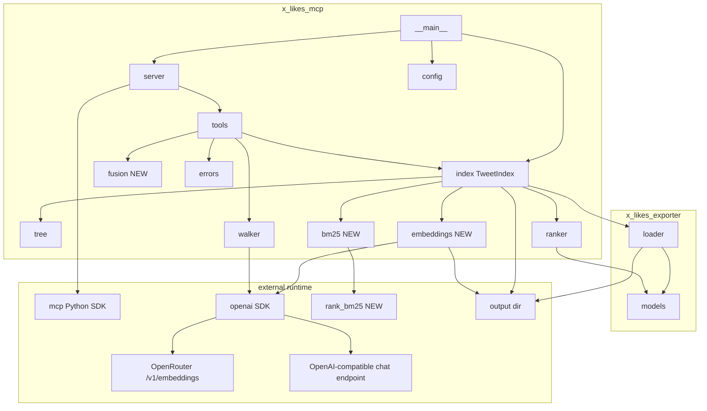
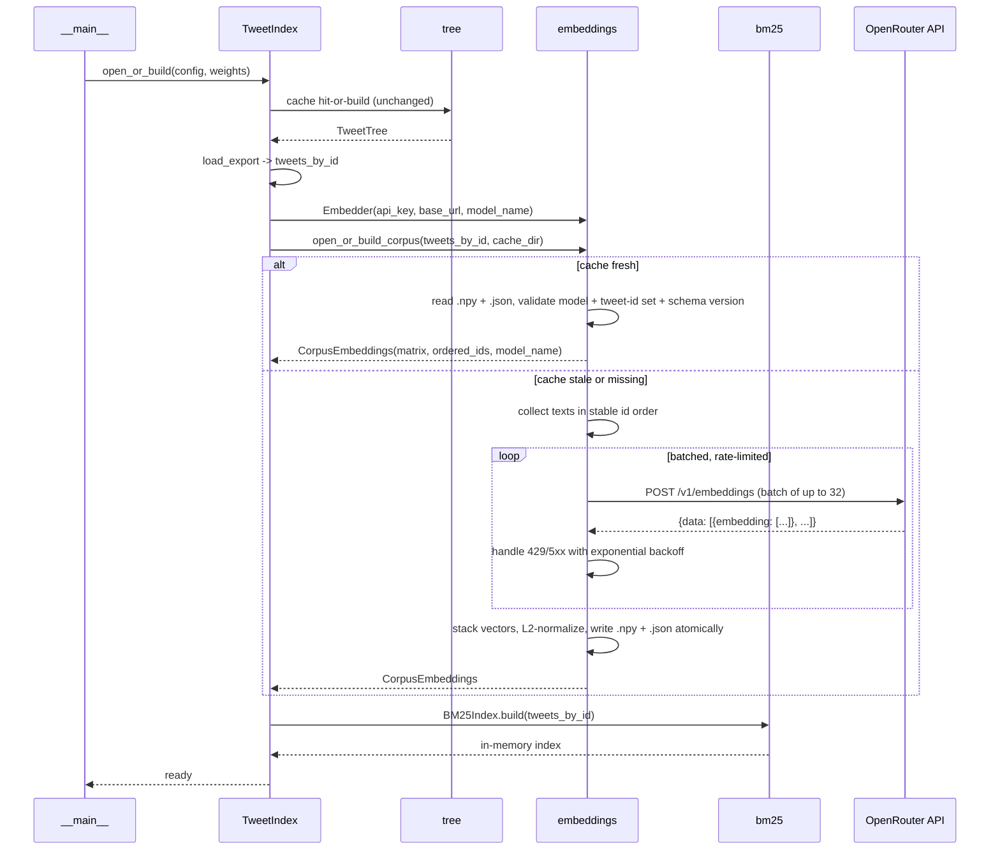
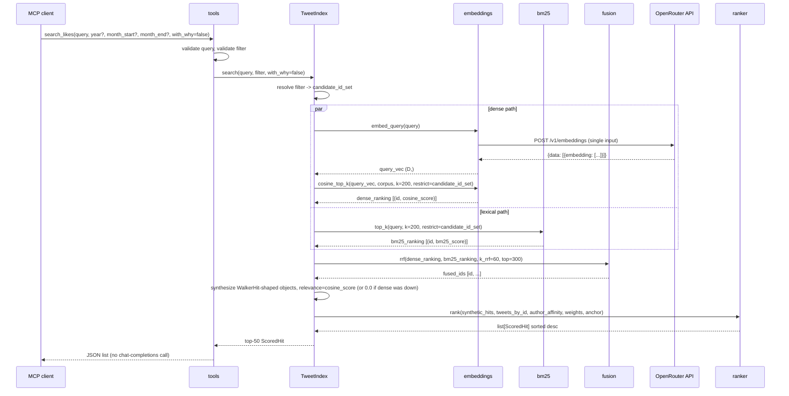

# Design Document

## Overview

This spec rips the LLM walker out of the `search_likes` hot path and replaces it with three layers: hybrid recall (BM25 + dense via OpenRouter, fused with Reciprocal Rank Fusion), then the existing engagement-and-affinity ranker, then an optional walker explainer over the top hits. The walker module stays in the package, walker tests stay green, and a new `with_why=true` flag re-enables the walker as an opt-in explainer. Default search returns in seconds, regardless of how many months are in scope.

The dense retrieval is network-based (not in-process) for two converging reasons. First, the maintainer's primary machine is Intel macOS x86_64, which has no modern PyTorch or ONNX Runtime wheels — sentence-transformers and fastembed both refused to install. Second, OpenRouter exposes modern embedding models (default: `nvidia/llama-nemotron-embed-vl-1b-v2:free`) on a free tier behind the standard OpenAI `/v1/embeddings` shape, which the existing `openai` SDK can reach by changing `base_url`. No new SDK dependency, no transformer model in-process, no torch.

The lexical retrieval uses `rank_bm25` (pure-python, ~50 KB, no native deps). At 7,780 short documents `BM25Okapi` is essentially free: ~10 ms per query, in-memory index built in under a second at startup.

`tools.search_likes` is refactored to call: validate inputs, resolve the structured filter to a candidate id-set, run BM25 top-K and dense top-K (the dense path uses a one-call query embedding plus pure-numpy cosine over the cached corpus matrix), fuse the rankings via RRF, hand the top-300 fused ids to `ranker.rank`, return the top-N (default 50) `ScoredHit` results, and only then — when `with_why=true` — invoke the walker over the top-20 ranked tweets to populate the `why` field. The walker continues to be the only chat-completions LLM call site.

### Goals

- A clean checkout, after `uv sync` and `scrape.sh` and an `OPENROUTER_API_KEY` in `.env`, runs `python -m x_likes_mcp` and serves `search_likes` queries in under 10 seconds (typically under 2 seconds) without invoking a chat-completions LLM call.
- The first-time corpus embedding pass completes in roughly 12 minutes for a 7,780-tweet corpus on the free OpenRouter rate limit (~20 RPM, 32 inputs/batch ≈ 244 requests) and is cached on disk afterwards.
- `pytest tests/` passes on a clean checkout without network access. The new tests mock `embeddings._call_embeddings_api` the same way the existing tests mock `walker._call_chat_completions`.
- An MCP client can opt into the walker explainer by passing `with_why=true`; the default call performs zero chat-completions HTTP calls.

### Non-Goals

- Replacing or retuning the ranker. Same formula, same weights, same `ScoredHit` shape.
- Removing the walker module. It is the explainer now; deleting it would also break the walker tests.
- Image embeddings, cross-encoder re-ranking. The default model is vision-language-capable; plumbing image inputs is a separate spec.
- Storing vectors in Chroma / Qdrant / FAISS. At 7,780 docs (32 MB float32 matrix), numpy with optional id-set masking is the right answer; a vector DB would be complexity tax for nothing.
- Loading a transformer in-process. Off the table on the maintainer's Intel macOS x86_64 platform.
- Pre-computing the index in a separate process or watching the filesystem.
- Rewriting the existing tree cache, the four MCP tool surfaces, or the JSON-schema scaffolding.

## Boundary Commitments

### This Spec Owns

- A new module `x_likes_mcp/embeddings.py` containing the OpenRouter HTTP client, the `_call_embeddings_api` test seam, the cosine top-k helper, and the on-disk cache format.
- A new module `x_likes_mcp/bm25.py` containing the lexical index and a top-k helper.
- A new module `x_likes_mcp/fusion.py` (or an inline helper in `tools.py` if it stays small) implementing Reciprocal Rank Fusion.
- The two new cache files: `corpus_embeddings.npy` and `corpus_embeddings.meta.json` under the configured output directory.
- The refactor of `tools.search_likes` to drop the walker from the default path, drive the hybrid pipeline, and introduce the optional explainer path.
- A small refactor of `TweetIndex.search` (and `TweetIndex.open_or_build`) to (a) hold the loaded `Embedder` and `BM25Index` instances, (b) build-or-load the corpus embedding cache during startup, (c) build the in-memory BM25 index during startup, and (d) expose a candidate-id resolution path that respects the structured filter.
- Three new fields on `Config`: `openrouter_api_key: str | None`, `openrouter_base_url: str` (default `"https://openrouter.ai/api/v1"`), `embedding_model: str` (default `"nvidia/llama-nemotron-embed-vl-1b-v2:free"`), and the corresponding env-var bindings in `config.py`.
- The new optional `with_why: bool = False` parameter on `tools.search_likes` and on the `search_likes` MCP tool input schema in `server.py`.
- One new runtime dependency in `pyproject.toml`: `rank_bm25>=0.2`. (`openai` is already a dep; `numpy` arrives transitively via pandas.)
- Updates to `.env.sample` and the README MCP section.
- New tests under `tests/mcp/`: `test_embeddings.py`, `test_bm25.py`, `test_fusion.py`, additions to `test_index.py`, `test_tools.py`, and `test_server_integration.py`.

### Out of Boundary

- Anything `x_likes_exporter` (Spec 1) owns. The `Tweet` shape, the loader, the public read API.
- The walker's internals. Walker tests stay green; we do not edit `walker.py` other than possibly a docstring nudge.
- The ranker's internals. We pass it walker-shaped hits derived from cosine scores and let it score them with the same formula it has today.
- The MCP server transport, the error-shaping wrapper in `server.py`, the JSON-schema declarations for the other three tools.
- The four-tool surface. We do not add or remove tools.

### Allowed Dependencies

- Spec 1's public read API: `from x_likes_exporter import load_export, iter_monthly_markdown` and the `Tweet` dataclass.
- Spec 2's modules: `tree.py`, `walker.py`, `ranker.py`, `index.py`, `tools.py`, `server.py`, `config.py`, `errors.py`. We import from them; we do not delete or rename any.
- New runtime dep `rank_bm25>=0.2` (pure-python, no native deps).
- Existing runtime dep `openai>=1.0` (pointed at `OPENROUTER_BASE_URL` for the embeddings call site).
- Stdlib for the cache and HTTP retry logic: `json`, `os`, `tempfile`, `pathlib`, `time`, `re`.

### Revalidation Triggers

This spec re-checks if Spec 2 changes any of:

- `TweetIndex.tweets_by_id` shape, the `Tweet.id` contract, or the `Tweet.text` field used as embedding/BM25 input.
- The `walker.walk` signature or `WalkerHit` shape (the explainer path consumes them).
- The `ScoredHit` shape (still the response shape `tools.search_likes` returns).
- `config.Config` additions or removals (the new fields are additive).
- The output-directory layout convention (`output/` plus `tweet_tree_cache.pkl`); the new cache files live alongside.

If Spec 1 changes the `Tweet.text` accessor, both the embedder's text source and the BM25 tokenizer's input must be revisited.

## Architecture

### Existing Architecture Analysis

mcp-pageindex shipped a hub-and-spoke layout inside `x_likes_mcp/`: `__main__` boots, `config` parses `.env`, `index.TweetIndex` orchestrates, the four tool handlers in `tools.py` are thin wrappers, and the only LLM call site is `walker.py`. The dependency arrow inside the package goes one way: `errors`/`config` are leaves; `tree`, `walker`, `ranker` are domain modules; `index` orchestrates; `tools` adapts; `server` transports.

The walker is not slow because the LLM is slow per call. It is slow because the walker calls the LLM once per chunk per month, sequentially, and most of those chunks contain tweets that have nothing to do with the query. The fix is structural, not parametric: stop using the LLM for retrieval. Use it for explanation.

Pure cosine over a 7,780-tweet mixed-topic corpus has a known failure mode: the top-K fills with topically-similar-but-off-target neighbours that share generic vocabulary with the query but aren't on the actual subject. BM25 in parallel anchors recall to actual query tokens; RRF fuses without weight tuning. This is the same shape every production hybrid-search system uses (Elasticsearch, Vertex AI Search, Pinecone hybrid).

### Architecture Pattern and Boundary Map



The shape is largely unchanged. Three new modules (`embeddings`, `bm25`, `fusion`) join the domain layer next to `walker` and `ranker`. `index.TweetIndex` gains `embedder`, `corpus`, and `bm25` fields. `tools.search_likes` calls into the embedder and BM25 in parallel, fuses the rankings, and then calls the ranker; the walker call moves out of the default path and into the optional explainer path. No edges flip direction.

The same `openai` SDK instance (or two thin wrappers around it) reaches both endpoints: `OPENROUTER_BASE_URL` for embeddings, `OPENAI_BASE_URL` for the walker's chat completions. Two separate clients in code, one SDK on the install graph.

### Technology Stack

| Layer | Choice / Version | Role | Notes |
|-------|------------------|------|-------|
| Embedding endpoint | OpenRouter `/v1/embeddings` (default model `nvidia/llama-nemotron-embed-vl-1b-v2:free`, override via env) | Sentence embeddings for tweet text and query strings. | Free tier on OpenRouter at the time of writing. Modern 1B-param vision-language encoder. The free tier rate-limits writes; the corpus embed budgets for it. |
| Embedding client | `openai >= 1.0` (existing dep) pointed at `OPENROUTER_BASE_URL` | OpenAI-shape `/v1/embeddings` call with `Authorization: Bearer $OPENROUTER_API_KEY`. | Already on the install graph for the walker. No new SDK dep. |
| Lexical index | `rank_bm25 >= 0.2` | BM25Okapi over tokenized tweet text. | Pure-python, ~50 KB, no native deps. Works on every wheel-deprived platform including Intel macOS x86_64. |
| Tensor / array | `numpy` (transitive via pandas) | Cosine similarity, matrix storage on disk. | Already in the runtime tree. |
| Cache file | numpy `.npy` for the matrix; `.json` sidecar for metadata. | On-disk persistence of corpus vectors only. | Trivially inspectable; rebuild on schema-version bump. BM25 is rebuilt in-memory at startup; not persisted. |
| Walker | `openai >= 1.0` (already a dep) | Optional explainer. | Unchanged; only the call site moves out of the default path. |

Concrete model size, memory footprint, per-call latency, and rate-limit numbers are surfaced in the README rather than restated here.

## File Structure Plan

### New files

```
x_likes_mcp/
  embeddings.py          # OpenRouter HTTP client, _call_embeddings_api seam, cosine_top_k, cache load/save.
  bm25.py                # rank_bm25 wrapper, deterministic tokenizer, top-k helper.
  fusion.py              # reciprocal_rank_fusion(rankings) -> fused ordered list.

tests/mcp/
  test_embeddings.py     # Unit tests for Embedder, cache round-trip, invalidation, retry behavior.
  test_bm25.py           # Unit tests for tokenizer, BM25 top-k, filter masking.
  test_fusion.py         # Unit tests for RRF over crafted rankings.
```

### Modified files

- `x_likes_mcp/config.py` — add `openrouter_api_key`, `openrouter_base_url`, `embedding_model` fields on `Config`; read `OPENROUTER_API_KEY`, `OPENROUTER_BASE_URL`, `EMBEDDING_MODEL` from env with the documented defaults; missing `OPENROUTER_API_KEY` is recorded as `None` and surfaced at index-build time, not at config-load time, so config tests don't need a key.
- `x_likes_mcp/index.py` — `TweetIndex.open_or_build` builds-or-loads the embedding cache and builds the BM25 index after the tree cache; `TweetIndex` gains `embedder: Embedder`, `corpus: CorpusEmbeddings`, `bm25: BM25Index` fields; `TweetIndex.search` is refactored to drive the hybrid pipeline; `_compute_anchor` and the filter-resolution helpers stay.
- `x_likes_mcp/tools.py` — `search_likes` accepts a new optional `with_why: bool = False` argument; the body is rewritten to drive the hybrid recall + RRF + ranker + optional-walker pipeline; a new internal helper `_call_walker_explainer(top_results, query, index)` encapsulates the explainer path.
- `x_likes_mcp/server.py` — extend the `search_likes` input schema with the optional `with_why` boolean; thread it through `_dispatch`.
- `tests/mcp/test_index.py` — new tests for the embedding-cache and BM25-index hooks on `open_or_build`; existing tests keep passing.
- `tests/mcp/test_tools.py` — replace walker-only assertions for `search_likes` with hybrid-path assertions; add `with_why=true` cases that exercise the explainer path; assert no walker call when `with_why=false`; add fallback cases for dense-down and bm25-down.
- `tests/mcp/test_server_integration.py` — extend the `search_likes` integration to cover the new schema shape and `with_why` toggle.
- `tests/mcp/conftest.py` — add an autouse fixture (or fixture helper) that patches `embeddings._call_embeddings_api` to a deterministic vectorizer so tests cannot accidentally hit the network.
- `pyproject.toml` — add `rank_bm25>=0.2` to `[project.dependencies]`.
- `.env.sample` — add commented `OPENROUTER_API_KEY`, `OPENROUTER_BASE_URL`, `EMBEDDING_MODEL` entries with defaults and one-line descriptions.
- `README.md` — update the MCP section: describe the hybrid recall + ranker default, the `with_why` flag, the new env vars, the platform reason for hosted embeddings, and the on-disk cache file paths.

Each new file has one clear responsibility; `embeddings.py` is the only place that imports the embeddings client; `bm25.py` is the only place that imports `rank_bm25`; `fusion.py` is pure-python and stdlib-only.

## System Flows

### Index build (cold start)



### `search_likes` happy path (default, `with_why=false`)



### `search_likes` with explainer (`with_why=true`)

The flow is identical up through the ranker. After the ranker returns, `tools.search_likes` calls `_call_walker_explainer(top_20_results, query, index)`. The explainer wraps `walker.walk` against a synthetic in-memory `TweetTree` whose `nodes_by_month` contains only the top-20 tweets in a single chunk, so the walker issues exactly one chat-completions LLM call. The walker's response populates `why` and refreshes `walker_relevance` on the matching results; result order is preserved as the ranker produced it. If the walker raises, the explainer logs once to stderr, returns the original results unchanged, and `search_likes` succeeds.

### Filter resolution at the candidate stage

The structured filter `(year, month_start, month_end)` resolves the same way it does today (`TweetIndex._resolve_filter`). The difference is what happens with the result. Instead of handing months to the walker, we translate "in-scope months" to an "in-scope tweet-id set" by grouping `tweets_by_id` on `Tweet.get_created_datetime().strftime('%Y-%m')`. Tweets with unparseable `created_at` are excluded from filtered queries; they remain eligible in unfiltered queries. Both retrieval paths (dense and BM25) take the id set as a `restrict_to_ids` parameter and mask before taking top-K.

### Failure-mode degradation

- **Dense-down (OpenRouter unreachable, auth rejected, malformed payload, cache file unreadable mid-run):** `tools.search_likes` catches the embedding/cosine error, logs one stderr line, falls back to BM25-only recall (the fused list is just the BM25 ranking), and continues. `walker_relevance` defaults to a normalized rank-derived value.
- **BM25-down (extremely unlikely; rank_bm25 is pure-python):** symmetric. Fall back to dense-only recall.
- **Both down:** `upstream_failure` tool error; server stays alive.

## Requirements Traceability

| Requirement | Summary | Components | Interfaces | Flows |
|-------------|---------|------------|------------|-------|
| 1.1 | `OPENROUTER_BASE_URL` env var with default. | `config` | `load_config` | Index build |
| 1.2 | `EMBEDDING_MODEL` env var with default. | `config` | `load_config` | Index build |
| 1.3 | `OPENROUTER_API_KEY` required at index build. | `config`, `embeddings`, `__main__` | startup error | Index build |
| 1.4 | No local transformer model files. | n/a (architectural) | n/a | n/a |
| 1.5 | `.env.sample` documents the three vars. | `.env.sample`, README | doc | n/a |
| 2.1 | Embed every tweet on cold start via OpenRouter. | `index`, `embeddings` | `open_or_build_corpus` | Index build |
| 2.2 | Embedding-input source and stable id ordering. | `embeddings` | `open_or_build_corpus` | Index build |
| 2.3 | Batched + retried + rate-limit-aware embedding. | `embeddings` | `_call_embeddings_api`, `embed_corpus` | Index build |
| 2.4 | Reuse cache when model + id-set match. | `embeddings` | metadata validation | Index build |
| 2.5 | Model-name change forces rebuild. | `embeddings` | metadata validation | Index build |
| 2.6 | Tweet-id set change forces rebuild. | `embeddings` | metadata validation | Index build |
| 2.7 | Cache lives in output dir, atomic writes. | `embeddings` | `_save_cache` | Index build |
| 2.8 | Build fails loudly on unwritable dir or persistent OpenRouter failure. | `embeddings`, `__main__` | startup error | Index build |
| 3.1 | `.npy` matrix file. | `embeddings` | `_save_cache` | Index build |
| 3.2 | `.meta.json` with model, count, dim, ids, version. | `embeddings` | `_save_cache` | Index build |
| 3.3 | Schema-version mismatch forces rebuild. | `embeddings` | `_load_cache` | Index build |
| 3.4 | Missing or unreadable file forces rebuild. | `embeddings` | `_load_cache` | Index build |
| 4.1 | Embed query via OpenRouter; cosine vs corpus. | `embeddings`, `index` | `embed_query`, `cosine_top_k` | Search |
| 4.2 | Dense top-K=200 default. | `embeddings`, `index` | `cosine_top_k` | Search |
| 4.3 | Filtered scope smaller than K returns all. | `index`, `embeddings` | candidate masking | Search |
| 4.4 | Filter applied at candidate stage (dense). | `index` | `_candidate_ids` | Search |
| 4.5 | Pure-numpy cosine after the network round trip. | `embeddings` | `cosine_top_k` | n/a |
| 5.1 | Build BM25 index at startup. | `index`, `bm25` | `BM25Index.build` | Index build |
| 5.2 | Deterministic dependency-free tokenizer. | `bm25` | `tokenize` | Index build / Search |
| 5.3 | BM25 top-K=200 default. | `bm25`, `index` | `BM25Index.top_k` | Search |
| 5.4 | Filter applied at candidate stage (BM25). | `index`, `bm25` | candidate masking | Search |
| 5.5 | BM25 not persisted. | `bm25` | rebuild-on-start | Index build |
| 6.1 | RRF formula with k_rrf=60. | `fusion` | `reciprocal_rank_fusion` | Search |
| 6.2 | Top-300 fused candidates. | `fusion`, `index` | `reciprocal_rank_fusion` | Search |
| 6.3 | Fused score is recall-only; ranker still consumes cosine score. | `tools`, `ranker` | synthetic WalkerHit | Search |
| 6.4 | Single-method input path works. | `fusion` | `reciprocal_rank_fusion` | Search (degraded) |
| 7.1 | Refactored end-to-end flow. | `tools`, `index`, `embeddings`, `bm25`, `fusion`, `ranker` | `search_likes` | Search |
| 7.2 | Default path makes no chat-completions call. | `tools`, `index` | `search_likes(with_why=false)` | Search |
| 7.3 | Empty fused result -> empty list. | `tools`, `index` | `search_likes` | Search |
| 7.4 | Dense-down -> BM25-only fallback. | `tools`, `index` | error path | Search (degraded) |
| 7.5 | BM25-down -> dense-only fallback. | `tools`, `index` | error path | Search (degraded) |
| 7.6 | Both-down -> upstream_failure. | `tools`, `errors` | error path | Search |
| 7.7 | Existing search_likes contract preserved. | `tools`, `server` | schema + shape | Search |
| 7.8 | walker_relevance + why default values when explainer off. | `tools`, `index` | `_shape_hit` | Search |
| 8.1 | `with_why` optional, default false. | `tools`, `server` | schema | Search |
| 8.2 | Walker explainer over top-20. | `tools`, `walker` | `_call_walker_explainer` | Search w/ explainer |
| 8.3 | Order preserved when explainer runs. | `tools` | `_call_walker_explainer` | Search w/ explainer |
| 8.4 | Walker failure during explainer is non-fatal. | `tools` | `_call_walker_explainer` | Search w/ explainer |
| 8.5 | No walker.walk on default path. | `tools`, `index` | grep-checkable | Search |
| 9.1 | <10s for default search on warm cache. | `tools`, `index`, `embeddings`, `bm25` | latency | Search |
| 9.2 | First build ≤~12 min on free tier; documented. | `embeddings`, README | doc | Index build |
| 9.3 | <10s plus one chat call when explainer on. | `tools`, `walker` | latency | Search w/ explainer |
| 10.1 | `pytest` runs without network. | `conftest`, `embeddings` | `_call_embeddings_api` mock | n/a |
| 10.2 | `_call_embeddings_api` test seam exists. | `embeddings` | `_call_embeddings_api` | n/a |
| 10.3 | Unit tests cover cosine, cache round-trip, invalidations, retry. | `test_embeddings` | tests | n/a |
| 10.4 | Unit tests cover BM25 + RRF. | `test_bm25`, `test_fusion` | tests | n/a |
| 10.5 | Integration tests drive `tools.search_likes`. | `test_tools`, `test_server_integration` | tests | Search |
| 11.1 | `walker.py` callable as-is. | `walker` | unchanged | Search w/ explainer |
| 11.2 | Walker tests stay green. | `test_walker` | unchanged | n/a |
| 11.3 | `_call_chat_completions` mock seam preserved. | `walker` | unchanged | n/a |
| 11.4 | Explainer routes through `walker.walk`. | `tools` | `_call_walker_explainer` | Search w/ explainer |
| 12.1 | `.env.sample` updated. | `.env.sample` | doc | n/a |
| 12.2 | README MCP section updated. | README | doc | n/a |
| 12.3 | Cache file paths documented. | README | doc | n/a |
| 12.4 | Walker is opt-in, still only chat-completions site. | README, `tools` | doc + behavior | n/a |
| 12.5 | Platform reason for hosted dense path documented. | README | doc | n/a |

## Components and Interfaces

| Component | Domain/Layer | Intent | Req Coverage | Key Dependencies | Contracts |
|-----------|--------------|--------|--------------|------------------|-----------|
| `embeddings` | Retrieval (dense) | Call OpenRouter `/v1/embeddings`, persist cache, embed query, compute cosine top-k. | 1.3, 2.1-2.8, 3.1-3.4, 4.1-4.5, 10.2 | openai SDK, numpy, stdlib | Service, State |
| `bm25` | Retrieval (lexical) | Tokenize tweet text and query, build BM25 index, return top-k. | 5.1-5.5 | rank_bm25, stdlib | Service, State |
| `fusion` | Retrieval (combine) | Pure RRF over k named rankings. | 6.1-6.4 | stdlib | Service |
| `config` (extension) | Startup | Add OpenRouter + embedding model fields; bind env vars. | 1.1, 1.2, 1.5 | stdlib | Service |
| `index` (extension) | Indexing | Hold the `Embedder`, `CorpusEmbeddings`, `BM25Index`; build them at startup; orchestrate hybrid search → ranker. | 2.1, 4.1-4.4, 5.1, 7.1, 7.2 | `embeddings`, `bm25`, `fusion`, `ranker` | Service, State |
| `tools` (extension) | MCP handlers | `search_likes` rewrite: hybrid recall → ranker → optional walker explainer. | 7.1-7.8, 8.1-8.5 | `index`, `errors`, `walker`, `fusion` | Service |
| `server` (extension) | MCP transport | Extend `search_likes` input schema with `with_why`. | 8.1, 7.7 | `mcp` SDK | Service |
| `walker` (no edits) | LLM site (now opt-in) | Continues to work as the explainer. | 11.1-11.4 | `openai` SDK | Service |

### Retrieval Layer (dense)

#### `embeddings`

| Field | Detail |
|-------|--------|
| Intent | Call OpenRouter's `/v1/embeddings` for tweets and queries; persist the corpus matrix; expose cosine top-k with optional id-set masking. The only place in the package that issues HTTP requests for embeddings. |
| Requirements | 1.3, 2.1-2.8, 3.1-3.4, 4.1-4.5, 10.2 |

**Service interface**

```python
# x_likes_mcp/embeddings.py
from __future__ import annotations
from dataclasses import dataclass
from pathlib import Path
import numpy as np

CACHE_SCHEMA_VERSION: int = 1
DEFAULT_EMBEDDING_MODEL: str = "nvidia/llama-nemotron-embed-vl-1b-v2:free"
DEFAULT_BASE_URL: str = "https://openrouter.ai/api/v1"
DEFAULT_TOP_K: int = 200
DEFAULT_BATCH_SIZE: int = 32
DEFAULT_MAX_RETRIES: int = 3


class EmbeddingError(RuntimeError):
    """Raised when corpus embedding fails fatally (auth, persistent rate limit, write error)."""


@dataclass
class CorpusEmbeddings:
    matrix: np.ndarray              # shape (N, D), float32, L2-normalized rows
    ordered_ids: list[str]          # row index N -> tweet_id
    model_name: str                 # for invalidation


class Embedder:
    """OpenRouter-backed embedder for queries and the corpus.

    The `_call_embeddings_api` method is the test mock seam (mirrors walker._call_chat_completions).
    """

    def __init__(
        self,
        api_key: str,
        base_url: str = DEFAULT_BASE_URL,
        model_name: str = DEFAULT_EMBEDDING_MODEL,
        batch_size: int = DEFAULT_BATCH_SIZE,
    ) -> None: ...

    def embed_query(self, query: str) -> np.ndarray:
        """Encode one query string. Returns a (D,) float32 vector, L2-normalized."""

    def embed_corpus(self, ordered_ids: list[str], texts: list[str]) -> np.ndarray:
        """Encode a list of texts in the given id order. Returns (N, D) float32."""

    def cosine_top_k(
        self,
        query_vec: np.ndarray,
        corpus: CorpusEmbeddings,
        k: int = DEFAULT_TOP_K,
        restrict_to_ids: set[str] | None = None,
    ) -> list[tuple[str, float]]:
        """Return up to k (tweet_id, cosine_similarity) pairs, descending."""

    # Test seam.
    def _call_embeddings_api(self, texts: list[str]) -> list[list[float]]:
        """Underlying batched HTTP call. Tests patch this to return canned vectors."""


def open_or_build_corpus(
    embedder: Embedder,
    tweets_by_id: dict[str, "Tweet"],
    cache_dir: Path,
) -> CorpusEmbeddings:
    """Load the cache if model + id-set + schema match; otherwise rebuild + save."""
```

**Responsibilities and constraints**

- `__init__(api_key, base_url, model_name, batch_size)` records configuration; the `openai.OpenAI(api_key=..., base_url=...)` client is constructed lazily on first `_call_embeddings_api` invocation. If `api_key` is falsy when `_call_embeddings_api` is finally called, raise `EmbeddingError` naming `OPENROUTER_API_KEY`.
- `_call_embeddings_api(texts)` issues `client.embeddings.create(model=self.model_name, input=texts)`, returns the list of embedding vectors as a `list[list[float]]`. Retries up to `DEFAULT_MAX_RETRIES` times on `429` and transient `5xx` with exponential backoff (e.g. 1s, 2s, 4s); after the cap the error propagates as `EmbeddingError`. Auth errors (`401`/`403`) propagate immediately.
- `embed_query(query)` calls `_call_embeddings_api([query])`, takes row 0, L2-normalizes, returns `np.ndarray` of shape `(D,)` `float32`.
- `embed_corpus(ordered_ids, texts)` chunks `texts` into batches of `self.batch_size`, calls `_call_embeddings_api(batch)` for each, concatenates the resulting vectors in order, L2-normalizes each row, returns `np.ndarray` of shape `(N, D)` `float32` aligned with `ordered_ids`. Between batches a small fixed `time.sleep` (e.g. 0.05 s) prevents rare burst-rate edge cases on the free tier; the per-call retry loop handles the rest.
- `cosine_top_k` is pure numpy: matrix-multiply the L2-normalized query vector against the L2-normalized corpus matrix (cosine reduces to dot product on normalized vectors), optionally mask to `restrict_to_ids` by gathering rows for those ids, take the top-k indices, return `(tweet_id, score)` tuples in descending order. When `restrict_to_ids` is smaller than `k`, return every restricted candidate.
- `open_or_build_corpus`:
  1. Compute `cache_npy = cache_dir / "corpus_embeddings.npy"`, `cache_meta = cache_dir / "corpus_embeddings.meta.json"`.
  2. Try `_load_cache(cache_npy, cache_meta)` -> returns `CorpusEmbeddings` if model name, id set, and schema version all match `(embedder.model_name, set(tweets_by_id.keys()), CACHE_SCHEMA_VERSION)`. Otherwise returns `None`.
  3. If `_load_cache` returned `None`, build fresh: `ordered_ids = sorted(tweets_by_id.keys())`, `texts = [tweets_by_id[i].text or "" for i in ordered_ids]`, `matrix = embedder.embed_corpus(ordered_ids, texts)`. Then `_save_cache(cache_npy, cache_meta, matrix, ordered_ids, embedder.model_name)`.
  4. Cache writes are atomic: write to `*.tmp` files, `os.replace` onto the canonical paths. If the directory is unwritable, raise `EmbeddingError`.

**Implementation notes**

- The OpenAI SDK accepts `input=list[str]` and returns `data=[{embedding: list[float], index: int}, ...]`. Sort by `index` before stacking to be safe.
- The cache uses `np.save` / `np.load` (allow_pickle=False). The meta JSON is plain `json.dump`. The schema-version field is an integer; bumping the constant in source is the rebuild trigger.
- `tweets_by_id[i].text` is the embedding source. Empty strings are allowed; the model produces a stable vector for them. Tweets whose text is missing still occupy a row in the matrix so id-to-row alignment never drifts.
- Determinism is not load-bearing here, but the `ordered_ids = sorted(tweets_by_id.keys())` choice keeps cache files reproducible across runs. `set(ordered_ids) == set(tweets_by_id.keys())` is the actual invariant the loader checks.
- The dimensionality `D` is whatever the model returns on the first batch; the matrix shape is determined dynamically and recorded in `meta.json` so debugging tools don't have to guess.

### Retrieval Layer (lexical)

#### `bm25`

| Field | Detail |
|-------|--------|
| Intent | Build a `BM25Okapi` index over tokenized tweet text; expose top-k with optional id-set masking; share its tokenizer with the query path so query terms tokenize identically to corpus terms. |
| Requirements | 5.1-5.5 |

**Service interface**

```python
# x_likes_mcp/bm25.py
from __future__ import annotations
from dataclasses import dataclass
from rank_bm25 import BM25Okapi


def tokenize(text: str) -> list[str]:
    """Lowercase, split on whitespace, strip non-word edges, drop empties."""


@dataclass
class BM25Index:
    bm25: BM25Okapi
    ordered_ids: list[str]          # row index N -> tweet_id

    @classmethod
    def build(cls, tweets_by_id: dict[str, "Tweet"]) -> "BM25Index": ...

    def top_k(
        self,
        query: str,
        k: int = 200,
        restrict_to_ids: set[str] | None = None,
    ) -> list[tuple[str, float]]:
        """Return up to k (tweet_id, bm25_score) pairs, descending."""
```

**Responsibilities and constraints**

- `tokenize`: `re.split(r"\s+", text.lower())` then strip non-word characters from each token (`re.sub(r"^\W+|\W+$", "", tok)`), drop empties. Deterministic, stdlib-only. No stemming, no stopword list — tweets are short and the corpus is already topical.
- `BM25Index.build`: `ordered_ids = sorted(tweets_by_id.keys())`, `tokenized = [tokenize(tweets_by_id[i].text or "") for i in ordered_ids]`, `bm25 = BM25Okapi(tokenized)`. Returns the dataclass.
- `top_k`: tokenize the query; if it produces no tokens, return `[]`. Compute `scores = bm25.get_scores(query_tokens)` (numpy array shape `(N,)`). If `restrict_to_ids` is provided, mask out non-restricted positions to `-inf`. Take `argpartition` for top-k indices, sort descending, return `(ordered_ids[i], float(scores[i]))` for the survivors. When the restricted scope is smaller than `k`, return every restricted candidate that scored above `-inf`.

**Implementation notes**

- `rank_bm25.BM25Okapi` accepts `list[list[str]]` and is pickleable, but we don't persist it: build is sub-second at startup.
- Build memory: `BM25Okapi` stores per-doc tf-idf-like data; ~5-10 MB at 7,780 short docs. Negligible.

### Retrieval Layer (combine)

#### `fusion`

| Field | Detail |
|-------|--------|
| Intent | Pure-python Reciprocal Rank Fusion. Given N named rankings, return a single fused ordered list of doc ids. |
| Requirements | 6.1-6.4 |

**Service interface**

```python
# x_likes_mcp/fusion.py
from __future__ import annotations

DEFAULT_K_RRF: int = 60
DEFAULT_FUSED_TOP: int = 300


def reciprocal_rank_fusion(
    rankings: list[list[str]],
    k_rrf: int = DEFAULT_K_RRF,
    top: int = DEFAULT_FUSED_TOP,
) -> list[str]:
    """Fuse N ranked id-lists into a single descending id-list of size <= top.

    For each id `d` and each ranking `r_i` it appears in (1-indexed rank),
    fused_score(d) += 1.0 / (k_rrf + rank_i(d)).

    Empty rankings are silently ignored. If all rankings are empty, returns [].
    """
```

**Responsibilities and constraints**

- 1-indexed rank (the published RRF formulation).
- Stable order on tie: deterministic by insertion order of first occurrence across the rankings, then by id.
- `top` defaulting to 300 returns enough candidates to exercise the heavy ranker meaningfully; the ranker still sorts to top-50 from there.
- Single-method input (one of the rankings is empty) reduces to `[1/(k_rrf + rank_i(d))]` per id, which is monotonic in the original rank — equivalent to "use whichever method produced something."

### Indexing Layer (extension)

#### `index.TweetIndex` deltas

| Field | Detail |
|-------|--------|
| Intent | Hold the `Embedder` + `CorpusEmbeddings` + `BM25Index`; resolve the candidate id-set from the structured filter; orchestrate the parallel BM25 + dense retrieval, fuse via RRF, then call the ranker. |
| Requirements | 2.1, 4.1-4.4, 5.1, 7.1, 7.2 |

**Service interface (extension)**

```python
# x_likes_mcp/index.py
from .embeddings import Embedder, CorpusEmbeddings
from .bm25 import BM25Index

@dataclass
class TweetIndex:
    # existing fields ...
    embedder: Embedder
    corpus: CorpusEmbeddings
    bm25: BM25Index

    @classmethod
    def open_or_build(cls, config: Config, weights: RankerWeights) -> "TweetIndex": ...
    # extended: also constructs Embedder, calls open_or_build_corpus, builds BM25Index.

    def search(
        self,
        query: str,
        year: int | None = None,
        month_start: str | None = None,
        month_end: str | None = None,
        top_n: int = 50,
    ) -> list[ScoredHit]: ...
    # rewritten: hybrid recall -> RRF -> ranker -> top-N. No walker call.

    def _candidate_ids(
        self, year: int | None, month_start: str | None, month_end: str | None
    ) -> set[str] | None:
        """Return the in-scope tweet-id set, or None when no filter is set."""
```

**Responsibilities and constraints**

- `open_or_build` after the existing tree+tweets+affinity steps:
  1. Construct `Embedder(api_key=config.openrouter_api_key, base_url=config.openrouter_base_url, model_name=config.embedding_model)`.
  2. Call `open_or_build_corpus(embedder, tweets_by_id, config.output_dir)`.
  3. Call `BM25Index.build(tweets_by_id)`.
  4. Store all three on the dataclass.
- `_candidate_ids`: if the filter is fully unset, return `None` (whole corpus). Otherwise resolve `_resolve_filter` to the list of `YYYY-MM` strings, then walk `tweets_by_id` and select ids whose `Tweet.get_created_datetime().strftime('%Y-%m')` is in that set. Tweets whose `created_at` is unparseable are excluded.
- `search`:
  1. `candidate_ids = self._candidate_ids(...)`.
  2. Run dense path and BM25 path. They are independent; an implementation may run them in true parallel (a pair of `concurrent.futures.ThreadPoolExecutor` submits) or sequentially. Failures in one are caught locally and converted to an empty ranking; both failing simultaneously raises `EmbeddingError`-or-equivalent up to `tools.py` which translates to `upstream_failure`.
  3. `fused_ids = reciprocal_rank_fusion([dense_ids, bm25_ids], k_rrf=60, top=300)`.
  4. For each fused id, look up its dense cosine score (if present) or set `relevance` to `0.0`. Synthesize `WalkerHit(tweet_id=tid, relevance=score, why="")` per fused id.
  5. `scored = ranker.rank(synthetic_hits, self.tweets_by_id, self.author_affinity, self.weights, anchor=_compute_anchor(...))`.
  6. Return `scored[:top_n]`.

The walker is no longer a dependency of `TweetIndex.search`. The explainer call lives in `tools.py`, where it has access to the `index` only when `with_why=true`.

### MCP Handler Layer (extension)

#### `tools.search_likes` rewrite

| Field | Detail |
|-------|--------|
| Intent | Default path: hybrid recall + ranker, zero chat-completions calls. Optional path with `with_why=true`: same plus a single walker call over the top-20 ranked tweets to populate `why`. |
| Requirements | 7.1-7.8, 8.1-8.5 |

**Service interface (extension)**

```python
# x_likes_mcp/tools.py

def search_likes(
    index: TweetIndex,
    query: str,
    year: int | None = None,
    month_start: str | None = None,
    month_end: str | None = None,
    with_why: bool = False,
) -> list[dict[str, Any]]: ...

def _call_walker_explainer(
    top_results: list[ScoredHit],
    query: str,
    index: TweetIndex,
) -> dict[str, "WalkerHit"]:
    """Run the walker over a single synthetic chunk; return a tweet_id -> WalkerHit map.

    Failures are caught here, logged once to stderr, and result in an empty map so the
    caller can fall back to the cosine-derived `why` placeholder.
    """
```

**Responsibilities and constraints**

- Validate `query` and the structured filter exactly as today.
- Validate `with_why`: must be `bool` or absent; default is `False`. Non-bool raises `invalid_input("with_why", ...)`.
- Catch `EmbeddingError` (and any other non-`ToolError` exception bubbling out of `index.search`) and translate to `errors.upstream_failure(...)` only when both retrieval paths failed; if only the dense path failed and BM25 returned candidates, the call succeeds with degraded ranking and a single stderr log line.
- After `index.search` returns the ranked top-50, pass the top-20 to `_call_walker_explainer` only when `with_why=true`. Update each affected `ScoredHit.why` and `walker_relevance` from the returned `WalkerHit` map; entries the walker didn't return are left with their cosine-derived placeholders.
- `_shape_hit` is unchanged in its responsibility: dict shape stays `{"tweet_id", "year_month", "handle", "snippet", "score", "walker_relevance", "why", "feature_breakdown"}`. When `with_why=false`, `walker_relevance = cosine_score in [0,1]` (or normalized rank when only BM25 returned candidates) and `why = ""`.

### Server (extension)

`server._search_likes_tool` adds one property to the input schema:

```python
"with_why": {
    "type": "boolean",
    "default": False,
    "description": "Optional: run the walker LLM over the top hits to populate `why`. Off by default."
}
```

`_dispatch` threads `arguments.get("with_why", False)` into the call. No other tool changes.

## Data Models

### On-disk

- `output/tweet_tree_cache.pkl` — unchanged; mcp-pageindex owns this.
- `output/corpus_embeddings.npy` — new; numpy float32 matrix of shape `(N, D)`, L2-normalized rows. Aligned with `ordered_ids` from the metadata file.
- `output/corpus_embeddings.meta.json` — new; JSON object of the shape:
  ```json
  {
    "schema_version": 1,
    "model_name": "nvidia/llama-nemotron-embed-vl-1b-v2:free",
    "n_tweets": 7780,
    "embedding_dim": 1024,
    "tweet_ids_in_order": ["1234567890123456789", "..."]
  }
  ```

### In-memory

- `CorpusEmbeddings(matrix, ordered_ids, model_name)` — lives on `TweetIndex.corpus`.
- `Embedder(api_key, base_url, model_name)` — lives on `TweetIndex.embedder`.
- `BM25Index(bm25, ordered_ids)` — lives on `TweetIndex.bm25`.
- The synthetic `WalkerHit` instances created in `TweetIndex.search` are throwaway; they exist only to fit the ranker's input contract.

### Existing dataclasses (unchanged)

`Tweet`, `User`, `Media` (Spec 1); `TreeNode`, `TweetTree` (Spec 2 `tree`); `WalkerHit` (Spec 2 `walker`); `ScoredHit` (Spec 2 `ranker`); `MonthInfo`, `RankerWeights`, `Config` (Spec 2). `Config` gains three additive fields: `openrouter_api_key`, `openrouter_base_url`, `embedding_model`.

## Error Handling

### Categories

- **Startup errors**: `ConfigError` from `config.load_config` is unchanged. Missing `OPENROUTER_API_KEY` is recorded as `None` in config and surfaced as `EmbeddingError` at index-build time, with a message naming the env var. `EmbeddingError` from `embeddings.open_or_build_corpus` (auth, persistent rate limit, write error) bubbles to `__main__.main`, prints to stderr, exits non-zero.
- **Tool-level errors during `search_likes`**:
  - `invalid_input` for empty query, bad filter, or non-bool `with_why` (existing pattern; one new field).
  - `upstream_failure` only when both retrieval paths fail. Single-path failure logs and degrades.
- **Dense-path runtime failure**: caught inside `TweetIndex.search` (or the dense subroutine), logged once, dense ranking treated as empty. BM25-only fused list still produced.
- **BM25-path runtime failure**: symmetric with dense-path failure.
- **Explainer failures**: `_call_walker_explainer` catches `WalkerError` and other exceptions internally. It logs one stderr line and returns an empty map; the caller proceeds with cosine-derived `why` placeholders. The `search_likes` call still succeeds.

### Strategy

The boundary that converts exceptions to tool errors is unchanged in `server.py`. The new categories are subsumed by the existing wrapper. The single-path-degrades-to-other-path pattern is intentional: a transient OpenRouter blip should not turn a useful default search into a failure.

## Testing Strategy

### Unit tests

- `test_embeddings.py` — exercises the new module with `Embedder._call_embeddings_api` patched to a deterministic stub:
  - `embed_query` returns a normalized vector of the expected dimension.
  - `embed_corpus` returns an `(N, D)` matrix with the expected ordering, exercising batch boundaries.
  - Retry behavior: a stub that raises a transient error twice then succeeds completes in three attempts; a stub that raises persistently raises `EmbeddingError` after `DEFAULT_MAX_RETRIES`.
  - `cosine_top_k` returns the right ids in descending score order; `restrict_to_ids` masks correctly; smaller-than-k restricted scopes return every candidate.
  - `open_or_build_corpus` writes both files atomically; round-trip reload yields the same matrix and ordered_ids.
  - Invalidation: model-name change forces a rebuild; tweet-id set difference forces a rebuild; schema-version mismatch forces a rebuild; missing or unreadable file forces a rebuild.
  - `EmbeddingError` raised when the cache directory is unwritable.
  - `EmbeddingError` raised when `api_key` is empty at first `_call_embeddings_api` invocation.
- `test_bm25.py` — `tokenize` produces the documented output on canned inputs (case, punctuation, whitespace edge cases, empty string); `BM25Index.build` over a hand-built corpus returns expected top-K for a query that hits one document strongly; `restrict_to_ids` masks correctly; an all-empty-after-tokenize query returns `[]`.
- `test_fusion.py` — RRF over two crafted rankings produces the documented fused order; single-method input (one ranking is `[]`) returns the other ranking's order; both-empty returns `[]`; ties resolved deterministically.
- `test_index.py` (additions) — `TweetIndex.open_or_build` constructs an `Embedder`, builds the corpus cache, and builds the BM25 index; second call reuses the embedding cache (assert via a counter on the patched `_call_embeddings_api`) and rebuilds the BM25 index in-memory; `_candidate_ids` excludes tweets with unparseable `created_at` when a filter is set, includes them when the filter is unset; `search` calls both retrieval paths with the expected `restrict_to_ids` and does not call `walker.walk` on the default path.
- `test_tools.py` (rewrite) — `search_likes(with_why=false)` returns ranker-shaped dicts and never calls the walker (assert via patched `walker.walk` raising if invoked); `search_likes(with_why=true)` calls the walker exactly once over the top-20 and merges the returned `why`/`walker_relevance` onto matching results; walker failure during the explainer is non-fatal and the call still succeeds with cosine-derived placeholders; non-bool `with_why` raises `invalid_input`; dense-down path falls back to BM25-only and the call succeeds; both-down path becomes `upstream_failure`.

### Integration tests

- `test_server_integration.py` (additions) — drive `search_likes` through the in-process MCP server with the embedder seam patched and the walker mocked; assert the JSON-schema accepts `with_why`; assert the structured response shape is unchanged when `with_why=false`; assert the `why` fields populate when `with_why=true`.

### Network and model guard

`tests/mcp/conftest.py` gains an autouse fixture that monkey-patches `embeddings.Embedder._call_embeddings_api` to a deterministic vectorizer (e.g. hashed-bag-of-words producing a consistent `(D,)` vector for any input). The walker guard from mcp-pageindex stays. Together they ensure no network call.

### Fixtures

The existing `tests/mcp/fixtures/` export is reused. The unit tests drive `Embedder` and `BM25Index` directly with hand-built `tweets_by_id` dicts.

### Real-API verification (manual, not CI)

The README documents a manual smoke test: from a clean checkout, set `OPENROUTER_API_KEY` and (optionally) `EMBEDDING_MODEL` in `.env`, run `python -m x_likes_mcp` once to trigger the cold-start embedding pass (~12 minutes on the free tier for 7,780 tweets), then re-run and observe sub-second startup. Then call `search_likes("pentesting with AI and LLMs")` from Claude Code and confirm a sub-2s response. Optional: pass `with_why=true` and observe one extra chat-completions call.

## Performance and Scalability

The retrieval stages have predictable costs:

- **Embedding the query**: one OpenRouter HTTP call. ~80-300 ms depending on network. Run on every `search_likes` call.
- **Cosine top-K against ~8,000 vectors**: one matrix-vector multiply, one argsort. ~5 ms with numpy. Includes optional id-set masking.
- **BM25 top-K against ~8,000 docs**: `rank_bm25.BM25Okapi.get_scores` is essentially numpy under the hood. ~10 ms. Includes optional id-set masking via post-filter.
- **RRF fusion**: trivial; sums of reciprocals over at most 400 unique ids. <1 ms.
- **Ranker**: linear in the number of fused candidates (≤300). Pure arithmetic. ~1-2 ms.
- **Explainer (opt-in)**: one chat-completions call over the top-20 ranked tweets. ~5 s on a fast local model, more on a slow one. Off by default.

**Cold-start build**: embedding 7,780 tweets through OpenRouter's free tier at ~20 RPM with batch size 32 ≈ 244 requests ≈ 12 minutes. BM25 index build is ~1 second. Both are paid once per cache invalidation. Documented in the README.

If the corpus grows past the point where the in-memory matrix becomes unfriendly (single-user archives are unlikely to), the obvious next moves are (a) memory-mapping the matrix on read (`np.load(..., mmap_mode='r')`), (b) chunked encoding-and-write during build. Out of scope here.

## Constraints

- **Install graph**: `rank_bm25>=0.2` is pure-python (~50 KB). The `openai` SDK is already a dep. No `sentence-transformers`, no `torch`, no `onnxruntime` — these were considered and rejected because the maintainer's primary platform (Intel macOS x86_64) has no modern wheels for any of them.
- **First run**: the corpus embedding pass requires `OPENROUTER_API_KEY` to be set and the network to be reachable. The free tier rate-limits to ~20 RPM; the embedder budgets for it. Documented.
- **Network at query time**: every `search_likes` call issues one OpenRouter request to embed the query. The dense-path-down fallback (BM25-only) keeps the tool usable when the network or OpenRouter is unhealthy.
- **CI**: tests must not hit the network. The `_call_embeddings_api` mock is the enforcement seam alongside the existing walker mock.
- **Walker stays the only chat-completions LLM call site**: by construction. The new `embeddings.py` makes embeddings calls; only `walker.py` makes chat-completions calls.

## Migration: `.env.sample` Update

Append after the existing MCP-server block:

```
# === Fast-search retrieval (Spec 3 / mcp-fast-search) ===

# OpenRouter API key. Required for the MCP server to start; the corpus
# embedding pass and every per-query embedding flow through OpenRouter's
# /v1/embeddings endpoint. Sign up at https://openrouter.ai for a key.
# OPENROUTER_API_KEY=sk-or-v1-...

# OpenRouter base URL. Default works; override only if you front it with
# a different gateway.
# OPENROUTER_BASE_URL=https://openrouter.ai/api/v1

# Embedding model. Default is OpenRouter's free Nemotron VL 1B encoder.
# First-run corpus embed is ~12 minutes on the free tier rate limit
# (~20 RPM, 32 inputs/batch over ~7,780 tweets); cached afterwards.
# Override at your own pace; a model-name change rebuilds the cache.
# EMBEDDING_MODEL=nvidia/llama-nemotron-embed-vl-1b-v2:free
```

## Migration: README MCP Section

Add a paragraph under the existing MCP section describing:
- The default search path is now hybrid recall (BM25 + dense via OpenRouter, fused with RRF) plus the existing ranker; no chat-completions call.
- The walker explainer is opt-in via `with_why=true` on the `search_likes` tool call.
- Three new env vars: `OPENROUTER_API_KEY` (required), `OPENROUTER_BASE_URL` (default `https://openrouter.ai/api/v1`), `EMBEDDING_MODEL` (default `nvidia/llama-nemotron-embed-vl-1b-v2:free`).
- The new on-disk caches: `output/corpus_embeddings.npy` and `output/corpus_embeddings.meta.json`.
- The first-run cost (~12 min embedding pass on the free tier for ~7,780 tweets) and the warm-cache cost (sub-second startup, sub-2 s queries in the typical case).
- The platform reason for hosted dense embeddings: Intel macOS x86_64 has no modern PyTorch / ONNX Runtime wheels, so an in-process transformer is not possible. OpenRouter is the pragmatic alternative.

## Open Questions and Risks

- **OpenRouter availability**: the dense path depends on OpenRouter's free tier remaining free and reachable. The BM25-only fallback keeps the tool usable through transient outages; persistent ones are visible in the manual smoke and can be addressed by changing models or upgrading to a paid tier. Documented.
- **Free-tier rate-limit drift**: if OpenRouter tightens the free tier, the cold-start build time changes. The retry loop and per-batch sleep absorb modest drift; large changes would require a smaller batch size or a paid tier. Documented.
- **Embedding model behavior on tweets with media-only content**: short or empty `Tweet.text` produces a less informative embedding. BM25 inherits the same problem. The vision-language default could in principle embed images, but plumbing image inputs is out of scope for this spec.
- **Tweet-id set drift between scrapes**: when `scrape.sh` runs and adds new likes, the id set changes and the embedding cache rebuilds in full on next startup (paying the rate-limit cost again). For incremental rebuild we would need a per-id store; not worth the complexity at this scale.
- **Schema-version policy**: the constant `CACHE_SCHEMA_VERSION = 1` is bumped any time the on-disk format changes. Today it is 1. Future bumps force a rebuild; that is the migration policy.
- **Tokenizer mismatch with the embedding model**: the BM25 path uses a stdlib tokenizer; the embedding model has its own internal tokenizer. This is intentional — BM25 is the lexical signal, not a proxy for the model. Both paths see the same `Tweet.text`, so neither is fed something the other has not.
