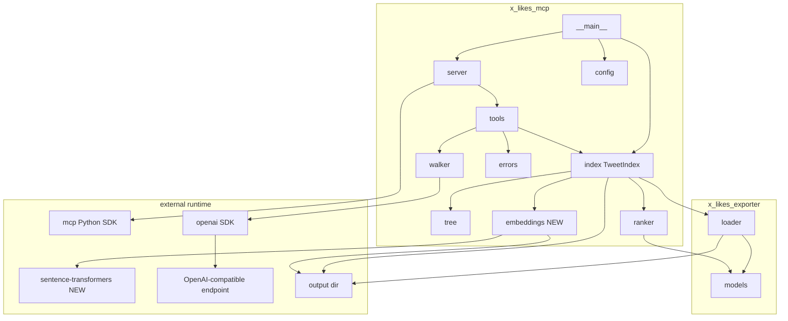
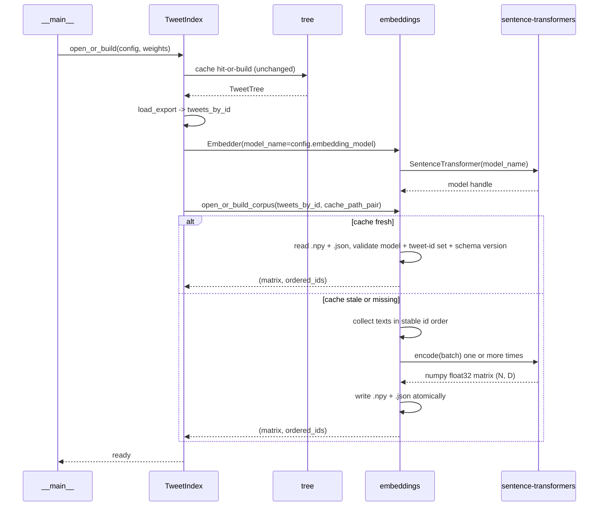
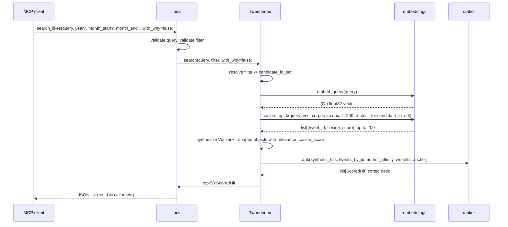

# Design Document

## Overview

This spec rips the LLM walker out of the `search_likes` hot path and replaces it with two-stage local retrieval: cheap cosine recall over the whole corpus, followed by the existing engagement-and-affinity ranker on the survivors. The walker module stays in the package, tests stay green, and a new `with_why=true` flag re-enables it as an opt-in explainer over the top hits. Default search returns in seconds, regardless of how many months are in scope.

The retrieval layer is a new module `x_likes_mcp/embeddings.py`. It loads a small local sentence-transformers model (`BAAI/bge-small-en-v1.5` by default), embeds every tweet at index-build time, and persists the resulting `(N, D)` matrix as a numpy `.npy` file with a sidecar `.json` carrying the model name, the ordered tweet-id list, and a schema version. Cache invalidation is structural: rebuild when the model name changes or the set of tweet ids changes. No mtime games. The `_encode` function inside the module is the test mock seam, mirroring the walker's `_call_chat_completions` pattern.

`tools.search_likes` is refactored to call: validate inputs, resolve the structured filter to a candidate id-set, embed the query, compute cosine top-K (default 200) over the candidate set, hand the surviving ids to `ranker.rank`, return the top-N (default 50) `ScoredHit` results, and only then — when `with_why=true` — invoke the walker over the top-20 ranked tweets to populate the `why` field. The walker continues to be the only LLM call site.

### Goals

- A clean checkout, after `uv sync` and `scrape.sh`, runs `python -m x_likes_mcp` and serves `search_likes` queries in under 10 seconds without hitting an LLM.
- The first-time corpus embedding pass completes in roughly 60 seconds on a CPU-only laptop for a 7,780-tweet corpus and is cached on disk afterwards.
- `pytest tests/mcp/` passes on a clean checkout without downloading the embedding model. The new tests mock `embeddings._encode` the same way the existing tests mock `walker._call_chat_completions`.
- An MCP client can opt into the walker explainer by passing `with_why=true`; the default call performs zero LLM HTTP calls.

### Non-Goals

- Replacing or retuning the ranker. Same formula, same weights, same `ScoredHit` shape.
- Removing the walker module. It is the explainer now; deleting it would also break the walker tests.
- Image embeddings, cross-encoder re-ranking, hybrid BM25 + vector. All speculative at this scale.
- Hosted embedding APIs. Local-only.
- Pre-computing the index in a separate process or watching the filesystem.
- Rewriting the existing tree cache, the four MCP tool surfaces, or the JSON-schema scaffolding.

## Boundary Commitments

### This Spec Owns

- A new module `x_likes_mcp/embeddings.py` containing the `Embedder` class, the `_encode` test seam, the cosine top-k helper, and the on-disk cache format.
- The two new cache files: `corpus_embeddings.npy` and `corpus_embeddings.meta.json` under the configured output directory.
- The refactor of `tools.search_likes` to drop the walker from the default path and to introduce the optional explainer path.
- A small refactor of `TweetIndex.search` (and `TweetIndex.open_or_build`) to (a) hold the loaded `Embedder` instance, (b) build-or-load the corpus embedding cache during startup, and (c) expose a candidate-id resolution path that respects the structured filter.
- A new field on `Config`: `embedding_model: str` (default `"BAAI/bge-small-en-v1.5"`), and the `EMBEDDING_MODEL` env-var binding in `config.py`.
- The new optional `with_why: bool = False` parameter on `tools.search_likes` and on the `search_likes` MCP tool input schema in `server.py`.
- One new runtime dependency in `pyproject.toml`: `sentence-transformers>=2.7`. (numpy comes in transitively via sentence-transformers / pandas; we do not add it directly.)
- Updates to `.env.sample` and the README MCP section.
- New tests under `tests/mcp/`: `test_embeddings.py`, additions to `test_index.py`, `test_tools.py`, and `test_server_integration.py`.

### Out of Boundary

- Anything `x_likes_exporter` (Spec 1) owns. The `Tweet` shape, the loader, the public read API.
- The walker's internals. Walker tests stay green; we do not edit `walker.py` other than possibly a docstring nudge.
- The ranker's internals. We pass it walker-shaped hits derived from cosine scores and let it score them with the same formula it has today.
- The MCP server transport, the error-shaping wrapper in `server.py`, the JSON-schema declarations for the other three tools.
- The four-tool surface. We do not add or remove tools.

### Allowed Dependencies

- Spec 1's public read API: `from x_likes_exporter import load_export, iter_monthly_markdown` and the `Tweet` dataclass.
- Spec 2's modules: `tree.py`, `walker.py`, `ranker.py`, `index.py`, `tools.py`, `server.py`, `config.py`, `errors.py`. We import from them; we do not delete or rename any.
- New runtime dep `sentence-transformers>=2.7` (which transitively pulls in `torch` and `numpy`). We import `sentence_transformers.SentenceTransformer` in `embeddings.py` only; `numpy` is allowed throughout the new module.
- Stdlib for the cache: `json`, `os`, `tempfile`, `pathlib`.

### Revalidation Triggers

This spec re-checks if Spec 2 changes any of:

- `TweetIndex.tweets_by_id` shape, the `Tweet.id` contract, or the `Tweet.text` field used as embedding input.
- The `walker.walk` signature or `WalkerHit` shape (the explainer path consumes them).
- The `ScoredHit` shape (still the response shape `tools.search_likes` returns).
- `config.Config` additions or removals (the new `embedding_model` field is additive).
- The output-directory layout convention (`output/` plus `tweet_tree_cache.pkl`); the new cache files live alongside.

If Spec 1 changes the `Tweet.text` accessor, the embedder's text source must be revisited.

## Architecture

### Existing Architecture Analysis

mcp-pageindex shipped a hub-and-spoke layout inside `x_likes_mcp/`: `__main__` boots, `config` parses `.env`, `index.TweetIndex` orchestrates, the four tool handlers in `tools.py` are thin wrappers, and the only LLM call site is `walker.py`. The dependency arrow inside the package goes one way: `errors`/`config` are leaves; `tree`, `walker`, `ranker` are domain modules; `index` orchestrates; `tools` adapts; `server` transports.

The walker is not slow because the LLM is slow per call. It is slow because the walker calls the LLM once per chunk per month, sequentially, and most of those chunks contain tweets that have nothing to do with the query. The fix is structural, not parametric: stop using the LLM for retrieval. Use it for explanation.

### Architecture Pattern and Boundary Map



The shape is unchanged. One new module (`embeddings`) joins the domain layer next to `walker` and `ranker`. `index.TweetIndex` gains an `embedder` field. `tools.search_likes` calls into the embedder before calling the ranker; the walker call moves out of the default path and into the optional explainer path. No edges flip direction.

Dependency direction: `embeddings` depends on `sentence-transformers`, `numpy`, the `Tweet` shape, and stdlib. Nothing imports `embeddings` except `index` and `tools`. The walker still does not know about embeddings; the embedder still does not know about the walker.

### Technology Stack

| Layer | Choice / Version | Role | Notes |
|-------|------------------|------|-------|
| Embedding model | `BAAI/bge-small-en-v1.5` (default, override via env) | Sentence embeddings for tweet text and query strings. | ~33 MB on disk. CPU-friendly. Best small model on the MTEB English retrieval leaderboard at the time of writing. |
| Embedding library | `sentence-transformers >= 2.7` | Wraps the model, exposes `encode()` returning numpy arrays. | Transitively pulls `torch` (CPU-only at install time on the project's lockfile is acceptable; the user does not need GPU). Adds ~200 MB to the install graph. |
| Tensor / array | `numpy` (transitive via sentence-transformers / pandas) | Cosine similarity, matrix storage on disk. | Already in the runtime tree via pandas. |
| Cache file | numpy `.npy` for the matrix; `.json` sidecar for metadata. | On-disk persistence. | Trivially inspectable; rebuild on schema-version bump. |
| Walker | `openai >= 1.0` (already a dep) | Optional explainer. | Unchanged; only the call site moves. |

Concrete model size, memory footprint, and per-call latency are surfaced in the README rather than restated here.

## File Structure Plan

### New files

```
x_likes_mcp/
  embeddings.py          # Embedder class, _encode test seam, cosine_top_k, cache load/save.

tests/mcp/
  test_embeddings.py     # Unit tests for Embedder, cache round-trip, invalidation rules.
```

### Modified files

- `x_likes_mcp/config.py` — add `embedding_model: str` field on `Config`, read `EMBEDDING_MODEL` from env with the documented default.
- `x_likes_mcp/index.py` — `TweetIndex.open_or_build` builds-or-loads the embedding cache after the tree cache; `TweetIndex` gains an `embedder: Embedder` field; `TweetIndex.search` is refactored to call the cosine path then the ranker; `_compute_anchor` and the filter-resolution helpers stay.
- `x_likes_mcp/tools.py` — `search_likes` accepts a new optional `with_why: bool = False` argument; the body is rewritten to drive the cosine→ranker→optional-walker pipeline; a new internal helper `_call_walker_explainer(top_results, query, index)` encapsulates the explainer path.
- `x_likes_mcp/server.py` — extend the `search_likes` input schema with the optional `with_why` boolean; thread it through `_dispatch`.
- `tests/mcp/test_index.py` — new tests for the embedding cache hooks on `open_or_build`; existing tests keep passing.
- `tests/mcp/test_tools.py` — replace walker-only assertions for `search_likes` with cosine-path assertions; add `with_why=true` cases that exercise the explainer path; assert no walker call when `with_why=false`.
- `tests/mcp/test_server_integration.py` — extend the `search_likes` integration to cover the new schema shape and `with_why` toggle.
- `tests/mcp/conftest.py` — add an autouse fixture or fixture helper that patches `embeddings._encode` to a deterministic vectorizer so tests cannot accidentally trigger a real model load.
- `pyproject.toml` — add `sentence-transformers>=2.7` to `[project.dependencies]`.
- `.env.sample` — add a commented `EMBEDDING_MODEL` line with the default value and a one-line description.
- `README.md` — update the MCP section: describe the cosine-then-ranker default, the `with_why` flag, the new env var, the install-graph cost, and the on-disk cache file paths.

Each file has one clear responsibility; the new `embeddings.py` is the only place that imports `sentence_transformers`.

## System Flows

### Index build (cold start)



### `search_likes` happy path (default, `with_why=false`)



### `search_likes` with explainer (`with_why=true`)

The flow is identical up through the ranker. After the ranker returns, `tools.search_likes` calls `_call_walker_explainer(top_20_results, query, index)`. The explainer wraps `walker.walk` against a synthetic in-memory `TweetTree` whose `nodes_by_month` contains only the top-20 tweets in a single chunk, so the walker issues exactly one LLM call. The walker's response populates `why` and refreshes `walker_relevance` on the matching results; result order is preserved as the ranker produced it. If the walker raises, the explainer logs once to stderr, returns the original results unchanged, and `search_likes` succeeds.

### Filter resolution at the candidate stage

The structured filter `(year, month_start, month_end)` resolves the same way it does today (`TweetIndex._resolve_filter`). The difference is what happens with the result. Instead of handing months to the walker, we translate "in-scope months" to an "in-scope tweet-id set" by grouping `tweets_by_id` on `Tweet.get_created_datetime().strftime('%Y-%m')`. Tweets with unparseable `created_at` are excluded from filtered queries; they remain eligible in unfiltered queries. The cosine retrieval then masks the corpus matrix to that id set before taking top-K.

## Requirements Traceability

| Requirement | Summary | Components | Interfaces | Flows |
|-------------|---------|------------|------------|-------|
| 1.1 | `EMBEDDING_MODEL` env var with default. | `config` | `load_config` | Index build |
| 1.2 | Local sentence-transformers load. | `embeddings` | `Embedder.__init__` | Index build |
| 1.3 | Loud failure on unresolvable model. | `embeddings`, `__main__` | startup error | Index build |
| 1.4 | `.env.sample` documents the var and install cost. | `.env.sample`, README | doc | n/a |
| 2.1 | Embed every tweet on cold start. | `index`, `embeddings` | `open_or_build_corpus` | Index build |
| 2.2 | Embedding-input source and stable id ordering. | `embeddings` | `open_or_build_corpus` | Index build |
| 2.3 | Reuse cache when model + id-set match. | `embeddings` | metadata validation | Index build |
| 2.4 | Model-name change forces rebuild. | `embeddings` | metadata validation | Index build |
| 2.5 | Tweet-id set change forces rebuild. | `embeddings` | metadata validation | Index build |
| 2.6 | Cache lives in output dir, atomic writes. | `embeddings` | `_save_cache` | Index build |
| 2.7 | Build fails loudly on unwritable output dir. | `embeddings`, `__main__` | startup error | Index build |
| 3.1 | `.npy` matrix file. | `embeddings` | `_save_cache` | Index build |
| 3.2 | `.meta.json` with model, count, ids, version. | `embeddings` | `_save_cache` | Index build |
| 3.3 | Schema-version mismatch forces rebuild. | `embeddings` | `_load_cache` | Index build |
| 3.4 | Missing or unreadable file forces rebuild. | `embeddings` | `_load_cache` | Index build |
| 4.1 | Embed query; cosine vs corpus. | `embeddings`, `index` | `embed_query`, `cosine_top_k` | Search |
| 4.2 | Top-K=200 default. | `embeddings`, `index` | `cosine_top_k` | Search |
| 4.3 | Filtered scope smaller than K returns all. | `index`, `embeddings` | candidate masking | Search |
| 4.4 | Filter applied at candidate stage. | `index` | `_resolve_candidates` | Search |
| 4.5 | Pure-numpy cosine, no LLM. | `embeddings` | `cosine_top_k` | n/a |
| 5.1 | Refactored end-to-end flow. | `tools`, `index`, `embeddings`, `ranker` | `search_likes` | Search |
| 5.2 | Default path makes no LLM call. | `tools`, `index` | `search_likes(with_why=false)` | Search |
| 5.3 | Empty cosine result -> empty list. | `tools`, `index` | `search_likes` | Search |
| 5.4 | Embedding failure -> upstream_failure. | `tools`, `errors` | error path | Search |
| 5.5 | Existing search_likes contract preserved. | `tools`, `server` | schema + shape | Search |
| 5.6 | walker_relevance + why default values when explainer off. | `tools`, `index` | `_shape_hit` | Search |
| 6.1 | `with_why` optional, default false. | `tools`, `server` | schema | Search |
| 6.2 | Walker explainer over top-20. | `tools`, `walker` | `_call_walker_explainer` | Search w/ explainer |
| 6.3 | Order preserved when explainer runs. | `tools` | `_call_walker_explainer` | Search w/ explainer |
| 6.4 | Walker failure during explainer is non-fatal. | `tools` | `_call_walker_explainer` | Search w/ explainer |
| 6.5 | No openai import on default path. | `tools`, `index`, `embeddings` | grep-checkable | Search |
| 7.1 | <10s for default search on warm cache. | `tools`, `index`, `embeddings` | latency | Search |
| 7.2 | First build <~60s on CPU; documented. | `embeddings`, README | doc | Index build |
| 7.3 | <10s plus one LLM call when explainer on. | `tools`, `walker` | latency | Search w/ explainer |
| 8.1 | `pytest` runs without model download. | `conftest`, `embeddings` | `_encode` mock | n/a |
| 8.2 | `_encode` test seam exists. | `embeddings` | `_encode` | n/a |
| 8.3 | Unit tests cover cosine, cache round-trip, invalidations. | `test_embeddings` | tests | n/a |
| 8.4 | Integration tests drive `tools.search_likes`. | `test_tools`, `test_server_integration` | tests | Search |
| 9.1 | `walker.py` callable as-is. | `walker` | unchanged | Search w/ explainer |
| 9.2 | Walker tests stay green. | `test_walker` | unchanged | n/a |
| 9.3 | `_call_chat_completions` mock seam preserved. | `walker` | unchanged | n/a |
| 9.4 | Explainer routes through `walker.walk`. | `tools` | `_call_walker_explainer` | Search w/ explainer |
| 10.1 | `.env.sample` updated. | `.env.sample` | doc | n/a |
| 10.2 | README MCP section updated. | README | doc | n/a |
| 10.3 | Cache file paths documented. | README | doc | n/a |
| 10.4 | Walker is opt-in, still only LLM site. | README, `tools` | doc + behavior | n/a |

## Components and Interfaces

| Component | Domain/Layer | Intent | Req Coverage | Key Dependencies | Contracts |
|-----------|--------------|--------|--------------|------------------|-----------|
| `embeddings` | Retrieval | Load model, embed corpus, persist cache, embed query, compute cosine top-k. | 1.2, 2.1-2.7, 3.1-3.4, 4.1-4.5, 8.2 | sentence-transformers, numpy, stdlib | Service, State |
| `config` (extension) | Startup | Add `embedding_model` field; bind `EMBEDDING_MODEL` env. | 1.1, 1.4 | stdlib | Service |
| `index` (extension) | Indexing | Hold the `Embedder`, build-or-load the corpus cache, compute candidate id set, run the cosine path then the ranker. | 2.1, 4.1-4.4, 5.1, 5.2 | `embeddings`, `ranker` | Service, State |
| `tools` (extension) | MCP handlers | `search_likes` rewrite: cosine → ranker → optional walker explainer. | 5.1-5.6, 6.1-6.5 | `index`, `errors`, `walker` | Service |
| `server` (extension) | MCP transport | Extend `search_likes` input schema with `with_why`. | 6.1, 5.5 | `mcp` SDK | Service |
| `walker` (no edits) | LLM site (now opt-in) | Continues to work as the explainer. | 9.1-9.4 | `openai` SDK | Service |

### Retrieval Layer

#### `embeddings`

| Field | Detail |
|-------|--------|
| Intent | Embed tweet texts and queries using a local sentence-transformers model; persist the corpus matrix; expose cosine top-k with optional id-set masking. The only place in the package that imports `sentence_transformers` and `numpy`. |
| Requirements | 1.2, 2.1-2.7, 3.1-3.4, 4.1-4.5, 8.2 |

**Service interface**

```python
# x_likes_mcp/embeddings.py
from __future__ import annotations
from dataclasses import dataclass
from pathlib import Path
import numpy as np

CACHE_SCHEMA_VERSION: int = 1
DEFAULT_EMBEDDING_MODEL: str = "BAAI/bge-small-en-v1.5"
DEFAULT_TOP_K: int = 200


class EmbeddingError(RuntimeError):
    """Raised when corpus embedding fails fatally (model load, write, etc.)."""


@dataclass
class CorpusEmbeddings:
    matrix: np.ndarray              # shape (N, D), float32, L2-normalized rows
    ordered_ids: list[str]          # row index N -> tweet_id
    model_name: str                 # for invalidation


class Embedder:
    """Loads a sentence-transformers model and exposes encode + cosine helpers.

    The `_encode` method is the test mock seam (mirrors walker._call_chat_completions).
    """

    def __init__(self, model_name: str = DEFAULT_EMBEDDING_MODEL) -> None: ...

    def embed_query(self, query: str) -> np.ndarray:
        """Encode one query string. Returns a (D,) float32 vector, L2-normalized."""

    def embed_corpus(self, ordered_ids: list[str], texts: list[str]) -> np.ndarray:
        """Encode a list of texts in the given id order. Returns (N, D) float32."""

    def cosine_top_k(
        self,
        query_vec: np.ndarray,
        corpus: CorpusEmbeddings,
        k: int = DEFAULT_TOP_K,
        restrict_to_ids: set[str] | None = None,
    ) -> list[tuple[str, float]]:
        """Return up to k (tweet_id, cosine_similarity) pairs, descending."""

    # Test seam.
    def _encode(self, texts: list[str]) -> np.ndarray:
        """Underlying batched encoder. Tests patch this to skip model load."""


def open_or_build_corpus(
    embedder: Embedder,
    tweets_by_id: dict[str, "Tweet"],
    cache_dir: Path,
) -> CorpusEmbeddings:
    """Load the cache if model + id-set + schema match; otherwise rebuild + save."""
```

**Responsibilities and constraints**

- `__init__(model_name)` constructs `SentenceTransformer(model_name)` lazily on first `_encode` call so tests that patch `_encode` never pay the load cost. If the model cannot be loaded when `_encode` is finally called, raise `EmbeddingError` naming `model_name` and the underlying cause.
- `embed_query` calls `_encode([query])`, takes row 0, L2-normalizes, returns `np.ndarray` of shape `(D,)`.
- `embed_corpus` calls `_encode(texts)` (the model's internal batching does the work), L2-normalizes each row, returns `np.ndarray` of shape `(N, D)` aligned with `ordered_ids`.
- `cosine_top_k` is pure numpy: matrix-multiply the L2-normalized query vector against the L2-normalized corpus matrix (cosine reduces to dot product on normalized vectors), optionally mask to `restrict_to_ids` by gathering rows for those ids, take the top-k indices, return `(tweet_id, score)` tuples in descending order. When `restrict_to_ids` is smaller than `k`, return every restricted candidate.
- `open_or_build_corpus`:
  1. Compute `cache_npy = cache_dir / "corpus_embeddings.npy"`, `cache_meta = cache_dir / "corpus_embeddings.meta.json"`.
  2. Try `_load_cache(cache_npy, cache_meta)` -> returns `CorpusEmbeddings` if model name, id set, and schema version all match `(embedder.model_name, set(tweets_by_id.keys()), CACHE_SCHEMA_VERSION)`. Otherwise returns `None`.
  3. If `_load_cache` returned `None`, build fresh: `ordered_ids = sorted(tweets_by_id.keys())`, `texts = [tweets_by_id[i].text or "" for i in ordered_ids]`, `matrix = embedder.embed_corpus(ordered_ids, texts)`. Then `_save_cache(cache_npy, cache_meta, matrix, ordered_ids, embedder.model_name)`.
  4. Cache writes are atomic: write to `*.tmp` files, `os.replace` onto the canonical paths. If the directory is unwritable, raise `EmbeddingError`.

**Implementation notes**

- Use `sentence_transformers.SentenceTransformer(model_name).encode(texts, normalize_embeddings=True, show_progress_bar=False, convert_to_numpy=True)` inside `_encode`. The library handles batching.
- The cache uses `np.save` / `np.load` (allow_pickle=False). The meta JSON is plain `json.dump`. The schema-version field is an integer; bumping the constant in source is the rebuild trigger.
- `tweets_by_id[i].text` is the embedding source. Empty strings are allowed; the model produces a stable vector for them. Tweets whose text is missing still occupy a row in the matrix so id-to-row alignment never drifts.
- Determinism is not load-bearing here, but the `ordered_ids = sorted(tweets_by_id.keys())` choice keeps cache files reproducible across runs. `set(ordered_ids) == set(tweets_by_id.keys())` is the actual invariant the loader checks.

### Indexing Layer (extension)

#### `index.TweetIndex` deltas

| Field | Detail |
|-------|--------|
| Intent | Hold the `Embedder` plus the loaded `CorpusEmbeddings`; resolve the candidate id-set from the structured filter; run the cosine path then the ranker; expose a hook the explainer can use. |
| Requirements | 2.1, 4.1-4.4, 5.1, 5.2 |

**Service interface (extension)**

```python
# x_likes_mcp/index.py
from .embeddings import Embedder, CorpusEmbeddings

@dataclass
class TweetIndex:
    # existing fields ...
    embedder: Embedder
    corpus: CorpusEmbeddings

    @classmethod
    def open_or_build(cls, config: Config, weights: RankerWeights) -> "TweetIndex": ...
    # extended: also constructs Embedder and calls open_or_build_corpus.

    def search(
        self,
        query: str,
        year: int | None = None,
        month_start: str | None = None,
        month_end: str | None = None,
        top_n: int = 50,
    ) -> list[ScoredHit]: ...
    # rewritten: cosine top-K -> ranker -> top-N. No walker call.

    def _candidate_ids(
        self, year: int | None, month_start: str | None, month_end: str | None
    ) -> set[str] | None:
        """Return the in-scope tweet-id set, or None when no filter is set."""
```

**Responsibilities and constraints**

- `open_or_build` after the existing tree+tweets+affinity steps: construct `Embedder(config.embedding_model)`, call `open_or_build_corpus(embedder, tweets_by_id, config.output_dir)`, store both on the dataclass.
- `_candidate_ids`: if the filter is fully unset, return `None` (whole corpus). Otherwise resolve `_resolve_filter` to the list of `YYYY-MM` strings, then walk `tweets_by_id` and select ids whose `Tweet.get_created_datetime().strftime('%Y-%m')` is in that set. Tweets whose `created_at` is unparseable are excluded.
- `search`:
  1. `candidate_ids = self._candidate_ids(...)`.
  2. `query_vec = self.embedder.embed_query(query)`.
  3. `cosine_hits = self.embedder.cosine_top_k(query_vec, self.corpus, k=200, restrict_to_ids=candidate_ids)`.
  4. Synthesize `WalkerHit(tweet_id=tid, relevance=score, why="")` for each `(tid, score)` to fit the ranker's input contract.
  5. `scored = ranker.rank(synthetic_hits, self.tweets_by_id, self.author_affinity, self.weights, anchor=_compute_anchor(...))`.
  6. Return `scored[:top_n]`.

The walker is no longer a dependency of `TweetIndex.search`. The explainer call lives in `tools.py`, where it has access to the `index.embedder` only when `with_why=true`.

### MCP Handler Layer (extension)

#### `tools.search_likes` rewrite

| Field | Detail |
|-------|--------|
| Intent | Default path: cosine + ranker, zero LLM calls. Optional path with `with_why=true`: same plus a single walker call over the top-20 ranked tweets to populate `why`. |
| Requirements | 5.1-5.6, 6.1-6.5 |

**Service interface (extension)**

```python
# x_likes_mcp/tools.py

def search_likes(
    index: TweetIndex,
    query: str,
    year: int | None = None,
    month_start: str | None = None,
    month_end: str | None = None,
    with_why: bool = False,
) -> list[dict[str, Any]]: ...

def _call_walker_explainer(
    top_results: list[ScoredHit],
    query: str,
    index: TweetIndex,
) -> dict[str, "WalkerHit"]:
    """Run the walker over a single synthetic chunk; return a tweet_id -> WalkerHit map.

    Failures are caught here, logged once to stderr, and result in an empty map so the
    caller can fall back to the cosine-derived `why` placeholder.
    """
```

**Responsibilities and constraints**

- Validate `query` and the structured filter exactly as today.
- Validate `with_why`: must be `bool` or absent; default is `False`. Non-bool raises `invalid_input("with_why", ...)`.
- Translate `EmbeddingError` (and any other non-`ToolError` exception bubbling out of `index.search`) to `errors.upstream_failure(...)`.
- After `index.search` returns the ranked top-50, pass the top-20 to `_call_walker_explainer` only when `with_why=true`. Update each affected `ScoredHit.why` and `walker_relevance` from the returned `WalkerHit` map; entries the walker didn't return are left with their cosine-derived placeholders.
- `_shape_hit` is unchanged in its responsibility: dict shape stays `{"tweet_id", "year_month", "handle", "snippet", "score", "walker_relevance", "why", "feature_breakdown"}`. When `with_why=false`, `walker_relevance = cosine_score in [0,1]` and `why = ""`.

### Server (extension)

`server._search_likes_tool` adds one property to the input schema:

```python
"with_why": {
    "type": "boolean",
    "default": False,
    "description": "Optional: run the walker LLM over the top hits to populate `why`. Off by default."
}
```

`_dispatch` threads `arguments.get("with_why", False)` into the call. No other tool changes.

## Data Models

### On-disk

- `output/tweet_tree_cache.pkl` — unchanged; mcp-pageindex owns this.
- `output/corpus_embeddings.npy` — new; numpy float32 matrix of shape `(N, D)`, L2-normalized rows. Aligned with `ordered_ids` from the metadata file.
- `output/corpus_embeddings.meta.json` — new; JSON object of the shape:
  ```json
  {
    "schema_version": 1,
    "model_name": "BAAI/bge-small-en-v1.5",
    "n_tweets": 7780,
    "tweet_ids_in_order": ["1234567890123456789", "..."]
  }
  ```

### In-memory

- `CorpusEmbeddings(matrix, ordered_ids, model_name)` — lives on `TweetIndex.corpus`.
- `Embedder(model_name)` — lives on `TweetIndex.embedder`.
- The synthetic `WalkerHit` instances created in `TweetIndex.search` are throwaway; they exist only to fit the ranker's input contract.

### Existing dataclasses (unchanged)

`Tweet`, `User`, `Media` (Spec 1); `TreeNode`, `TweetTree` (Spec 2 `tree`); `WalkerHit` (Spec 2 `walker`); `ScoredHit` (Spec 2 `ranker`); `MonthInfo`, `RankerWeights`, `Config` (Spec 2). `Config` gains one additive field: `embedding_model: str`.

## Error Handling

### Categories

- **Startup errors**: `ConfigError` from `config.load_config` if a malformed env var is added (no new error categories needed for the additive `EMBEDDING_MODEL` field; missing falls back to default). `EmbeddingError` from `embeddings.open_or_build_corpus` if model load or cache write fails. Both bubble to `__main__.main`, print to stderr, exit non-zero.
- **Tool-level errors during `search_likes`**:
  - `invalid_input` for empty query, bad filter, or non-bool `with_why` (existing pattern; one new field).
  - `upstream_failure` when `index.search` raises (now sourced from `EmbeddingError` rather than `WalkerError`). Server stays alive.
- **Explainer failures**: `_call_walker_explainer` catches `WalkerError` and other exceptions internally. It logs one stderr line and returns an empty map; the caller proceeds with the cosine-derived `why` placeholders. The `search_likes` call still succeeds.

### Strategy

The boundary that converts exceptions to tool errors is unchanged in `server.py`. The new categories are subsumed by the existing wrapper. The explainer's swallow-and-log pattern is intentional: a flaky local LLM should not turn a useful default search into a failure.

## Testing Strategy

### Unit tests

- `test_embeddings.py` — exercises the new module with `Embedder._encode` patched to a deterministic stub:
  - `embed_query` returns a normalized vector of the expected dimension.
  - `embed_corpus` returns an `(N, D)` matrix with the expected ordering.
  - `cosine_top_k` returns the right ids in descending score order; `restrict_to_ids` masks correctly; smaller-than-k restricted scopes return every candidate.
  - `open_or_build_corpus` writes both files atomically; round-trip reload yields the same matrix and ordered_ids.
  - Invalidation: model-name change forces a rebuild; tweet-id set difference forces a rebuild; schema-version mismatch forces a rebuild; missing or unreadable file forces a rebuild.
  - `EmbeddingError` raised when the cache directory is unwritable.
- `test_index.py` (additions) — `TweetIndex.open_or_build` constructs an `Embedder` and stores the corpus on the instance; second call reuses the cache (assert via a counter on the patched `_encode`); `_candidate_ids` excludes tweets with unparseable `created_at` when a filter is set, includes them when the filter is unset; `search` calls the embedder cosine helper with the expected `restrict_to_ids` and does not call `walker.walk` on the default path.
- `test_tools.py` (rewrite) — `search_likes(with_why=false)` returns ranker-shaped dicts and never calls the walker (assert via patched `walker.walk` raising if invoked); `search_likes(with_why=true)` calls the walker exactly once over the top-20 and merges the returned `why`/`walker_relevance` onto matching results; walker failure during the explainer is non-fatal and the call still succeeds with cosine-derived placeholders; non-bool `with_why` raises `invalid_input`; `EmbeddingError` from `index.search` becomes `upstream_failure`.

### Integration tests

- `test_server_integration.py` (additions) — drive `search_likes` through the in-process MCP server with the embedder and walker mocked; assert the JSON-schema accepts `with_why`; assert the structured response shape is unchanged when `with_why=false`; assert the `why` fields populate when `with_why=true`.

### Network and model guard

`tests/mcp/conftest.py` gains an autouse fixture that monkey-patches `embeddings.Embedder._encode` to a deterministic vectorizer (e.g. hashed-bag-of-words producing a consistent `(D,)` vector for any input). The walker guard from mcp-pageindex stays. Together they ensure no real model download and no real HTTP call.

### Fixtures

The existing `tests/mcp/fixtures/` export is reused. The unit tests drive `Embedder` directly with hand-built `tweets_by_id` dicts.

### Real-model verification (manual, not CI)

The README documents a manual smoke test: from a clean checkout, set `EMBEDDING_MODEL=BAAI/bge-small-en-v1.5`, run `python -m x_likes_mcp` once to trigger the cold-start embedding pass (~60s on CPU), then re-run and observe a sub-second startup. Then call `search_likes("pentesting with AI and LLMs")` from Claude Code and confirm a sub-10s response. Optional: pass `with_why=true` and observe one extra LLM call.

## Performance and Scalability

The two retrieval stages have predictable costs:

- **Embedding the query**: one forward pass on the configured model. ~50 ms on CPU for `bge-small-en-v1.5`. Run on every `search_likes` call.
- **Cosine top-K against ~8,000 vectors**: one matrix-vector multiply, one argsort. ~5 ms with numpy. Includes optional id-set masking.
- **Ranker**: linear in the number of candidates (≤200). Pure arithmetic. ~1 ms.
- **Explainer (opt-in)**: one LLM call over the top-20 ranked tweets. ~5 s on a fast local model, more on a slow one. Off by default.

**Cold-start build**: embedding 7,780 tweets with `bge-small-en-v1.5` on CPU runs about 30–60 seconds depending on hardware. This cost is paid once and cached. Documented in the README.

If the corpus grows past the point where the in-memory matrix becomes unfriendly, the obvious next moves are (a) chunked encoding-and-write during build, and (b) memory-mapping the matrix on read (`np.load(..., mmap_mode='r')`). Out of scope here.

## Constraints

- **Install graph**: `sentence-transformers>=2.7` brings `torch` (CPU-only is fine; users do not need GPU). The combined install footprint adds roughly 200 MB. This is a documented cost in the README MCP section. Users who do not run the MCP server are unaffected because `scrape.sh` has its own dep set.
- **First run**: the embedding model is downloaded on first use to `~/.cache/huggingface/`. Subsequent runs hit the local cache. Documented.
- **CI**: tests must not download models. The `_encode` mock is the enforcement seam.
- **Walker stays the only LLM call site**: by construction, the OpenAI SDK is imported only by `walker.py`. The new `embeddings.py` does not import `openai`.

## Migration: `.env.sample` Update

Append after the existing MCP-server block:

```
# === Fast-search retrieval (Spec 3 / mcp-fast-search) ===

# Local sentence-transformers model used for embedding-based candidate
# recall in `search_likes`. The model is downloaded on first run and
# cached under ~/.cache/huggingface/. ~33 MB on disk for the default;
# the install graph adds ~200 MB for sentence-transformers + CPU torch.
# EMBEDDING_MODEL=BAAI/bge-small-en-v1.5
```

## Migration: README MCP Section

Add a paragraph under the existing MCP section describing:
- The default search path is now cosine retrieval + the existing ranker; no LLM call.
- The walker explainer is opt-in via `with_why=true` on the `search_likes` tool call.
- One new env var, `EMBEDDING_MODEL`, with the default `BAAI/bge-small-en-v1.5`.
- The new on-disk caches: `output/corpus_embeddings.npy` and `output/corpus_embeddings.meta.json`.
- The first-run cost (one model download, one ~60 s embedding pass on CPU) and the warm-cache cost (sub-second startup, sub-10 s queries).

## Open Questions and Risks

- **CPU-only torch wheel selection**: `sentence-transformers` pulls `torch` by default. On most platforms the default wheel is fine; some users may prefer the explicit CPU-only wheel for size. We document the cost; we do not pin a CPU-only wheel because that is platform-specific and the user's lockfile is the right place for it.
- **Embedding model behavior on tweets with media-only content**: short or empty `Tweet.text` produces a less informative embedding. Users searching for media-heavy threads may see worse recall. Out of scope here.
- **Tweet-id set drift between scrapes**: when `scrape.sh` runs and adds new likes, the id set changes and the embedding cache rebuilds in full on next startup. For incremental rebuild we would need a per-id store; not worth the complexity at this scale.
- **Schema-version policy**: the constant `CACHE_SCHEMA_VERSION = 1` is bumped any time the on-disk format changes. Today it is 1. Future bumps force a rebuild; that is the migration policy.
- **CI cost of `sentence-transformers` install**: the dep adds size to the CI install step. Acceptable because tests do not load the model.
