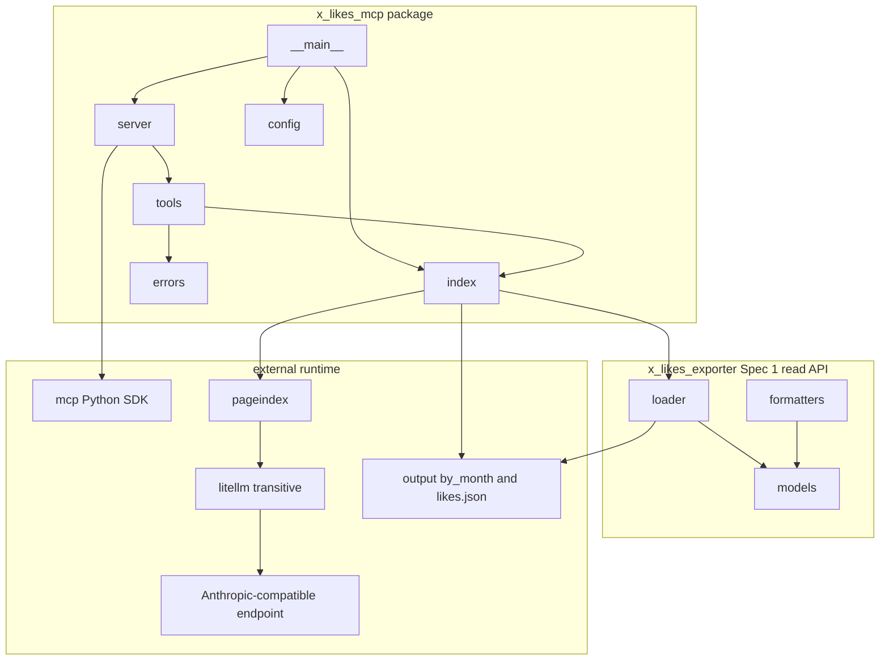
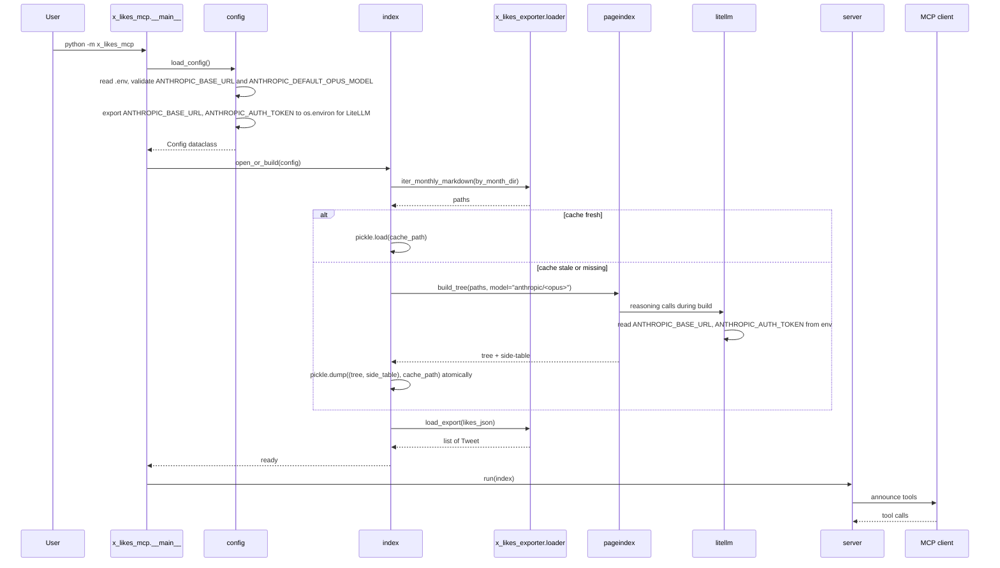
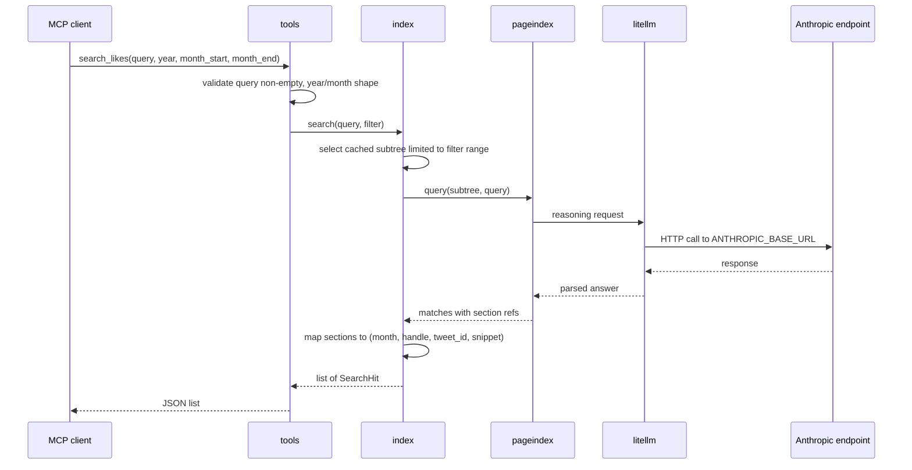

# Design Document

## Overview

This spec puts a stdio MCP server in front of the per-month Markdown the exporter already produces. The server exposes four tools: `search_likes`, `list_months`, `get_month`, `read_tweet`. `search_likes` is the only one with reasoning behind it. It hands the user's question (plus an optional structured year/month filter) to PageIndex with a tree built from `output/by_month/likes_YYYY-MM.md`, and PageIndex's reasoning step walks that tree to find matches. The other three are file-and-data lookups over the read API from Spec 1.

The reasoning step routes through LiteLLM, which is what PageIndex uses internally. The local LLM endpoint is configured as Anthropic-compatible: `ANTHROPIC_BASE_URL`, `ANTHROPIC_AUTH_TOKEN`, `ANTHROPIC_DEFAULT_OPUS_MODEL`. PageIndex is invoked with `model=f"anthropic/{ANTHROPIC_DEFAULT_OPUS_MODEL}"` so LiteLLM picks up the base URL and key from env. No calls to hosted vendors by default.

The server is single-user, local, stdio. No HTTP, no auth, no multi-user concerns. Runtime story: the user has run `scrape.sh` at least once, has `output/by_month/` and `output/likes.json` on disk, has a local Anthropic-compatible endpoint up, and registers `python -m x_likes_mcp` with their MCP client. Then they can ask their like history questions in natural language.

The `search_likes` filter (`year`, `month_start`, `month_end`) is a structured pre-filter, not a prose hint. The server narrows the file set handed to PageIndex before the reasoning walk begins. This is faster (smaller tree) and more reliable (the LLM cannot quietly ignore a date phrased in the prompt) than the prose-only alternative.

The tree cache lives next to the export and uses mtime-based invalidation. If any `.md` under `output/by_month/` is newer than the cache, rebuild on next startup. That is the whole policy. No manifest, no checksums, no incremental updates.

I am putting all of this in a new top-level package `x_likes_mcp/` rather than a single `mcp_server.py` module. The server has at least four logically separate concerns (config loading, tree cache, PageIndex wrapper, MCP tool surface). A package gives clean import seams and lets each module be tested in isolation.

This spec also makes one small change to Spec 1's `MarkdownFormatter.export`: drop the per-file h1 (`# X (Twitter) Liked Tweets`) and the export-timestamp line when the formatter is being driven in per-month mode. Without that change every `likes_YYYY-MM.md` looks like a master document and PageIndex sees 131 copies of the same h1, which corrupts the tree shape. With it gone, the `## YYYY-MM` heading becomes the effective top of each per-month file's tree. The change is backward-compatible: the single-file path keeps the boilerplate.

### Goals

- A `python -m x_likes_mcp` invocation on a fresh checkout (after `uv sync` and `scrape.sh`) starts a stdio MCP server with the four tools advertised.
- All four tools work end-to-end against a fixture export, with the LiteLLM call and the PageIndex tree builder mocked. `pytest tests/mcp/` passes with no network and no LLM.
- `search_likes(query, year=2025, month_start="04", month_end="06")` only sees `likes_2025-04.md`, `likes_2025-05.md`, `likes_2025-06.md` and is roughly an order of magnitude faster than an open-ended call.
- The server consumes Spec 1's `load_export(path)` and `iter_monthly_markdown(path)` exclusively for export reads. It does not reach into `XLikesExporter` or any module under `x_likes_exporter` other than what `__init__.py` exposes.
- `MarkdownFormatter.export` produces per-month files without the global h1 when called in per-month mode, and produces them with the h1 in single-file mode. Existing single-file behavior is unchanged.
- A README section documents `.mcp.json` registration plus the three new `.env` variables.

### Non-Goals

- HTTP/SSE transport. Stdio only.
- Re-fetching from X. Read-only over existing exports.
- A vector store, embeddings, or any retrieval backend other than PageIndex.
- Multi-user, auth, rate limiting, telemetry.
- Calls to hosted LLM services by default. The user can point `ANTHROPIC_BASE_URL` at a hosted vendor if they want; the server does not.
- Pre-computing the index in a separate process. Tree build happens in-server on first start (or after invalidation).
- Live filesystem watching. New `.md` files are picked up on server restart, not at runtime.
- Tests that exercise a real local LLM. Real-model verification is a manual step documented in the README.
- Any change to the existing single-file Markdown export shape.

## Boundary Commitments

### This Spec Owns

- A new top-level Python package `x_likes_mcp/` with the modules described in File Structure Plan.
- The `python -m x_likes_mcp` entry point (via `x_likes_mcp/__main__.py`).
- A new `[project.scripts]` entry `x-likes-mcp = "x_likes_mcp.__main__:main"` in `pyproject.toml`.
- Two new runtime dependencies in `pyproject.toml`: `mcp` (the Python MCP SDK) and `pageindex`. PageIndex pulls in `litellm` transitively.
- The cache file path (`<output_dir>/pageindex_cache.pkl`) and the mtime-based invalidation rule.
- Three new `.env` variables (`ANTHROPIC_BASE_URL`, `ANTHROPIC_AUTH_TOKEN`, `ANTHROPIC_DEFAULT_OPUS_MODEL`) and the corresponding entries in `.env.sample`.
- A README section on registering the server with Claude Code (or any MCP client).
- Tests under `tests/mcp/` (a subdirectory so they are separable from Spec 1's tests in `tests/`).
- A narrowly-scoped change to `x_likes_exporter/formatters.py:MarkdownFormatter.export`: a new `omit_global_header: bool = False` keyword argument that suppresses the per-file h1 plus the export-timestamp metadata when set. The exporter passes `omit_global_header=True` from the per-month loop. The single-file callsite passes nothing and therefore preserves existing output verbatim. The corresponding test update in `tests/test_formatters.py` lives in this spec's task plan.

### Out of Boundary

- Anything else `x_likes_exporter` owns: scraper internals, `Tweet`/`User`/`Media` data models, the loader, other formatters, scraper tests. This spec consumes them through the public read API; it does not modify them.
- The `output/by_month/` content. The server reads but never writes per-month Markdown or `likes.json`. Re-running `scrape.sh` to refresh the export with the new header shape is a manual step the user does once.
- The `cookies.json` file. The server never touches it.
- HTTP/SSE transport, web UI, multi-user concerns.
- A separate-process indexer. The server builds the tree itself.

### Allowed Dependencies

- Spec 1's public read API: `from x_likes_exporter import load_export, iter_monthly_markdown` and the `Tweet` dataclass it returns.
- `mcp` (Python MCP SDK) for the stdio server scaffold and JSON-schema declarations.
- `pageindex` for tree building and the query-time reasoning step. PageIndex pulls in `litellm` transitively; LiteLLM in turn drives the Anthropic-compatible HTTP call.
- Stdlib only for everything else: `pathlib`, `pickle` (or a JSON variant if PageIndex publishes one) for the cache, `os`/`sys`/`logging`, `re`, `argparse`.
- A small hand-rolled `.env` loader (no `python-dotenv` dependency) because `scrape.sh` does not currently depend on `python-dotenv` either.

### Revalidation Triggers

This spec re-checks if Spec 1 changes any of:

- The signature or return type of `load_export(path)`.
- The signature or return type of `iter_monthly_markdown(path)`.
- The shape of the `Tweet` dataclass or its `to_dict()` output.
- The directory layout under `output/by_month/` (currently `likes_YYYY-MM.md`).
- The package's top-level exports in `x_likes_exporter/__init__.py`.
- The `omit_global_header` parameter on `MarkdownFormatter.export` (added by this spec; once added, removing or renaming it would force a re-check here).

Conversely, downstream consumers of this spec (none planned today) would re-check on:

- Tool name, input schema, or output schema of any of the four tools, including the `search_likes` filter fields.
- The `.env` variable names (`ANTHROPIC_BASE_URL`, `ANTHROPIC_AUTH_TOKEN`, `ANTHROPIC_DEFAULT_OPUS_MODEL`) or the `anthropic/<model>` LiteLLM convention.
- The cache file path or invalidation rule.
- The console script name (`x-likes-mcp`) or module name (`x_likes_mcp`).

## Architecture

### Existing Architecture Analysis

There is no MCP server in the project today. Spec 1 lays the foundation: `x_likes_exporter.loader` exposes `load_export` and `iter_monthly_markdown`, both importable from the package top level, both runnable without a cookies file. This spec is the first consumer of that surface.

The directory layout produced by the existing scraper is fixed: `output/by_month/likes_YYYY-MM.md` plus `output/likes.json`. The Markdown files have `## YYYY-MM` and `### @handle` headings, which is the structure PageIndex's tree builder expects. After this spec lands, those files no longer carry the per-file `# X (Twitter) Liked Tweets` h1 or the export-timestamp line, so the `## YYYY-MM` heading is the effective root of each file's tree.

The `.sentrux/rules.toml` boundary model puts `x_likes_exporter/loader.py` in the `io` layer (order 2) and forbids it from depending on cookies, auth, client, exporter, or downloader. The new `x_likes_mcp/` package lives at the project top level alongside `x_likes_exporter/`, not inside it, so no sentrux rule applies. The dependency arrow goes one way: `x_likes_mcp` imports from `x_likes_exporter`, never the reverse.

### Architecture Pattern and Boundary Map



The pattern is hub-and-spokes. `__main__` is the entry point. `config` parses `.env`. `index` owns the cache file, the PageIndex object, and the in-memory `Tweet` map. `tools` is the four handlers. `server` wires `tools` into the MCP SDK. `errors` is a small module with the tool-error helpers.

Dependency direction inside the package: `errors` and `config` are leaves. `index` depends on `config` and on `x_likes_exporter.loader`. `tools` depends on `index` and `errors`. `server` depends on `tools` and on the MCP SDK. `__main__` depends on `server`, `config`, and `index`.

There is no dependency from `x_likes_exporter` to `x_likes_mcp`. The arrow only points one way. The single edit to `x_likes_exporter/formatters.py` is internal to that module; it does not introduce an import of anything in `x_likes_mcp`.

### Technology Stack

| Layer | Choice / Version | Role | Notes |
|-------|------------------|------|-------|
| Runtime | Python >= 3.12 | Same as the rest of the project. | No version bump. |
| MCP transport | `mcp >= 1.0` (Python SDK) | Stdio server, tool registration, JSON schema declarations. | New runtime dep. Stdio-only; HTTP/SSE not used. |
| Indexing | `pageindex` (pinned at impl time) | Tree builder over Markdown files; query-time reasoning step. | New runtime dep. Routes through LiteLLM transitively. |
| LLM transport | `litellm` (transitive via PageIndex) | Anthropic-compatible HTTP call from PageIndex's reasoning step. | Reads `ANTHROPIC_BASE_URL` and `ANTHROPIC_AUTH_TOKEN` from env when the model string is `anthropic/<model_name>`. |
| `.env` parsing | Stdlib (small hand-rolled loader) | Read three env variables on startup. | ~15 lines, tested directly. Avoids adding `python-dotenv`. |
| Cache | Stdlib `pickle` | Persist the PageIndex tree across restarts. | Single-user, local, never crosses a trust boundary. If PageIndex publishes a JSON or other safer serialization at impl time, prefer that. |
| Test runner | `pytest >= 8.0` (already pinned by Spec 1) | Test discovery, fixtures. | Reuse Spec 1's `[dependency-groups].dev`. |

Two notes on dep choices:

1. PageIndex's exact public API will be confirmed at implementation time. The `Index` wrapper exists specifically so swapping PageIndex for an alternative is a contained change.
2. LiteLLM's env var conventions for Anthropic routing are the load-bearing assumption here. The implementation must verify against LiteLLM's docs at impl time which env var names it actually honors when the model string is `anthropic/<...>` — `ANTHROPIC_BASE_URL` and `ANTHROPIC_AUTH_TOKEN` is the user-facing name; if LiteLLM expects `ANTHROPIC_API_KEY` or similar internally, `config.py` translates the user-facing names into whatever LiteLLM expects before the PageIndex call. The user only ever sets the three documented variables.

## File Structure Plan

### New files

```
x_likes_mcp/
  __init__.py            # Package marker. Defines __version__.
  __main__.py            # Entry point: load config, build index, run stdio loop, exit codes.
  config.py              # Config dataclass + .env reader. Validates Anthropic env vars present.
  errors.py              # ToolError exception + category helpers.
  index.py               # Index class: build/load tree, cache invalidation, search, lookup.
  tools.py               # Four tool handlers: search_likes, list_months, get_month, read_tweet.
  server.py              # MCP SDK wiring: server name, tool registration, run_stdio entry.

tests/mcp/
  __init__.py
  conftest.py            # Shared fixtures: fake export dir, mock LLM, mock PageIndex, network guard.
  fixtures/
    by_month/
      likes_2025-01.md   # Two tweets, one with media reference, one plain. No global h1.
      likes_2025-02.md   # One tweet. No global h1.
      likes_2025-03.md   # One tweet. Used to exercise three-month range filtering.
    likes.json           # Matches the by_month content above.
  test_config.py
  test_index.py
  test_tools.py
  test_server_integration.py
```

### Modified files

- `pyproject.toml` — add `mcp` and `pageindex` to `[project.dependencies]`; add `x-likes-mcp = "x_likes_mcp.__main__:main"` to `[project.scripts]`; extend `[tool.hatch.build.targets.wheel].packages` to include `x_likes_mcp`.
- `.env.sample` — add `ANTHROPIC_BASE_URL`, `ANTHROPIC_AUTH_TOKEN`, `ANTHROPIC_DEFAULT_OPUS_MODEL` with comments stating the endpoint is local Anthropic-compatible by default.
- `README.md` — add an "MCP Server" section: `.mcp.json` snippet, `claude mcp add` example, the four tools, the `.env` requirements, the prerequisite that `scrape.sh` has been run.
- `x_likes_exporter/formatters.py` — `MarkdownFormatter.export` gains an `omit_global_header: bool = False` keyword parameter. When `True`, the function skips the four lines that emit `# X (Twitter) Liked Tweets`, the `**Exported:** ...` timestamp line, the `**Total Tweets:** ...` line, and the trailing `---` separator. Everything else (the per-month sections, per-tweet blocks, the file write at the bottom) is unchanged.
- `x_likes_exporter/exporter.py` — `XLikesExporter.export_markdown` passes `omit_global_header=True` to `formatter.export(...)` inside the per-month loop. The non-split-by-month branch (a single `formatter.export(...)` call near the end) does not pass it, so the single-file output is byte-identical to today.
- `tests/test_formatters.py` — `test_markdown_formatter_basic` (or a sibling test) gains assertions that the global h1 and export-timestamp line are absent when `omit_global_header=True`, and present when it is omitted. The existing assertions on `## YYYY-MM` / `## Unknown Date` headings, per-tweet blocks, stats line, and reverse-chronological order remain.

Each new module owns one responsibility:
- `config.py` — read `.env`, validate, expose a frozen dataclass.
- `errors.py` — convert internal failures to MCP tool errors with a stable shape.
- `index.py` — build, persist, and query the PageIndex tree; expose tweet lookup; pre-filter file lists.
- `tools.py` — four tool handlers; each is thin and calls into `index`.
- `server.py` — declare the four tools to the MCP SDK and run the stdio loop.
- `__main__.py` — argv parsing (none expected for v1), error printing, exit codes.

## System Flows

### Startup



### `search_likes` happy path with structured filter



The structured-filter step is the place this design adds work over a naive PageIndex pass-through. When the filter is set, `Index.search` selects a subset of the cached tree's children (each child corresponds to one month file) instead of passing the entire tree to PageIndex. If PageIndex's API allows building a query against a subtree, that is the cheap path. If not, the fallback is to keep one tree per month at build time and combine the matching subtrees into an ad-hoc tree at query time. The choice is made at impl time once PageIndex's tree shape is confirmed; both paths give the same observable behavior.

When the filter is unset (`year`, `month_start`, `month_end` all `None`), `Index.search` passes the full tree, which is the original behavior.

### Filter validation

`year` is an `int` between 2006 (X launch year) and the current year, or `None`. `month_start` and `month_end` are zero-padded `MM` strings (`"01"` through `"12"`) or `None`. Validation rules:

- If `month_start` is set, `year` must also be set; otherwise `invalid_input`.
- If `month_end` is set, `month_start` must also be set; otherwise `invalid_input`.
- If both `month_start` and `month_end` are set, `month_start <= month_end`; otherwise `invalid_input`.
- If only `year` is set (no months), the filter spans the whole year.
- If `year` and `month_start` are set but `month_end` is not, the filter is the single month `year-month_start`.

These rules keep the schema declarable as four optional fields without an explicit "range" object, and mean `search_likes(query, year=2025)` and `search_likes(query, year=2025, month_start="04", month_end="06")` both read naturally.

### `read_tweet`, `list_months`, `get_month`

These three are file-and-data lookups, no diagram needed. `read_tweet` finds the tweet in the in-memory dict `Index` built from `load_export`. `list_months` scans `iter_monthly_markdown` and pairs each path with a count from the in-memory list. `get_month` reads the file off disk after pattern validation.

## Components and Interfaces

| Component | Domain/Layer | Intent | Req Coverage | Key Dependencies | Contracts |
|-----------|--------------|--------|--------------|------------------|-----------|
| `config` | Startup | Read `.env`, validate, hand back a `Config` dataclass. Export Anthropic env vars to `os.environ` so LiteLLM picks them up. | 2.1, 2.2, 2.3, 2.4, 2.5, 11.1 | stdlib | Service |
| `errors` | Cross-cutting | Tool-error shapes, category helpers. | 4.3, 4.4, 6.2, 6.3, 7.3, 7.4, 11.2, 11.4 | stdlib | Service |
| `index` | Indexing + cache | Build/load PageIndex tree, hold it in memory plus the in-memory `Tweet` dict, expose `search` (with optional filter), `lookup_tweet`, `list_months`, `get_month_markdown`. | 3.1, 3.2, 3.3, 3.4, 3.5, 4.1, 4.2, 4.5, 7.1, 7.2, 7.3, 8.4, 8.5, 11.3 | `pageindex`, `x_likes_exporter.loader` | Service, State |
| `tools` | MCP tool handlers | Four functions implementing the tools, each with input validation and error shaping. | 4.1-4.6, 5.1-5.4, 6.1-6.4, 7.1-7.5, 11.4 | `index`, `errors` | Service |
| `server` | MCP transport | Register tools with the MCP SDK, declare JSON schemas, run stdio loop, convert exceptions to tool errors. | 1.1, 1.3, 4.6, 5.4, 6.4, 7.5 | `mcp` SDK | Service |
| `__main__` | Entry point | Run startup pipeline, print errors, exit codes. | 1.1, 1.2, 11.1 | `config`, `index`, `server` | Service |
| `pyproject.toml` change | Project config | Declare new runtime deps and console script. | 1.2, 1.4, 9.6 | n/a | n/a |
| `.env.sample` change | Project config | Document new env vars. | 2.5 | n/a | n/a |
| README change | Docs | Registration with Claude Code, tool overview. | 10.1, 10.2, 10.3, 10.4 | n/a | n/a |
| `MarkdownFormatter.export` change | Spec 1 module touched in this spec | Add `omit_global_header` parameter so per-month files have `## YYYY-MM` as the effective top of the tree. | 3.1 (indirectly: tree shape PageIndex sees) | `models`, `dates`, `downloader` | Service |

### Startup Layer

#### `config`

| Field | Detail |
|-------|--------|
| Intent | Read `.env`, validate the required variables, return a frozen `Config`, and propagate the Anthropic env vars into `os.environ` so LiteLLM picks them up downstream. |
| Requirements | 2.1, 2.2, 2.3, 2.4, 2.5, 11.1 |

**Responsibilities and constraints**
- Reads `.env` from the project root (cwd at server startup) if present; otherwise reads from `os.environ` only.
- Validates `ANTHROPIC_BASE_URL` is set and non-empty. Validates `ANTHROPIC_DEFAULT_OPUS_MODEL` is set and non-empty. Raises `ConfigError` with a message naming the missing variable otherwise.
- `ANTHROPIC_AUTH_TOKEN` is optional; some local endpoints do not check it. Empty string and `None` are both acceptable.
- Defaults `OUTPUT_DIR` to `output` if absent.
- Returns a `Config` dataclass with `output_dir: Path`, `by_month_dir: Path`, `likes_json: Path`, `cache_path: Path`, `anthropic_base_url: str`, `anthropic_auth_token: str | None`, `anthropic_model: str`, `litellm_model_string: str`.
- The `litellm_model_string` field is `f"anthropic/{anthropic_model}"`, constructed once so callers do not duplicate the prefix.
- Side effect: `load_config` writes the resolved `ANTHROPIC_BASE_URL` and `ANTHROPIC_AUTH_TOKEN` (when set) into `os.environ` before returning, because LiteLLM reads them from there at the time PageIndex makes its reasoning call. The `.env` file is the source of truth; `os.environ` is the bridge.

**Service interface**

```python
# x_likes_mcp/config.py
from dataclasses import dataclass
from pathlib import Path

@dataclass(frozen=True)
class Config:
    output_dir: Path
    by_month_dir: Path
    likes_json: Path
    cache_path: Path
    anthropic_base_url: str
    anthropic_auth_token: str | None
    anthropic_model: str
    litellm_model_string: str

class ConfigError(Exception):
    pass

def load_config(env_path: Path | None = None, env: dict[str, str] | None = None) -> Config: ...
```

- Preconditions: none. Both arguments default to the project layout; `env` lets tests skip the file read.
- Postconditions: returns a fully populated `Config` or raises `ConfigError`. Anthropic env vars are present in `os.environ` after a successful return.
- Invariants: `Config` is frozen.

**Implementation notes**
- The `.env` reader is stdlib: split lines, strip comments, parse `KEY=VALUE`, no shell quoting. `python-dotenv` is not added as a dep for three variables.
- `cache_path` is `output_dir / "pageindex_cache.pkl"`.
- If LiteLLM, at impl time, turns out to expect a different env var name for the Anthropic auth token (e.g. `ANTHROPIC_API_KEY`), `config.load_config` sets both names in `os.environ`. The user-facing variable in `.env` stays `ANTHROPIC_AUTH_TOKEN`; the bridge to LiteLLM is hidden inside `config`.

### Indexing Layer

#### `index`

| Field | Detail |
|-------|--------|
| Intent | Build or load the PageIndex tree, hold it plus the in-memory `Tweet` map, expose `search` (with optional structured filter), `lookup_tweet`, `list_months`, `get_month_markdown`. |
| Requirements | 3.1, 3.2, 3.3, 3.4, 3.5, 4.1, 4.2, 4.5, 7.1, 7.2, 7.3, 8.4, 8.5, 11.3 |

**Responsibilities and constraints**
- On `open_or_build(config)`:
  1. Call `iter_monthly_markdown(config.by_month_dir)` to enumerate `.md` files. If the iterator yields nothing or the directory is missing, raise `IndexError("output/by_month/ is empty or missing")`.
  2. Compute `newest_md_mtime = max(p.stat().st_mtime for p in paths)`.
  3. If `config.cache_path` exists and `cache_path.stat().st_mtime >= newest_md_mtime`, load `(tree, side_table)` via `pickle.load`.
  4. Otherwise, build a fresh `(tree, side_table)` by calling `_build_tree(paths, config.litellm_model_string)`, then `pickle.dump` to a `.tmp` and `os.replace` onto `cache_path`.
  5. Call `load_export(config.likes_json)` and store the result as a `dict[str, Tweet]` keyed on `tweet.id`. Also retain the original `list[Tweet]` for `list_months` counts.
- `search(query, year=None, month_start=None, month_end=None) -> list[SearchHit]`:
  1. Resolve the filter to a list of `YYYY-MM` strings or `None` for unfiltered.
  2. If filtered, narrow the tree to the matching subtrees (or rebuild an ad-hoc tree from per-month subtrees, whichever PageIndex's API supports).
  3. Pass the (sub)tree and the query to PageIndex's query entry point.
  4. Map each match through the side-table to a `SearchHit`. Return `[]` when no matches.
- `lookup_tweet(tweet_id) -> Tweet | None`: dict lookup.
- `list_months() -> list[MonthInfo]`: derive months from `iter_monthly_markdown`, parse `YYYY-MM` from each filename, group the in-memory tweet list by `Tweet.get_created_datetime()` for counts, return reverse-chronological.
- `get_month_markdown(year_month) -> str | None`: read `by_month_dir / f"likes_{year_month}.md"` if it exists, else `None`.

**Service interface**

```python
# x_likes_mcp/index.py
from dataclasses import dataclass
from pathlib import Path
from x_likes_exporter import Tweet

@dataclass(frozen=True)
class SearchHit:
    tweet_id: str
    year_month: str
    handle: str
    snippet: str

@dataclass(frozen=True)
class MonthInfo:
    year_month: str
    path: Path
    tweet_count: int | None

class IndexError(Exception):
    pass

class Index:
    @classmethod
    def open_or_build(cls, config: "Config") -> "Index": ...
    def search(
        self,
        query: str,
        year: int | None = None,
        month_start: str | None = None,
        month_end: str | None = None,
    ) -> list[SearchHit]: ...
    def lookup_tweet(self, tweet_id: str) -> Tweet | None: ...
    def list_months(self) -> list[MonthInfo]: ...
    def get_month_markdown(self, year_month: str) -> str | None: ...
```

- Preconditions for `open_or_build`: `config.by_month_dir` exists, contains at least one `likes_YYYY-MM.md`, and `config.likes_json` exists.
- Postconditions: returns an `Index` whose methods all work without further setup.
- Invariants: `Index` is read-only after construction; methods do not mutate the tree or the tweet map.

**Implementation notes**
- The PageIndex call is wrapped in a single private method `_build_tree(paths, model_string)`. The wrapper takes a list of paths and a LiteLLM-style model string, returns `(tree, side_table)`, and has zero other responsibilities. This is the seam tests mock at the unit-test layer.
- The query call is wrapped in `_query(tree_or_subtree, query) -> list[<pageindex match>]`. The unit tests mock this wrapper, not PageIndex itself.
- The side-table maps each leaf section in the tree to a `tweet_id` via heading text matching. If a heading cannot be matched (e.g. handle missing for a deleted tweet), the entry is skipped; `search` returns the snippet without a `tweet_id`. Requirement 4.2 is satisfied even with skipped leaves: the result list includes the rest.
- Cache invalidation is mtime-only. The cache file is rewritten atomically (write `.tmp`, then `os.replace`) so a crash mid-write does not corrupt the cache.
- `list_months` derives `tweet_count` by grouping the in-memory tweet list by month using `Tweet.get_created_datetime()`. Tweets with unparseable `created_at` are skipped from counts (consistent with how the formatter buckets them under `unknown`). If counts cannot be derived, `tweet_count` is `None` (Requirement 5.3 explicitly allows this).
- `get_month_markdown` is a one-liner: `(self._by_month_dir / f"likes_{year_month}.md").read_text()` when the file exists, else `None`. The pattern check stays in `tools` so `Index` does not need to know about user input shape.
- The structured filter resolution is its own helper: `_resolve_filter(year, month_start, month_end) -> list[str] | None`. It returns `None` when no filter applies and a list of `YYYY-MM` strings otherwise. The helper's behavior is the rules listed in the System Flows "Filter validation" subsection. Validation errors raise `ValueError`; `tools.search_likes` catches that and converts to `invalid_input`.

### Tool Handlers

#### `tools`

| Field | Detail |
|-------|--------|
| Intent | Four MCP tool handlers. Each validates input, calls into `Index`, shapes the response. |
| Requirements | 4.1-4.6, 5.1-5.4, 6.1-6.4, 7.1-7.5, 11.4 |

**Responsibilities and constraints**
- Each handler is a single function that takes typed arguments (the parsed MCP tool arguments) and returns a JSON-serializable shape.
- Input validation lives here, not in `Index`. Pattern checks (`^\d{4}-\d{2}$` for `year_month`, `^(0[1-9]|1[0-2])$` for `month_start` / `month_end`, integer in valid year range, non-empty trimmed string for `query`, numeric string for `tweet_id`) raise `ToolError` from `errors.py`.
- The MCP SDK's tool-call dispatcher catches `ToolError` and returns a tool-error response. Other exceptions are caught at the boundary in `server.py` and converted to a generic upstream-failure tool error so the server does not crash.

**Service interface**

```python
# x_likes_mcp/tools.py
from .index import Index, SearchHit, MonthInfo

def search_likes(
    index: Index,
    query: str,
    year: int | None = None,
    month_start: str | None = None,
    month_end: str | None = None,
) -> list[dict]: ...

def list_months(index: Index) -> list[dict]: ...
def get_month(index: Index, year_month: str) -> str: ...
def read_tweet(index: Index, tweet_id: str) -> dict: ...
```

- Preconditions: `index` is a built `Index`. Arguments are whatever MCP delivered.
- Postconditions: each handler returns a JSON-serializable shape that matches the declared output schema.
- Invariants: handlers do not mutate `index`.

**Implementation notes**
- `search_likes` returns `[{"tweet_id": "...", "year_month": "...", "handle": "...", "snippet": "..."}, ...]`. Filter validation runs first; query validation second. A `ValueError` from `Index._resolve_filter` becomes `errors.invalid_input("filter", ...)`. A `RuntimeError` or any non-`ToolError` exception from `index.search` becomes `errors.upstream_failure(...)` so an LLM/network failure surfaces as a tool error, not a server crash.
- `list_months` returns `[{"year_month": "...", "path": "...", "tweet_count": N}, ...]` in reverse chronological order. `tweet_count` may be `null`.
- `get_month` returns the raw Markdown string. The MCP SDK's `TextContent` wrapping happens in `server.py`.
- `read_tweet` returns `{"tweet_id", "handle", "display_name", "text", "created_at", "view_count", "like_count", "retweet_count", "url"}`. Fields the source `Tweet` does not have are omitted, not nulled.

### Errors Layer

#### `errors`

| Field | Detail |
|-------|--------|
| Intent | One exception class for tool-level failures plus helpers for the three error categories. |
| Requirements | 4.3, 4.4, 6.2, 6.3, 7.3, 7.4, 11.2, 11.4 |

**Service interface**

```python
# x_likes_mcp/errors.py

class ToolError(Exception):
    def __init__(self, category: str, message: str): ...

def invalid_input(field: str, message: str) -> ToolError: ...
def not_found(what: str, identifier: str) -> ToolError: ...
def upstream_failure(detail: str) -> ToolError: ...
```

- The three categories are `"invalid_input"`, `"not_found"`, `"upstream_failure"`. They appear in the MCP error response so the calling LLM has enough context to react.

### MCP Transport Layer

#### `server`

| Field | Detail |
|-------|--------|
| Intent | Wire `tools` into the MCP SDK with JSON schemas, run the stdio loop, convert exceptions. |
| Requirements | 1.1, 1.3, 4.6, 5.4, 6.4, 7.5 |

**Responsibilities and constraints**
- Construct an MCP `Server` instance with name `"x-likes-mcp"` and version pulled from `x_likes_mcp.__version__`.
- Register the four tools with their input/output JSON schemas. Schemas are declared inline as Python dicts. `search_likes` declares `query` as required string, `year` as optional integer with min/max, `month_start` and `month_end` as optional strings with `pattern: "^(0[1-9]|1[0-2])$"`. `get_month` declares `year_month` as required string with `pattern: "^\\d{4}-\\d{2}$"`. `read_tweet` declares `tweet_id` as required string with `pattern: "^\\d+$"`.
- Catch `ToolError` from the handlers and convert to MCP error responses. Catch other exceptions at the boundary, log to stderr, and return a generic upstream-failure tool error so the process stays alive (Requirement 11.2).
- Run the SDK's stdio entry point.

**Implementation notes**
- The `Server` instance is constructed once in `server.build_server(index)` and the entry point is `server.run(index)` which calls the SDK's stdio runner. `__main__.main` calls `run(index)` after `Index.open_or_build` returns.
- The exact MCP SDK API (decorator vs. method registration) will be confirmed at impl time. The contract is "four tools registered, JSON schemas declared, stdio loop runs."

### Entry Point

#### `__main__`

| Field | Detail |
|-------|--------|
| Intent | Startup pipeline, exit codes. |
| Requirements | 1.1, 1.2, 11.1 |

**Implementation notes**
- `def main() -> int:` returns `0` on clean shutdown, non-zero on startup failure. Exposed as the `[project.scripts]` target.
- `if __name__ == "__main__": sys.exit(main())` at the bottom so `python -m x_likes_mcp` works.
- Startup failures (`ConfigError`, `IndexError`, `FileNotFoundError` on `likes.json`) are caught at the top of `main`, printed to stderr in a single line, and `main` returns `2`. Successful startup runs the SDK stdio loop until disconnect.

### Spec 1 Module Touched: `MarkdownFormatter.export`

The change is small and lives entirely inside `x_likes_exporter/formatters.py`. Today the body of `MarkdownFormatter.export` does:

```python
md_lines.append("# X (Twitter) Liked Tweets\n")
md_lines.append(f"**Exported:** {datetime.now().strftime('%Y-%m-%d %H:%M:%S')}\n")
md_lines.append(f"**Total Tweets:** {len(tweets)}\n")
md_lines.append("---\n")
```

After the change, those four `append` calls run inside an `if not omit_global_header:` block. The signature becomes `def export(self, tweets, output_file, include_media=True, omit_global_header=False)`. Default behavior is byte-identical to today.

The exporter side (`XLikesExporter.export_markdown`, the per-month branch around line 222) passes `omit_global_header=True` to `formatter.export(...)`. The non-split branch passes nothing.

`tests/test_formatters.py` gets two assertion updates: one test asserts the global h1 and the `**Exported:**` line are present when `omit_global_header` is omitted; another test asserts they are absent when `omit_global_header=True`. Neither test exists today as a dedicated case, so this is additive within the existing test file.

Why this change lives in this spec: PageIndex's tree quality depends on the per-month files not all sharing a top-level h1. The justification is purely indexing-driven, not a Spec 1 quality concern. Filing it back to Spec 1 would require re-opening that spec's task list; doing it here keeps the change small and ships with its consumer.

Why the change is safe: the parameter is keyword-only-by-position and defaults to `False`. Any existing caller of `MarkdownFormatter.export` keeps current behavior. Spec 1's tests for the basic and unknown-routing cases continue to pass on default arguments. The new assertions in `tests/test_formatters.py` cover both sides of the parameter.

## Data Models

This spec does not own any persistent data models. It consumes Spec 1's `Tweet` dataclass as the in-memory representation.

The two new dataclasses (`SearchHit`, `MonthInfo`) are the wire shape of two of the four tool responses. Their fields map directly to the JSON schema declared in `server.py`.

The cache file is a pickled tuple `(tree, side_table)`. The exact `tree` shape is determined by PageIndex; `side_table` is a `dict[<pageindex node key>, str]` mapping leaves to `tweet.id`.

## Requirements Traceability

| Requirement | Summary | Components | Interfaces | Flows |
|-------------|---------|------------|------------|-------|
| 1.1 | `python -m x_likes_mcp` starts stdio server. | `__main__`, `server` | stdio entry | Startup |
| 1.2 | Console script `x-likes-mcp` runs the same. | `pyproject.toml`, `__main__` | `[project.scripts]` | n/a |
| 1.3 | Server announces stable name and version. | `server` | MCP SDK init | Startup |
| 1.4 | New deps install cleanly via `uv sync`. | `pyproject.toml` | `[project.dependencies]` | n/a |
| 1.5 | No cookies, no live X network on startup. | `config`, `index`, `tools` | startup | Startup |
| 2.1 | `.env` provides LLM endpoint config. | `config` | `load_config` | Startup |
| 2.2 | `OUTPUT_DIR` from `.env` (default `output`). | `config` | `load_config` | Startup |
| 2.3 | Missing required env vars exits with named error. | `config`, `__main__` | validation | Startup |
| 2.4 | Local Anthropic-compatible endpoint, no hosted by default. | `config`, README | `load_config` + docs | n/a |
| 2.5 | `.env.sample` documents new vars. | `.env.sample` | file change | n/a |
| 3.1 | First start builds and caches PageIndex tree. | `index` | `open_or_build` | Startup |
| 3.2 | Fresh cache reused. | `index` | mtime check | Startup |
| 3.3 | Stale cache rebuilt. | `index` | mtime check | Startup |
| 3.4 | Empty/missing `by_month/` fails loudly. | `index`, `__main__` | startup error | Startup |
| 3.5 | Cache lives under output directory. | `index` | path constant | Startup |
| 4.1 | `search_likes` returns matching tweets. | `tools`, `index` | `search_likes` | search flow |
| 4.2 | Result includes id, month, handle, snippet. | `tools`, `index` | `SearchHit` | search flow |
| 4.3 | Empty query → input-validation error. | `tools` | `search_likes` | n/a |
| 4.4 | LLM failure → tool error, server stays up. | `tools`, `errors` | error path | search flow |
| 4.5 | No matches → empty list, not error. | `tools`, `index` | `SearchHit` list | search flow |
| 4.6 | JSON schema declared (incl. filter fields). | `server` | tool registration | n/a |
| 5.1 | `list_months` returns months present. | `tools` | `list_months` | n/a |
| 5.2 | Reverse chronological order. | `tools`, `index` | `list_months` | n/a |
| 5.3 | Includes path and count when available. | `tools`, `index` | `MonthInfo` | n/a |
| 5.4 | JSON schema declared. | `server` | tool registration | n/a |
| 6.1 | `get_month(year_month)` returns Markdown. | `tools` | `get_month` | n/a |
| 6.2 | Bad format → input-validation error. | `tools` | `get_month` | n/a |
| 6.3 | Missing month → not-found error. | `tools` | `get_month` | n/a |
| 6.4 | JSON schema declared. | `server` | tool registration | n/a |
| 7.1 | `read_tweet(tweet_id)` returns full tweet. | `tools`, `index` | `read_tweet` | n/a |
| 7.2 | Sourced from `likes.json` via Spec 1. | `index` | `load_export` | n/a |
| 7.3 | Unknown id → not-found error. | `tools` | `read_tweet` | n/a |
| 7.4 | Empty/non-numeric id → input-validation error. | `tools` | `read_tweet` | n/a |
| 7.5 | JSON schema declared. | `server` | tool registration | n/a |
| 8.1 | No writes under `by_month/` or `likes.json`. | `index`, `tools` | grep + behavior | n/a |
| 8.2 | No imports of scraper network paths. | `index`, `tools` | grep-checkable | n/a |
| 8.3 | No `cookies.json` access. | `config`, `index`, `tools` | grep-checkable | n/a |
| 8.4 | LLM calls only via configured Anthropic endpoint. | `index`, `config` | startup | Startup |
| 8.5 | Writes only to `output_dir` cache and stderr. | `index` | path constant | n/a |
| 9.1 | `pytest` runs with no `ANTHROPIC_BASE_URL`, no real HTTP. | tests/mcp, conftest | network guard | n/a |
| 9.2 | LLM and PageIndex tree builder mocked. | conftest | fixtures | n/a |
| 9.3 | Integration test exercises all four tools. | `test_server_integration` | in-process server | end-to-end |
| 9.4 | Real HTTP fails loudly. | conftest | network guard | n/a |
| 9.5 | No cookies in tests. | conftest | grep + behavior | n/a |
| 9.6 | New test deps reuse Spec 1's `dev` group. | `pyproject.toml` | `[dependency-groups].dev` | n/a |
| 10.1 | README documents `.mcp.json` registration. | README | doc | n/a |
| 10.2 | README lists `.env` requirements + `scrape.sh` prereq. | README | doc | n/a |
| 10.3 | README identifies the four tools. | README | doc | n/a |
| 10.4 | README states stdio-only, no hosted by default. | README | doc | n/a |
| 11.1 | Bad startup config → exit non-zero with named error. | `config`, `__main__` | error path | Startup |
| 11.2 | LLM down at runtime → tool error, server alive. | `errors`, `tools`, `server` | error path | search flow |
| 11.3 | Filesystem changes picked up on restart. | `index` | mtime check | Startup |
| 11.4 | Bad tool argument → input-validation error. | `tools`, `errors` | error path | n/a |

Note on requirements coverage: requirements.md was updated alongside this design to align with the brief — it now references the three Anthropic env vars (`ANTHROPIC_BASE_URL`, `ANTHROPIC_AUTH_TOKEN`, `ANTHROPIC_DEFAULT_OPUS_MODEL`) and the structured-filter `search_likes(query, year=None, month_start=None, month_end=None)` signature. Requirement 4 was extended from 6 to 8 acceptance criteria to cover the structured filter and its validation; the additional rows in the traceability table account for those.

## Testing Strategy

Tests live under `tests/mcp/` so they are separable from Spec 1's `tests/`. Each test file targets one source module.

### Unit tests

- `test_config.py` — `load_config` against an in-memory `env` dict, against a `.env` file fixture in `tmp_path`, missing `ANTHROPIC_BASE_URL` raises `ConfigError` naming the variable, missing `ANTHROPIC_DEFAULT_OPUS_MODEL` raises `ConfigError` naming the variable, default `OUTPUT_DIR` is `output`, `litellm_model_string` equals `f"anthropic/{anthropic_model}"`, `os.environ` carries the resolved Anthropic vars after a successful call. Covers Requirements 2.1, 2.2, 2.3, 2.4, 11.1.
- `test_index.py` — `Index.open_or_build` with mocked `_build_tree` against the fixture export. Cases: cache absent (build invoked, cache written), cache fresh (build not invoked, cache loaded), cache stale (touch one `.md` newer than the cache, rebuild invoked). `Index.open_or_build` against an empty `by_month/` raises `IndexError`. `Index.search("anything")` (unfiltered, mocked `_query`) returns `SearchHit` list. `Index.search("anything", year=2025, month_start="01", month_end="02")` only sees the in-range subtree (assert by spying on `_query`'s tree argument or by checking the resolved month list). `Index.search("anything", year=2025, month_start="01")` (single month) selects only `2025-01`. Filter validation errors (`year` missing while `month_start` set, `month_start` > `month_end`) raise `ValueError`. `Index.lookup_tweet` returns the right `Tweet` for a fixture ID and `None` for `"missing"`. `Index.list_months` returns `MonthInfo` list reverse-chronologically with correct counts. `Index.get_month_markdown` returns content for an existing month and `None` for a missing one. Covers 3.1, 3.2, 3.3, 3.4, 3.5, 4.1, 4.2, 4.5, 5.1, 5.2, 5.3, 7.1, 7.2, 7.3.
- `test_tools.py` — each handler with a mocked `Index`. `search_likes`: empty/whitespace `query` → `invalid_input`; valid `query` with mocked matches → list of dicts with the four expected keys; valid `query` plus full filter triple → handler passes filter through to `index.search`; bad filter (year-only-allowed rule violations) → `invalid_input`; `index.search` raising `RuntimeError` → `upstream_failure`. `list_months`: returns dict list with `year_month`, `path`, `tweet_count`. `get_month`: bad pattern → `invalid_input`; missing month → `not_found`; valid → returns the Markdown string. `read_tweet`: empty/non-numeric `tweet_id` → `invalid_input`; unknown id → `not_found`; valid → returns the metadata dict. Covers 4.1, 4.2, 4.3, 4.4, 4.5, 5.1, 5.3, 6.1, 6.2, 6.3, 7.1, 7.3, 7.4, 11.4.

### Integration test

- `test_server_integration.py` — build the MCP server in-process via `server.build_server(index)` against the fixture export with PageIndex mocked. Drive each of the four tools through the SDK's tool-call dispatch (programmatic, not stdio) and assert the response shape matches the declared output schema. Verify a `ToolError` raised inside a handler becomes an MCP error response with the right category and the server does not propagate the exception. Verify the registered tool list is exactly the four tool names. Covers 1.1, 1.3, 4.6, 5.4, 6.4, 7.5, 9.3, 11.2.

### Spec 1 fall-out: `test_formatters.py`

Two assertion additions inside `tests/test_formatters.py`:

- A test that asserts `# X (Twitter) Liked Tweets`, `**Exported:**`, and `**Total Tweets:**` are present in the output of `MarkdownFormatter().export(tweets, file)` (default arguments, equivalent to today's single-file behavior).
- A test that asserts those three strings are absent from the output of `MarkdownFormatter().export(tweets, file, omit_global_header=True)`, while `## YYYY-MM` headings and the per-tweet blocks remain present and correct.

These are additive; the existing `test_markdown_formatter_basic` and `test_markdown_formatter_unknown_routing` tests continue to assert the current shape against default arguments and continue to pass without modification.

### Fixtures

`tests/mcp/fixtures/by_month/` contains three small `.md` files generated by hand to match the layout the post-change formatter produces (`## YYYY-MM`, `### @handle`, the per-tweet block, no global h1). `tests/mcp/fixtures/likes.json` has four tweets across the three months matching the Markdown content. The fixtures are small (under 100 lines total) and checked into the repo.

### Network and LLM guard

`tests/mcp/conftest.py` does two things:

1. An autouse fixture that monkeypatches the LLM-call entry point (the wrapper around LiteLLM that PageIndex calls during `_build_tree` and `_query`) to raise `RealLLMCallAttempted`. This is the equivalent of Spec 1's `responses` strict-mode guard. Requirements 9.1, 9.2, 9.4.
2. An autouse fixture that asserts no `cookies.json` access happens during a test run, either by setting an env variable that the `Config` honors as a "tests mode" hint or by patching a well-known path read. Requirement 9.5.

### Real-model verification (manual, not CI)

The README documents how to verify against a real local LLM: start a local Anthropic-compatible server (a model exposed at `ANTHROPIC_BASE_URL` over Anthropic's API shape), set the three env vars, run `python -m x_likes_mcp`, register with Claude Code, ask a sample question (`search_likes("kernel scheduling")`, `search_likes("kernel scheduling", year=2025, month_start="03", month_end="05")`). Not gated in CI.

## Acceptance Mapping

The Requirements Traceability table above pairs each numeric requirement to the test that proves it. The full pairing:

- 1.1, 1.3 → `test_server_integration.py` (in-process server announcement) plus a smoke run check in the manual integration step.
- 1.2, 1.4 → `pyproject.toml` review and `uv pip show mcp pageindex` in the integration check task.
- 1.5 → `test_server_integration.py` plus the cookies guard in `conftest.py`.
- 2.1-2.4, 11.1 → `test_config.py`.
- 2.5 → grep on `.env.sample` in the integration check task.
- 3.1, 3.2, 3.3, 3.4, 3.5 → `test_index.py` cache cases.
- 4.1, 4.2, 4.5 → `test_index.py` and `test_tools.py` (handler shape).
- 4.3, 4.4, 11.4 → `test_tools.py` error paths.
- 4.6, 5.4, 6.4, 7.5 → `test_server_integration.py` schema assertions.
- 5.1, 5.2, 5.3 → `test_index.py::test_list_months_*`.
- 6.1, 6.2, 6.3 → `test_tools.py::test_get_month_*`.
- 7.1, 7.2, 7.3, 7.4 → `test_tools.py::test_read_tweet_*` and `test_index.py::test_lookup_tweet_*`.
- 8.1, 8.2, 8.3, 8.5 → grep checks plus the cookies guard.
- 8.4 → `test_config.py` plus `test_index.py` (model string is `anthropic/<model>`).
- 9.1, 9.2, 9.4, 9.5 → `conftest.py` guards.
- 9.3 → `test_server_integration.py`.
- 9.6 → `pyproject.toml` review.
- 10.1, 10.2, 10.3, 10.4 → README review in the docs task.
- 11.2 → `test_server_integration.py::test_llm_failure_returns_tool_error`.
- 11.3 → `test_index.py::test_cache_stale_rebuilds`.

## Architecture Rules and Sentrux Boundaries

`.sentrux/rules.toml` constrains the layer model inside `x_likes_exporter/`. The new package `x_likes_mcp/` lives at the project top level, not inside `x_likes_exporter/`. None of the existing layer assignments or boundary rules apply to it. The single module touched in `x_likes_exporter/` (`formatters.py`, in the `orchestration` layer) gains one keyword parameter and uses no new imports; the layer assignment, the dependency direction, and every existing boundary rule continue to hold.

Confirmed: this spec does not trip any existing `.sentrux/rules.toml` boundary.

## Error Handling

### Categories

- **Startup errors** (`ConfigError`, `IndexError`, `FileNotFoundError` on `likes.json`): printed to stderr in a single line, process exits with code 2 (Requirement 11.1).
- **Input validation** (`ToolError(category="invalid_input", ...)`): MCP error response, server stays up. Used by all four tools for shape checks (Requirements 4.3, 6.2, 7.4, 11.4) and by `search_likes` filter validation.
- **Not found** (`ToolError(category="not_found", ...)`): MCP error response, server stays up. Used by `get_month` and `read_tweet` for missing entities (Requirements 6.3, 7.3).
- **Upstream failure** (`ToolError(category="upstream_failure", ...)`): MCP error response, server stays up. Used when PageIndex raises, when the LiteLLM call fails, or when any other unexpected exception bubbles up to the boundary (Requirements 4.4, 11.2).

### Strategy

The boundary that converts exceptions to tool errors is the per-tool wrapper in `server.py`:

```python
async def call_tool(name: str, arguments: dict) -> ToolResult:
    try:
        return dispatch(name, arguments)
    except ToolError as e:
        return mcp_error_result(e.category, str(e))
    except Exception as e:
        logger.exception("Unhandled error in tool %s", name)
        return mcp_error_result("upstream_failure", "internal error; see server logs")
```

The startup pipeline in `__main__.main` has its own boundary: catch `ConfigError`, `IndexError`, `FileNotFoundError`, print to stderr, return non-zero. Other exceptions during startup are not caught — they crash the process and surface as a traceback, which is the right outcome for a real bug.

## Performance and Scalability

Out of scope as a feature. Three notes:

- Cache hit cost is dominated by `pickle.load`. For a typical export size (a few thousand tweets, a few hundred months), this is sub-second.
- Cache miss cost is dominated by PageIndex's tree build, which is itself dominated by the LLM calls PageIndex makes during build. The user pays this cost once after each new monthly Markdown lands.
- Filtered `search_likes` over a 3-month range avoids walking 26k+ tweets through a single tree pass; the tree handed to PageIndex is roughly 1/40th the size of the full one. The benefit is qualitative; no benchmarks are gated.

If startup latency becomes a real problem at much larger export sizes, per-month tree caching (one cache file per `.md`) is the obvious next move. Not in scope here.

## Security

Single-user local tool. No auth, no multi-user concerns. Three safety properties:

- Test fixtures contain no real credentials. The fixture `likes.json` and the per-month Markdown are hand-built with `@test_user` style placeholders.
- The server never reads `cookies.json`, never imports a network code path from `x_likes_exporter` that hits X, and never calls a hosted LLM service unless the user explicitly points `ANTHROPIC_BASE_URL` at one.
- The pickle cache is a known concern in general but acceptable here: single-user, single-machine, written by this server, never crosses a trust boundary. If PageIndex publishes a JSON or other safer serialization at impl time, prefer that.

## Migration: `.env.sample` Update

The existing `.env.sample` carries `X_USERNAME`, `X_USER_ID`, `COOKIES_FILE`, `OUTPUT_DIR`. Three lines are appended:

```
# Anthropic-compatible LLM endpoint for the MCP server's reasoning step.
# PageIndex routes through LiteLLM; LiteLLM honors these env vars when the
# model string is anthropic/<model_name>. Local by default; setting this
# to a hosted vendor is the user's choice.
ANTHROPIC_BASE_URL=http://localhost:8080
ANTHROPIC_AUTH_TOKEN=
ANTHROPIC_DEFAULT_OPUS_MODEL=claude-opus-4-5
```

Existing users do not need to migrate: `scrape.sh` does not consume the new variables. The MCP server is the only consumer.

## Open Questions and Risks

- **PageIndex API stability.** The exact shape of PageIndex's tree-build, query, and subtree-selection functions is the biggest unknown. The `Index` wrapper exists to absorb it. If at impl time PageIndex's interface looks meaningfully different, the wrapper grows; the four tool handlers do not change.
- **LiteLLM env var naming for Anthropic.** The user-facing names are `ANTHROPIC_BASE_URL` and `ANTHROPIC_AUTH_TOKEN`; LiteLLM may internally expect different names (e.g. `ANTHROPIC_API_KEY`). `config.load_config` is the bridge: it sets whatever LiteLLM expects in `os.environ`, validated against LiteLLM's docs at impl time. The user only sees the documented three.
- **Subtree selection vs. ad-hoc tree assembly.** If PageIndex's API does not allow querying a subtree, building per-month subtrees at index time and assembling an ad-hoc tree at filter time is the fallback. Either way, the observable behavior of the structured filter is the same. Decision deferred to impl time.
- **Tree-leaf to tweet-id mapping.** The side-table assumes PageIndex returns enough information per match to identify the source section. If it returns only a synthesized answer, the wrapper has to do more work — for example, asking PageIndex's reasoning step to include tweet IDs in its prompt template. Both fallbacks are acceptable.
- **Empty `output/by_month/` after a fresh checkout.** A user who clones the repo but has not run `scrape.sh` hits Requirement 3.4 on first `python -m x_likes_mcp`. The error message is the documentation: "output/by_month/ is empty or missing — run scrape.sh first." Not a UX problem worth designing around.
- **Existing `output/by_month/` was generated with the old h1.** The user re-runs `./scrape.sh --no-media --format markdown` once after the formatter change lands. The first MCP server build then sees the new shape. Documenting this in the README's MCP section is enough.
- **LiteLLM Anthropic-provider env-var bridge.** Same point as the bullet above, restated: the user-facing names are `ANTHROPIC_BASE_URL` / `ANTHROPIC_AUTH_TOKEN`. If LiteLLM's Anthropic provider expects different names (e.g. `ANTHROPIC_API_KEY` instead of `ANTHROPIC_AUTH_TOKEN`), `config.load_config` writes the LiteLLM-expected names into `os.environ` before any LLM call. The bridge is one-way and lives in one function.

## Spec 1 Contract Concerns

Two observations from going through this design that are worth filing back to Spec 1, neither blocking here:

1. **`load_export` returns `list[Tweet]`, not `dict[str, Tweet]`.** `Index` builds the dict itself. Fine for one consumer; if a second consumer wanted ID lookup, a small `index_by_id(tweets)` helper next to `load_export` would avoid duplication.
2. **`iter_monthly_markdown` yields `Path` only.** `Index.list_months` re-parses `likes_YYYY-MM.md` from each path with a regex. A richer return type (`(path, year_month)` namedtuple) would let consumers skip the parse. Minor.

Neither of these requires re-opening Spec 1 today. Both go on the Spec 1 follow-up list.
