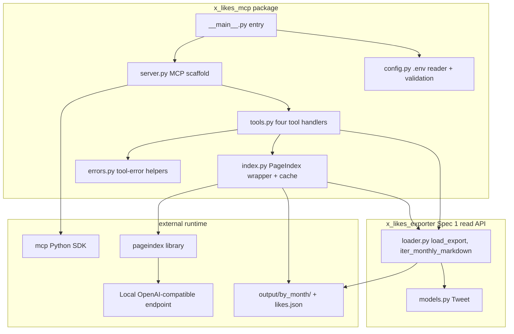
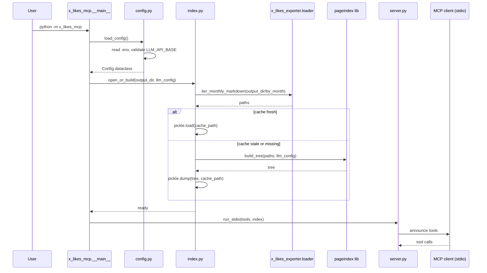
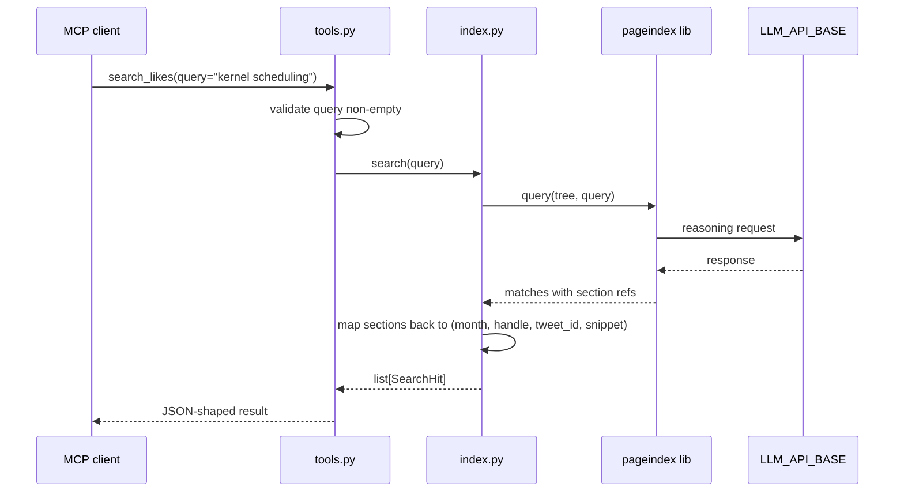

# Design Document

## Overview

This spec puts a stdio MCP server in front of the per-month Markdown the exporter already produces. The server exposes four tools: `search_likes`, `list_months`, `get_month`, `read_tweet`. The first one is the only interesting one. It hands the user's question to PageIndex with a tree built from `output/by_month/likes_YYYY-MM.md`, and PageIndex's reasoning step (an LLM call against a local OpenAI-compatible endpoint configured in `.env`) walks that tree to find matches. The other three are thin file-and-data lookups over the read API from Spec 1.

The server is single-user, local, stdio. No HTTP, no auth, no multi-user concerns. The runtime story is: the user has run `scrape.sh` at least once, has `output/by_month/` and `output/likes.json` on disk, has a local LLM endpoint up (llama.cpp, ollama, vllm, lm-studio — anything OpenAI-compatible), and registers `python -m x_likes_mcp` with their MCP client. After that they can ask their like history questions in natural language.

The tree cache lives next to the export and uses mtime-based invalidation. If any `.md` under `output/by_month/` is newer than the cache, rebuild on next startup. That's the whole policy. No manifest, no checksums, no incremental updates.

I'm putting all of this in a new top-level package `x_likes_mcp/` rather than a single `mcp_server.py` module. Justification: the server has at least four logically separate concerns (config loading, tree cache, PageIndex wrapper, MCP tool surface) that are each small but easier to test in isolation as separate modules. A single file would push the test surface onto monkeypatching internals of a 500-line module. A package gives me clean import seams.

### Goals

- A `python -m x_likes_mcp` invocation on a fresh checkout (after `uv sync` and `scrape.sh`) starts a stdio MCP server with the four tools advertised.
- The four tools work end-to-end against a fixture export, with the LLM call and the PageIndex tree builder mocked. `pytest tests/` passes with no network and no LLM.
- The server consumes Spec 1's `load_export(path)` and `iter_monthly_markdown(path)` exclusively for export reads. It does not reach into `XLikesExporter` or any module under `x_likes_exporter` other than what `__init__.py` exposes.
- A README section documents `.mcp.json` registration plus the two new `.env` variables.

### Non-Goals

- HTTP/SSE transport. Stdio only.
- Re-fetching from X. The server is read-only over existing exports.
- A vector store, embeddings, or any retrieval backend other than PageIndex.
- Multi-user, auth, rate-limiting, telemetry.
- Calls to hosted LLM services by default. The user can point `LLM_API_BASE` at a hosted vendor if they want to; the server doesn't.
- Pre-computing the index in a separate process. Tree build happens in-server on first start (or after invalidation).
- Live filesystem watching. New `.md` files are picked up on server restart, not at runtime.
- Tests that exercise a real local LLM. Real-model verification is a manual step documented in the README.

## Boundary Commitments

### This Spec Owns

- A new top-level Python package `x_likes_mcp/` with the modules described in File Structure Plan.
- The `python -m x_likes_mcp` entry point (via `x_likes_mcp/__main__.py`).
- A new `[project.scripts]` entry `x-likes-mcp = "x_likes_mcp.__main__:main"` in `pyproject.toml`.
- Two new runtime dependencies in `pyproject.toml`: `mcp` (the Python MCP SDK) and `pageindex`. No others.
- The cache file path (`<output_dir>/pageindex_cache.pkl` or equivalent) and the mtime-based invalidation rule.
- Two new `.env` variables (`LLM_API_BASE`, `LLM_API_KEY`) and the corresponding entries in `.env.sample`.
- A README section on registering the server with Claude Code (or any MCP client).
- Tests under `tests/mcp/` (a subdirectory so they're separable from Spec 1's tests in `tests/`).

### Out of Boundary

- Anything `x_likes_exporter` owns: scraper internals, `Tweet`/`User`/`Media` data models, the loader, the formatters, scraper tests. This spec consumes them through the public read API; it does not modify them.
- The `output/by_month/` content. The server reads but never writes per-month Markdown or `likes.json`.
- The `cookies.json` file. The server never touches it.
- HTTP/SSE transport, web UI, multi-user concerns.
- A separate-process indexer. The server builds the tree itself.

### Allowed Dependencies

- Spec 1's public read API: `from x_likes_exporter import load_export, iter_monthly_markdown` and the `Tweet` dataclass it returns.
- `mcp` (Python MCP SDK) for the stdio server scaffold and JSON-schema declarations.
- `pageindex` for tree building and the query-time reasoning step.
- `python-dotenv` is already in the indirect deps story for `scrape.sh` (it's not currently in `[project.dependencies]`; if it isn't, the server will read `.env` with a small hand-rolled loader rather than add a third runtime dep). Decision below: read `.env` with a stdlib loop, no new dep.
- Stdlib only for everything else: `pathlib`, `pickle` (or `json`) for the cache, `os`/`sys`/`logging`, `re`, `argparse`.

### Revalidation Triggers

This spec re-checks if Spec 1 changes any of:

- The signature or return type of `load_export(path)`.
- The signature or return type of `iter_monthly_markdown(path)`.
- The shape of the `Tweet` dataclass or its `to_dict()` output.
- The directory layout under `output/by_month/` (currently `likes_YYYY-MM.md`).
- The package's top-level exports in `x_likes_exporter/__init__.py`.

Conversely, downstream consumers of this spec (none planned) would re-check on:

- Tool name, input schema, or output schema of any of the four tools.
- The `.env` variable names (`LLM_API_BASE`, `LLM_API_KEY`).
- The cache file path or invalidation rule.
- The console script name (`x-likes-mcp`) or module name (`x_likes_mcp`).

## Architecture

### Existing Architecture Analysis

There is no MCP server in the project today. Spec 1 lays the foundation: a `loader.py` module under `x_likes_exporter` exposes `load_export` and `iter_monthly_markdown`, both importable from the package top level, both runnable without a cookies file. This spec is the first consumer of that surface.

The directory layout produced by the existing scraper is fixed: `output/by_month/likes_YYYY-MM.md` plus `output/likes.json`. The Markdown files have `## YYYY-MM` and `### @handle` headings, which is exactly the structure PageIndex's tree builder expects without any pre-processing.

### Architecture Pattern and Boundary Map



The pattern is hub-and-spokes. `__main__` is the entry point. `config` parses `.env`. `index` owns the cache file and the PageIndex object. `tools` is the four handlers. `server` wires `tools` into the MCP SDK. `errors` is a tiny module with two or three helpers for shaping tool errors consistently.

Dependency direction inside the package: `errors` and `config` are leaves. `index` depends on `config` and on `x_likes_exporter.loader`. `tools` depends on `index`, `errors`, and `x_likes_exporter.loader`. `server` depends on `tools` and on the MCP SDK. `__main__` depends on `server` and `config`.

There is no dependency from `x_likes_exporter` to `x_likes_mcp`. The arrow only points one way.

### Technology Stack

| Layer | Choice / Version | Role in Feature | Notes |
|-------|------------------|-----------------|-------|
| Runtime | Python >= 3.12 | Same as the rest of the project. | No version bump. |
| MCP transport | `mcp >= 1.0` (Python SDK) | Stdio server, tool registration, JSON schema declarations. | New runtime dep. Stdio-only; HTTP/SSE not used. |
| Indexing | `pageindex >= 0.1` (or whatever the published version is at impl time) | Tree builder over Markdown files; query-time reasoning step. | New runtime dep. Configured to call the user's local LLM endpoint. |
| LLM client | Whatever PageIndex uses internally (OpenAI-compatible) | Reasoning step inside `search_likes`. | Configured via `LLM_API_BASE` and `LLM_API_KEY`. No new dep on top of what PageIndex already pulls in. |
| `.env` parsing | Stdlib (small hand-rolled loader) | Read two variables on startup. | Avoid pulling in `python-dotenv` for two variables. The loader is ~15 lines, tested directly. |
| Cache | Stdlib `pickle` | Persist the PageIndex tree across restarts. | Acceptable here because the cache file is single-user, local, and never crosses a trust boundary. If PageIndex publishes a serialization format of its own, prefer that and fall back to pickle. |
| Test runner | `pytest >= 8.0` (already pinned by Spec 1) | Test discovery, fixtures. | Reuse Spec 1's `[dependency-groups].dev`. |

Two notes on dep choices:

1. PageIndex's actual API surface and serialization story will be confirmed at impl time. The `Index` wrapper class exists specifically so that swapping PageIndex for an alternative (or vendoring a thin pre-processor in front of it) is a contained change.
2. The MCP SDK is the only sensible choice for a stdio MCP server in Python; the alternative would be hand-rolling JSON-RPC, which is not worth it.

## File Structure Plan

### New files

```
x_likes_mcp/
  __init__.py            # Package marker. Re-exports nothing; consumers run as a process.
  __main__.py            # Entry point: parse args, load config, build server, run stdio loop.
  config.py              # Config dataclass + .env reader. Validates LLM_API_BASE present.
  errors.py              # ToolError exception + helpers for shaping MCP tool errors.
  index.py               # Index class: build/load tree, cache invalidation, search() method.
  tools.py               # Four tool handlers: search_likes, list_months, get_month, read_tweet.
  server.py              # MCP SDK wiring: server name, tool registration, run_stdio entry.

tests/mcp/
  __init__.py
  conftest.py            # Shared fixtures: fake export dir, mock LLM, mock PageIndex.
  fixtures/
    by_month/
      likes_2025-01.md   # Two tweets, one with media, one plain.
      likes_2025-02.md   # One tweet.
    likes.json           # Matches the by_month content above.
  test_config.py
  test_index.py
  test_tools.py
  test_server_integration.py  # End-to-end: spin up the server in-process, drive all four tools.
```

### Modified files

- `pyproject.toml` — add `mcp` and `pageindex` to `[project.dependencies]`; add `x-likes-mcp = "x_likes_mcp.__main__:main"` to `[project.scripts]`; extend `[tool.hatch.build.targets.wheel]` `packages` to include `x_likes_mcp`.
- `.env.sample` — add `LLM_API_BASE` and `LLM_API_KEY` with a comment that the endpoint is OpenAI-compatible and local by default.
- `README.md` — add an "MCP Server" section near the existing usage section: `.mcp.json` snippet, `claude mcp add` example, the four tools, the `.env` requirements, the prerequisite that `scrape.sh` has been run.

Each new module owns one responsibility:
- `config.py` — read `.env`, validate, expose a frozen dataclass.
- `errors.py` — convert internal failures to MCP tool errors with a stable shape.
- `index.py` — build, persist, and query the PageIndex tree.
- `tools.py` — four tool handlers; each is thin and calls into `index` or the read API.
- `server.py` — declare the four tools to the MCP SDK and run the stdio loop.
- `__main__.py` — argv parsing, error printing, exit codes.

## System Flows

### Startup



### `search_likes` happy path



The mapping step in `Index.search` is the place where this design has the most uncertainty. PageIndex returns matches keyed by some representation of where in the tree the match was found (section title, page id, etc.). I need to translate that back to `(month, handle, tweet_id, snippet)`. The plan: when `Index` builds the tree, it also builds a side-table mapping each leaf section to a `Tweet` from `load_export(likes.json)`, keyed on the heading text (`### @handle` plus the date+text bytes so collisions are unlikely). At query time, the side-table turns a PageIndex match into a `SearchHit`. If PageIndex's output shape doesn't make this clean, the side-table grows or the wrapper takes over more of the matching logic.

### `read_tweet` and `list_months` and `get_month`

These three are file-and-data lookups, no diagram needed. `read_tweet` finds the tweet in the in-memory list `Index` already built from `load_export`. `list_months` scans `iter_monthly_markdown` and pairs each path with a count from the in-memory list. `get_month` reads the file off disk after path validation.

## Requirements Traceability

| Requirement | Summary | Components | Interfaces | Flows |
|-------------|---------|------------|------------|-------|
| 1.1 | `python -m x_likes_mcp` starts stdio server. | `__main__`, `server` | stdio entry | Startup |
| 1.2 | Console script `x-likes-mcp` runs the same. | `pyproject.toml`, `__main__` | `[project.scripts]` | n/a |
| 1.3 | Server announces stable name and version. | `server` | MCP SDK init | Startup |
| 1.4 | New deps install cleanly via `uv sync`. | `pyproject.toml` | `[project.dependencies]` | n/a |
| 1.5 | No cookies, no live network on startup. | `config`, `index`, `tools` | startup | Startup |
| 2.1 | `.env` provides `LLM_API_BASE`, `LLM_API_KEY`. | `config` | `load_config` | Startup |
| 2.2 | `OUTPUT_DIR` from `.env` (default `output`). | `config` | `load_config` | Startup |
| 2.3 | Missing `LLM_API_BASE` exits with named error. | `config`, `__main__` | validation | Startup |
| 2.4 | Local OpenAI-compatible endpoint, no hosted by default. | `config`, README | `load_config` + docs | n/a |
| 2.5 | `.env.sample` documents new vars. | `.env.sample` | file change | n/a |
| 3.1 | First start builds and caches PageIndex tree. | `index` | `open_or_build` | Startup |
| 3.2 | Fresh cache reused. | `index` | mtime check | Startup |
| 3.3 | Stale cache rebuilt. | `index` | mtime check | Startup |
| 3.4 | Empty/missing `by_month/` fails loudly. | `index`, `__main__` | startup error | Startup |
| 3.5 | Cache lives under output directory. | `index` | path constant | Startup |
| 4.1 | `search_likes` returns matching tweets. | `tools`, `index` | `search_likes` | search flow |
| 4.2 | Result includes id, month, handle, snippet. | `tools`, `index` | `SearchHit` | search flow |
| 4.3 | Empty query → input-validation error. | `tools` | `search_likes` | n/a |
| 4.4 | LLM failure → tool error, server stays up. | `tools`, `errors` | error path | search flow |
| 4.5 | No matches → empty list, not error. | `tools`, `index` | `SearchHit` list | search flow |
| 4.6 | JSON schema declared. | `server` | tool registration | n/a |
| 5.1 | `list_months` returns months present. | `tools` | `list_months` | n/a |
| 5.2 | Reverse chronological order. | `tools` | `list_months` | n/a |
| 5.3 | Includes path and count when available. | `tools`, `index` | `MonthInfo` | n/a |
| 5.4 | JSON schema declared. | `server` | tool registration | n/a |
| 6.1 | `get_month(year_month)` returns Markdown. | `tools` | `get_month` | n/a |
| 6.2 | Bad format → input-validation error. | `tools` | `get_month` | n/a |
| 6.3 | Missing month → not-found error. | `tools` | `get_month` | n/a |
| 6.4 | JSON schema declared. | `server` | tool registration | n/a |
| 7.1 | `read_tweet(tweet_id)` returns full tweet. | `tools`, `index` | `read_tweet` | n/a |
| 7.2 | Sourced from `likes.json` via Spec 1. | `index` | `load_export` consumption | n/a |
| 7.3 | Unknown id → not-found error. | `tools` | `read_tweet` | n/a |
| 7.4 | Empty/non-numeric id → input-validation error. | `tools` | `read_tweet` | n/a |
| 7.5 | JSON schema declared. | `server` | tool registration | n/a |
| 8.1 | No writes under `by_month/` or `likes.json`. | grep + behavior | n/a | n/a |
| 8.2 | No imports of scraper network paths. | `index`, `tools` | grep-checkable | n/a |
| 8.3 | No `cookies.json` access. | `config`, `index`, `tools` | grep-checkable | n/a |
| 8.4 | LLM calls only via `LLM_API_BASE`. | `index`, PageIndex config | startup | n/a |
| 8.5 | Writes only to `output_dir` cache and stderr. | `index` | path constant | n/a |
| 9.1 | `pytest` runs with no `LLM_API_BASE`, no real HTTP. | tests/mcp, conftest | network guard | n/a |
| 9.2 | LLM and PageIndex tree builder mocked. | conftest | fixtures | n/a |
| 9.3 | Integration test exercises all four tools. | `test_server_integration` | in-process server | end-to-end |
| 9.4 | Real HTTP fails loudly. | conftest | network guard | n/a |
| 9.5 | No cookies in tests. | conftest | grep + behavior | n/a |
| 9.6 | New test deps reuse Spec 1's `dev` group. | `pyproject.toml` | `[dependency-groups].dev` | n/a |
| 10.1 | README documents `.mcp.json` registration. | README | doc | n/a |
| 10.2 | README lists `.env` requirements + `scrape.sh` prereq. | README | doc | n/a |
| 10.3 | README identifies the four tools. | README | doc | n/a |
| 10.4 | README states stdio-only, no hosted by default. | README | doc | n/a |
| 11.1 | Bad startup config → exit non-zero with named error. | `config`, `__main__` | error path | Startup |
| 11.2 | LLM down at runtime → tool error, server alive. | `errors`, `tools` | error path | search flow |
| 11.3 | Filesystem changes picked up on restart. | `index` | mtime check | Startup |
| 11.4 | Bad tool argument → input-validation error. | `tools`, `errors` | error path | n/a |

## Components and Interfaces

| Component | Domain/Layer | Intent | Req Coverage | Key Dependencies | Contracts |
|-----------|--------------|--------|--------------|------------------|-----------|
| `config` | Startup | Read `.env`, validate, hand back a `Config` dataclass. | 2.1, 2.2, 2.3, 2.4, 2.5, 11.1 | stdlib | Service |
| `errors` | Cross-cutting | Tool-error shapes, validation-error helpers. | 4.3, 4.4, 6.2, 6.3, 7.3, 7.4, 11.2, 11.4 | stdlib, MCP SDK error types | Service |
| `index` | Indexing + cache | Build/load PageIndex tree, hold it in memory, expose `search`, hold the in-memory `Tweet` list for ID lookup. | 3.1, 3.2, 3.3, 3.4, 3.5, 4.1, 4.2, 4.5, 7.1, 7.2, 7.3, 8.4, 8.5, 11.3 | `pageindex`, `x_likes_exporter.loader` | Service, State |
| `tools` | MCP tool handlers | Four functions implementing the tools, each with input validation and error shaping. | 4.1-4.6, 5.1-5.4, 6.1-6.4, 7.1-7.5, 11.4 | `index`, `errors`, `x_likes_exporter.loader` | Service |
| `server` | MCP transport | Register tools with the MCP SDK, declare JSON schemas, run the stdio loop. | 1.1, 1.3, 4.6, 5.4, 6.4, 7.5 | `mcp` SDK | Service |
| `__main__` | Entry point | Parse argv, run startup pipeline, print errors, exit codes. | 1.1, 1.2, 11.1 | `config`, `server` | Service |
| `pyproject.toml` change | Project config | Declare new runtime deps and console script. | 1.2, 1.4, 9.6 | n/a | n/a |
| `.env.sample` change | Project config | Document new env vars. | 2.5 | n/a | n/a |
| README change | Docs | Registration with Claude Code, tool overview. | 10.1, 10.2, 10.3, 10.4 | n/a | n/a |

### Startup Layer

#### `config`

| Field | Detail |
|-------|--------|
| Intent | Read `.env`, validate the required variables, return a frozen `Config`. |
| Requirements | 2.1, 2.2, 2.3, 2.4, 2.5, 11.1 |

**Responsibilities and constraints**
- Reads `.env` from the project root (cwd at server startup) if present; otherwise reads from `os.environ` only.
- Validates `LLM_API_BASE` is set and non-empty. Raises `ConfigError` with a message naming the missing variable otherwise.
- Defaults `OUTPUT_DIR` to `output` if absent.
- Returns a `Config` dataclass with `output_dir: Path`, `by_month_dir: Path`, `likes_json: Path`, `cache_path: Path`, `llm_api_base: str`, `llm_api_key: Optional[str]`.
- No side effects beyond reading files.

**Service interface**

```python
# x_likes_mcp/config.py
from dataclasses import dataclass
from pathlib import Path

@dataclass(frozen=True)
class Config:
    output_dir: Path
    by_month_dir: Path
    likes_json: Path
    cache_path: Path
    llm_api_base: str
    llm_api_key: str | None

class ConfigError(Exception):
    pass

def load_config(env_path: Path | None = None, env: dict[str, str] | None = None) -> Config: ...
```

- Preconditions: none. Both arguments default to the project layout.
- Postconditions: returns a fully-populated `Config` or raises `ConfigError`.
- Invariants: `Config` is frozen.

**Implementation notes**
- The `.env` reader is stdlib: split lines, strip comments, parse `KEY=VALUE`, no shell quoting. Fifteen lines at most. The two arguments to `load_config` exist for testability — tests pass an `env` dict and skip the file read.
- `cache_path` is `output_dir / "pageindex_cache.pkl"`.
- `LLM_API_KEY` is optional because some local endpoints don't check it. Empty string and `None` are both acceptable.

### Indexing Layer

#### `index`

| Field | Detail |
|-------|--------|
| Intent | Build or load the PageIndex tree, hold it plus the in-memory `Tweet` list, expose `search` and `lookup_tweet`. |
| Requirements | 3.1, 3.2, 3.3, 3.4, 3.5, 4.1, 4.2, 4.5, 7.1, 7.2, 7.3, 8.4, 8.5, 11.3 |

**Responsibilities and constraints**
- On `open_or_build(config)`:
  1. Call `iter_monthly_markdown(config.by_month_dir)` to enumerate `.md` files. If the iterator yields nothing or the directory is missing, raise `IndexError` (`"output/by_month/ is empty or missing"`).
  2. Compute `newest_md_mtime = max(p.stat().st_mtime for p in paths)`.
  3. If `config.cache_path` exists and `cache_path.stat().st_mtime >= newest_md_mtime`, load the tree via `pickle.load`.
  4. Otherwise, build a fresh tree by calling PageIndex with the list of paths and the LLM config, then `pickle.dump` it to `cache_path`.
  5. Call `load_export(config.likes_json)` and store the result as a `dict[str, Tweet]` keyed on `tweet.id`.
- Exposes `search(query: str) -> list[SearchHit]` which delegates to PageIndex and maps results to `SearchHit` via the side-table built at index-build time.
- Exposes `lookup_tweet(tweet_id: str) -> Tweet | None`.
- Exposes `list_months() -> list[MonthInfo]` returning months in reverse chronological order with path and count.
- Exposes `get_month_markdown(year_month: str) -> str | None` reading the file off disk after pattern validation lives in the caller.

**Service interface**

```python
# x_likes_mcp/index.py
from dataclasses import dataclass
from pathlib import Path
from x_likes_exporter import Tweet

@dataclass(frozen=True)
class SearchHit:
    tweet_id: str
    year_month: str
    handle: str
    snippet: str

@dataclass(frozen=True)
class MonthInfo:
    year_month: str
    path: Path
    tweet_count: int | None

class IndexError(Exception):
    pass

class Index:
    @classmethod
    def open_or_build(cls, config: "Config") -> "Index": ...
    def search(self, query: str) -> list[SearchHit]: ...
    def lookup_tweet(self, tweet_id: str) -> Tweet | None: ...
    def list_months(self) -> list[MonthInfo]: ...
    def get_month_markdown(self, year_month: str) -> str | None: ...
```

- Preconditions for `open_or_build`: `config.by_month_dir` exists, contains at least one `likes_YYYY-MM.md`, and `config.likes_json` exists.
- Postconditions: returns an `Index` whose `search`, `lookup_tweet`, etc. all work without further setup.
- Invariants: `Index` is read-only after construction; methods do not mutate the tree or the tweet map.

**Implementation notes**
- The PageIndex call is wrapped in a single private method `_build_tree(paths, llm_config)`. The wrapper takes paths, returns a `Tree` object, and has zero other responsibilities. This is the seam tests mock at the unit-test layer.
- Cache invalidation is mtime-only. The cache file is rewritten atomically (write to `.tmp`, then `os.replace`) so a crash mid-write doesn't corrupt the cache.
- The side-table is built during `_build_tree`. It maps each leaf section in the PageIndex tree to a `Tweet` via heading text. If a heading can't be matched (handle is missing, e.g. for a "deleted" tweet), the entry is skipped; `search` returns it without a tweet-id mapping (the snippet is still useful).
- `list_months` derives `tweet_count` by grouping the in-memory tweet list by month using `Tweet.get_created_datetime()`. If the tweet's `created_at` doesn't parse, the tweet is grouped under `"unknown"` and excluded from the month list (consistent with how the formatter handles it). If counts can't be derived for any reason, `tweet_count` is `None` (Requirement 5.3 explicitly allows this).
- `get_month_markdown` is a one-liner: `(self.config.by_month_dir / f"likes_{year_month}.md").read_text()`. The pattern check stays in `tools` so `Index` doesn't need to know about user input shape.

### Tool Handlers

#### `tools`

| Field | Detail |
|-------|--------|
| Intent | Four MCP tool handlers. Each validates input, calls into `Index`, shapes the response. |
| Requirements | 4.1-4.6, 5.1-5.4, 6.1-6.4, 7.1-7.5, 11.4 |

**Responsibilities and constraints**
- Each handler is a single function that takes a typed dict (the parsed MCP tool arguments) and returns a typed dict (the MCP tool result).
- Input validation lives here, not in `Index`. Pattern checks (`^\d{4}-\d{2}$` for `year_month`, non-empty trimmed string for `query`, numeric string for `tweet_id`) raise `ToolError` from `errors.py`.
- The MCP SDK's tool-call dispatcher catches `ToolError` and returns a tool-error response; other exceptions are caught at the boundary in `server.py` and converted to a generic tool error so the server doesn't crash.

**Service interface**

```python
# x_likes_mcp/tools.py
from .index import Index, SearchHit, MonthInfo

def search_likes(index: Index, query: str) -> list[dict]: ...
def list_months(index: Index) -> list[dict]: ...
def get_month(index: Index, year_month: str) -> str: ...
def read_tweet(index: Index, tweet_id: str) -> dict: ...
```

- Preconditions: `index` is a built `Index`. Arguments are whatever MCP delivered.
- Postconditions: each handler returns a JSON-serializable shape that matches the declared output schema.
- Invariants: handlers do not mutate `index`.

**Implementation notes**
- `search_likes` returns `[{"tweet_id": "...", "year_month": "...", "handle": "...", "snippet": "..."}, ...]`.
- `list_months` returns `[{"year_month": "...", "path": "...", "tweet_count": N}, ...]` in reverse chronological order. `tweet_count` may be `null`.
- `get_month` returns the raw Markdown string. The MCP SDK's `TextContent` wrapping happens in `server.py`.
- `read_tweet` returns `{"tweet_id": ..., "handle": ..., "display_name": ..., "text": ..., "created_at": ..., "view_count": ..., "like_count": ..., "retweet_count": ..., "url": ...}`. Fields the source `Tweet` doesn't have are omitted, not nulled.

### Errors Layer

#### `errors`

| Field | Detail |
|-------|--------|
| Intent | One exception class for tool-level failures plus helpers for the three error categories. |
| Requirements | 4.3, 4.4, 6.2, 6.3, 7.3, 7.4, 11.2, 11.4 |

**Service interface**

```python
# x_likes_mcp/errors.py

class ToolError(Exception):
    def __init__(self, category: str, message: str): ...

def invalid_input(field: str, message: str) -> ToolError: ...
def not_found(what: str, identifier: str) -> ToolError: ...
def upstream_failure(detail: str) -> ToolError: ...
```

- The three categories are `"invalid_input"`, `"not_found"`, `"upstream_failure"`. They show up in the MCP error response so the calling LLM has enough context to react.

### MCP Transport Layer

#### `server`

| Field | Detail |
|-------|--------|
| Intent | Wire `tools` into the MCP SDK with JSON schemas, run the stdio loop. |
| Requirements | 1.1, 1.3, 4.6, 5.4, 6.4, 7.5 |

**Responsibilities and constraints**
- Construct an MCP `Server` instance with name `"x-likes-mcp"` and version pulled from `x_likes_mcp.__version__` (defined in `__init__.py`).
- Register the four tools with their input/output JSON schemas. Schemas are declared inline as Python dicts; pattern strings (`^\d{4}-\d{2}$`, etc.) match the tool-handler validation.
- Catch `ToolError` from the handlers and convert to MCP error responses. Catch other exceptions at the boundary, log to stderr, and return a generic upstream-failure tool error so the process stays alive (Requirement 11.2).
- Run `await server.run_stdio()` (or whatever the SDK's stdio entry point is at impl time).

**Implementation notes**
- The `Server` instance is constructed once in `server.py:build_server(index)` and the entry point is `server.py:run(index)` which calls the SDK's stdio runner. `__main__.py` calls `run(index)` after `Index.open_or_build` returns.
- The exact MCP SDK API (decorator-based vs. method-registration) will be confirmed at impl time. The Components table above abstracts over that detail; the contract is "four tools registered, JSON schemas declared, stdio loop runs."

### Entry Point

#### `__main__`

| Field | Detail |
|-------|--------|
| Intent | Argv parsing (none expected for v1), startup pipeline, exit codes. |
| Requirements | 1.1, 1.2, 11.1 |

**Implementation notes**
- `def main() -> int:` returns `0` on clean shutdown, non-zero on startup failure. Exposed as the `[project.scripts]` target.
- `if __name__ == "__main__": sys.exit(main())` at the bottom so `python -m x_likes_mcp` works.
- Startup failures (`ConfigError`, `IndexError`, `FileNotFoundError` on `likes.json`) are caught at the top of `main`, printed to stderr in a single line, and `main` returns `2`. Successful startup runs the SDK's stdio loop until disconnect.

## Data Models

This spec does not own any persistent data models. It consumes Spec 1's `Tweet` dataclass as the in-memory representation.

The two new dataclasses (`SearchHit`, `MonthInfo`) are purely the wire shape of two of the four tool responses. Their fields map directly to the JSON schema declared in `server.py`.

The cache file is a pickled PageIndex tree object plus the side-table that maps tree leaves to `Tweet.id`. The exact pickled shape is determined by PageIndex; the wrapper persists the tuple `(tree, side_table)` rather than the tree alone.

## Error Handling

### Categories

- **Startup errors** (`ConfigError`, `IndexError`, `FileNotFoundError` on `likes.json`): printed to stderr, process exits with code 2. The user gets a single line naming the failing condition (Requirement 11.1).
- **Input validation** (`ToolError(category="invalid_input", ...)`): MCP error response, server stays up. Used by all four tools for shape checks (Requirements 4.3, 6.2, 7.4, 11.4).
- **Not found** (`ToolError(category="not_found", ...)`): MCP error response, server stays up. Used by `get_month` and `read_tweet` for missing entities (Requirements 6.3, 7.3).
- **Upstream failure** (`ToolError(category="upstream_failure", ...)`): MCP error response, server stays up. Used when PageIndex raises, when the LLM call fails, or when any other unexpected exception bubbles up to the boundary (Requirements 4.4, 11.2).

### Strategy

The boundary that converts exceptions to tool errors is the per-tool wrapper in `server.py`. The pattern is:

```python
async def call_tool(name: str, arguments: dict) -> ToolResult:
    try:
        return dispatch(name, arguments)
    except ToolError as e:
        return mcp_error_result(e.category, str(e))
    except Exception as e:
        logger.exception("Unhandled error in tool %s", name)
        return mcp_error_result("upstream_failure", "internal error; see server logs")
```

The startup pipeline in `__main__.main` has its own boundary: catch `ConfigError`, `IndexError`, `FileNotFoundError`, print to stderr, return non-zero. Other exceptions during startup are not caught — they crash the process and the user sees the traceback, which is the right outcome for a bug rather than a misconfiguration.

## Testing Strategy

Tests live under `tests/mcp/` so they're separable from Spec 1's tests. Each test file targets one source module.

### Unit tests

- `test_config.py` — `load_config` with a `.env` fixture, `load_config` with env-only, missing `LLM_API_BASE` raises `ConfigError` naming the variable, default `OUTPUT_DIR` is `output`. Covers Requirements 2.1, 2.2, 2.3, 11.1.
- `test_index.py` — `Index.open_or_build` with mocked PageIndex tree builder against the fixture export directory. Cache hit (cache mtime newer than all `.md`), cache miss (one `.md` mtime newer than cache), cache absent (first build). `search` returns `SearchHit` objects via the mocked tree's matches. `lookup_tweet` for present and absent IDs. `list_months` order. Covers 3.1, 3.2, 3.3, 3.5, 4.5, 7.1, 7.2, 7.3, 5.1, 5.2.
- `test_tools.py` — each handler with a mocked `Index`. Empty query → `ToolError("invalid_input")`. Bad `year_month` → `ToolError("invalid_input")`. Missing `year_month` file → `ToolError("not_found")`. Empty `tweet_id` → `ToolError("invalid_input")`. Unknown `tweet_id` → `ToolError("not_found")`. Successful happy paths for each tool. Covers 4.1, 4.2, 4.3, 4.5, 5.1, 5.3, 6.1, 6.2, 6.3, 7.1, 7.3, 7.4, 11.4.
- `test_index.py::test_empty_by_month_raises` — `Index.open_or_build` against a directory with no `.md` files raises `IndexError`. Covers 3.4.

### Integration test

- `test_server_integration.py` — start the MCP server in-process against the fixture export dir, call each of the four tools through the SDK's tool-call interface, assert the responses. Mock the LLM call (the function `Index._build_tree` resolves to during this test) so no real HTTP. Covers 1.1, 1.3, 1.5, 4.6, 5.4, 6.4, 7.5, 9.3.

### Fixtures

`tests/mcp/fixtures/by_month/` contains two small `.md` files generated by hand to match the layout the formatter produces (`## YYYY-MM`, `### @handle`, the per-tweet block). `tests/mcp/fixtures/likes.json` has three tweets matching the Markdown content. The fixtures are small (under 100 lines total) and checked into the repo.

### Network and LLM guard

`tests/mcp/conftest.py` does two things:

1. An autouse fixture that monkeypatches the LLM-call entry point in PageIndex (or in `Index._build_tree` if that's cleaner) to raise an explicit `RealLLMCallAttempted` exception. This is the equivalent of Spec 1's `responses` strict-mode guard. Requirement 9.1, 9.2, 9.4.
2. An autouse fixture that asserts `cookies.json` is never read by patching `Path.open` against the cookies path or by setting an env variable that `Config` honors. Requirement 9.5.

### Real-model verification (manual)

The README documents how to verify against a real local LLM: start a llama.cpp/ollama server, set `LLM_API_BASE`, run the MCP server, register with Claude Code, ask a question. Not gated in CI. Documented as a manual step (Requirement 9.1's "no real HTTP" applies to CI; the manual path is allowed).

## Notes on Spec 1's read API surface

Going through this design, two things stand out about Spec 1's contract that are worth flagging back rather than working around here:

1. **`load_export` returns `list[Tweet]`, not a `dict[str, Tweet]`.** This spec needs ID-keyed lookup for `read_tweet`, so `Index` builds the dict itself in `open_or_build`. That's fine for now (one consumer, one place), but if a second consumer wanted ID lookup too, a `load_export(...)` variant or a small `index_by_id(tweets)` helper next to it would avoid duplication. Filing as Spec 1 feedback, not bolting on here.
2. **`iter_monthly_markdown` doesn't expose a count or a parsed `(year, month)` per file.** This spec re-parses `likes_YYYY-MM.md` from the path with a regex inside `Index.list_months`. That's a four-line regex; not a problem. But a richer return type (e.g. a `MonthlyExport` namedtuple with `path`, `year_month`, optional `tweet_count`) would let consumers skip the parse. Filing as Spec 1 feedback.

Neither of these blocks this spec. Both go on the Spec 1 follow-up list.

## Security

Single-user local tool. No auth, no multi-user concerns. Two safety properties:

- Test fixtures contain no real credentials. The fixture `likes.json` and the per-month Markdown are hand-built with `@test_user` style placeholders.
- The server never reads `cookies.json`, never imports a network code path from `x_likes_exporter` that hits X, and never calls a hosted LLM service unless the user explicitly points `LLM_API_BASE` at one.

The pickle cache is a known concern in general but acceptable here: the cache file is single-user, single-machine, written by this server, never crosses a trust boundary. If PageIndex publishes a JSON or other safer serialization at impl time, prefer that.

## Performance and Scalability

Out of scope as a performance feature. Two notes:

- Cache hit cost is dominated by `pickle.load`. For a typical export size (a few thousand tweets, a few hundred months), this is sub-second.
- Cache miss cost is dominated by PageIndex's tree build, which is itself dominated by the LLM calls PageIndex makes during build. The user pays this cost once after each new monthly Markdown lands.

If startup latency becomes a real problem at much larger export sizes, per-month tree caching (one cache file per `.md`) is the obvious next move. Not in scope here.

## Open Questions and Risks

- **PageIndex API stability.** The exact shape of PageIndex's tree-build and query functions is the biggest unknown. The `Index` wrapper exists to absorb that. If at impl time PageIndex's interface looks meaningfully different, the wrapper grows; the four tool handlers don't change.
- **Tree-leaf to tweet-id mapping.** The side-table approach assumes PageIndex returns enough information per match to identify the source section. If it returns only a synthesized answer, the wrapper has to do more work — for example, asking PageIndex to also return the matching node's heading path, then matching that against the in-memory tweet list. Plan B is to ask PageIndex's reasoning step to include tweet IDs in its output prompt template. Both are fine; the design doesn't pin down which.
- **MCP SDK version churn.** The MCP Python SDK is young. Pinning a minor version (`mcp>=1.0,<2.0`) is the v1 plan. If the SDK ships a breaking change, this spec re-checks.
- **Empty `output/by_month/` after a fresh checkout.** A user who clones the repo but hasn't run `scrape.sh` will hit Requirement 3.4 on first `python -m x_likes_mcp`. The error message is the documentation: "output/by_month/ is empty or missing — run scrape.sh first." Not a UX problem worth designing around.
- **`.env` parsing without `python-dotenv`.** A 15-line stdlib loader is fine for two variables. If `.env` ever grows to need shell-quote handling, multi-line values, or variable interpolation, switch to `python-dotenv`. Today, no.
