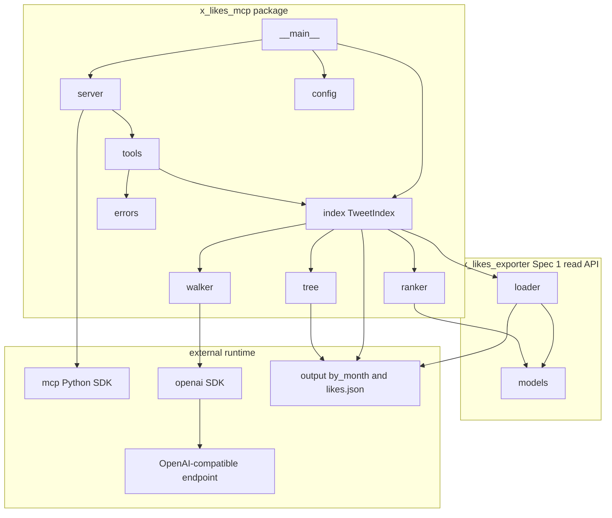
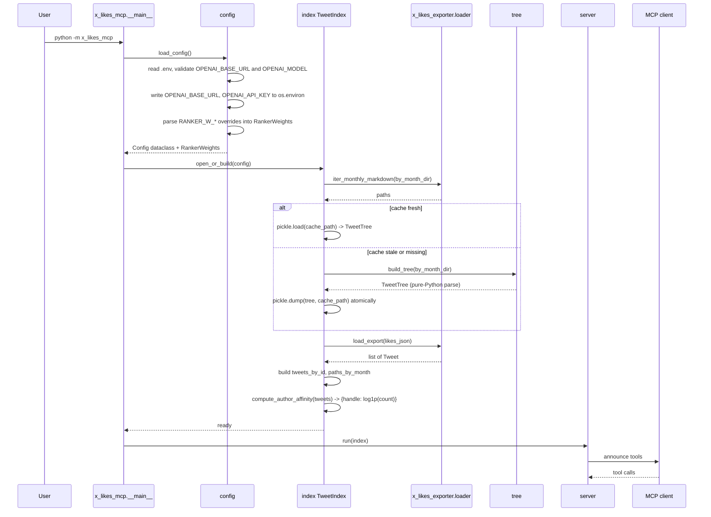
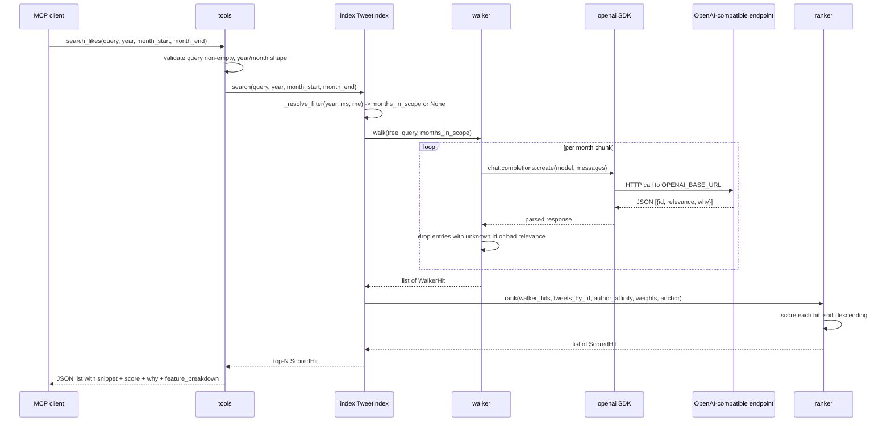

# Design Document

## Overview

This spec puts a stdio MCP server in front of the per-month Markdown the exporter already produces. The server exposes four tools: `search_likes`, `list_months`, `get_month`, `read_tweet`. `search_likes` is the only one with reasoning behind it. It parses the per-month Markdown into a tree, walks the in-scope months with a local LLM (one chat-completions call per chunk of N tweets), and ranks the surviving hits with a heavy-ranker-feature-shape weighted combiner. The other three are file-and-data lookups over the read API from Spec 1.

The reasoning step calls the OpenAI Python SDK directly, pointed at the user's local OpenAI-compatible endpoint via `OPENAI_BASE_URL`, `OPENAI_API_KEY`, `OPENAI_MODEL`. The OpenAI SDK reads `OPENAI_BASE_URL` and `OPENAI_API_KEY` from `os.environ` when constructing its client. `config.load_config` writes both into `os.environ` before any walker call. No bridge layer.

The server is single-user, local, stdio. No HTTP, no auth, no multi-user concerns. Runtime story: the user has run `scrape.sh` at least once, has `output/by_month/` and `output/likes.json` on disk, has a local OpenAI-compatible endpoint up, and registers `python -m x_likes_mcp` with their MCP client. Then they can ask their like history questions in natural language.

The `search_likes` filter (`year`, `month_start`, `month_end`) is a structured pre-filter, not a prose hint. It narrows the set of months handed to the walker before any LLM call. This is faster (fewer chunks) and more reliable (the LLM cannot quietly ignore a date phrased in the prompt) than the prose-only alternative.

The tree cache lives next to the export and uses mtime-based invalidation. If any `.md` under `output/by_month/` is newer than the cache, rebuild on next startup. That is the whole policy. No manifest, no checksums, no incremental updates.

## Why this approach (and not PageIndex, embeddings, or a port of twitter/the-algorithm)

I sized up three alternatives before landing here.

**PageIndex (the PyPI package, version 0.2.8).** The README sells reasoning-based tree walking, which fits the data shape. The actual package is a thin client for the hosted service at `api.pageindex.ai` — it posts your documents to a third party. Single-user local tool, no third parties. So it is out as a dependency, but the shape it implies (parse to tree, walk with reasoning) is the right shape for this data. I am keeping the shape and writing the three modules myself.

**Embeddings + MMR.** I tried this first on a smaller corpus. Cosine similarity over BGE embeddings finds semantically-near tweets, but on one person's likes the ranking is flat — every other tweet about the same topic scores within a few percent. MMR helps with diversity without fixing the ordering. The conclusion: similarity alone, on an already-curated set, does not produce useful ranking.

**A port of `twitter/the-algorithm`.** The repo is the open-sourced heavy ranker plus all the infrastructure feeding it. Most of that infrastructure (real-graph, SimClusters, TwHIN, the candidate generators, the GraphJet engine) needs Twitter-scale data and Twitter-scale compute. None of it is portable to one person's archive. What is portable is the **feature shape**: a weighted sum of engagement counts (favorite, retweet, reply, view), an author-affinity term, recency decay, plus small boosts for verified authors and tweets with media. Those are the features the heavy ranker uses, and every one of them is already on the `Tweet` objects from Spec 1's loader.

So: walker for "is this plausibly relevant to the question," ranker for "how much should I care about this hit." The walker uses the LLM because relevance judgment is qualitative. The ranker is pure arithmetic because once relevance is decided, ordering by engagement and affinity is deterministic and deterministic is cheaper, faster, and tunable.

### Goals

- A `python -m x_likes_mcp` invocation on a fresh checkout (after `uv sync` and `scrape.sh`) starts a stdio MCP server with the four tools advertised.
- All four tools work end-to-end against a fixture export, with the walker mocked. `pytest tests/mcp/` passes with no network and no real LLM.
- `search_likes(query, year=2025, month_start="04", month_end="06")` only walks `likes_2025-04.md`, `likes_2025-05.md`, `likes_2025-06.md` — three months of LLM calls, not 26 months.
- The server consumes Spec 1's `load_export(path)` and `iter_monthly_markdown(path)` exclusively for export reads.
- A README section documents `.mcp.json` registration, the OpenAI env vars, and the ranker weight env vars.

### Non-Goals

- HTTP/SSE transport. Stdio only.
- Re-fetching from X. Read-only over existing exports.
- The PageIndex PyPI package (replaced by our own implementation).
- Vector embeddings, MMR, BGE-style similarity ranking.
- Real-graph features, SimClusters, TwHIN, anything that needs Twitter-scale infrastructure.
- Multi-user, auth, rate limiting, telemetry.
- Calls to hosted LLM services by default.
- Pre-computing the index in a separate process.
- Live filesystem watching. New `.md` files are picked up on server restart.
- Tests that exercise a real local LLM. Real-model verification is a manual step in the README.

## Boundary Commitments

### This Spec Owns

- A new top-level Python package `x_likes_mcp/` with the modules described in File Structure Plan.
- The `python -m x_likes_mcp` entry point (via `x_likes_mcp/__main__.py`).
- A `[project.scripts]` entry `x-likes-mcp = "x_likes_mcp.__main__:main"` in `pyproject.toml`.
- Two runtime dependencies in `pyproject.toml`: `mcp` (the Python MCP SDK) and `openai` (called directly by the walker).
- The cache file path (`<output_dir>/tweet_tree_cache.pkl`) and the mtime-based invalidation rule.
- Three OpenAI-compatible `.env` variables (`OPENAI_BASE_URL`, `OPENAI_API_KEY`, `OPENAI_MODEL`), nine `RANKER_W_*` overrides, one `RANKER_RECENCY_HALFLIFE_DAYS`, and the corresponding entries in `.env.sample`.
- A README section on registering the server with Claude Code (or any MCP client).
- Tests under `tests/mcp/` (a subdirectory so they are separable from Spec 1's tests in `tests/`).
- The narrowly-scoped change to `x_likes_exporter/formatters.py:MarkdownFormatter.export` already shipped in this spec's task 1.1 (the `omit_global_header` parameter). That task is complete; documenting it here for traceability.

### Out of Boundary

- Anything else `x_likes_exporter` owns: scraper internals, `Tweet`/`User`/`Media` data models, the loader, other formatters, scraper tests. This spec consumes them through the public read API; it does not modify them.
- The `output/by_month/` content. The server reads but never writes per-month Markdown or `likes.json`.
- The `cookies.json` file. The server never touches it.
- HTTP/SSE transport, web UI, multi-user concerns.

### Allowed Dependencies

- Spec 1's public read API: `from x_likes_exporter import load_export, iter_monthly_markdown` and the `Tweet` / `User` / `Media` dataclasses it returns.
- `mcp` (Python MCP SDK) for the stdio server scaffold and JSON-schema declarations.
- `openai` (the OpenAI Python SDK) for the walker's chat-completions call.
- Stdlib for everything else: `pathlib`, `pickle` for the cache, `os`/`sys`/`logging`, `re`, `argparse`, `math`, `datetime`, `json`.
- A small hand-rolled `.env` loader (no `python-dotenv` dependency) because `scrape.sh` does not currently depend on it either.

### Revalidation Triggers

This spec re-checks if Spec 1 changes any of:

- The signature or return type of `load_export(path)`.
- The signature or return type of `iter_monthly_markdown(path)`.
- The shape of the `Tweet` dataclass or its `to_dict()` output, especially the engagement fields (`favorite_count`, `retweet_count`, `reply_count`, `view_count`), the `created_at` parser contract, and the `User.screen_name` / `User.verified` / `Media` shape.
- The directory layout under `output/by_month/` (currently `likes_YYYY-MM.md`).
- The package's top-level exports in `x_likes_exporter/__init__.py`.

Conversely, downstream consumers of this spec (none planned today) would re-check on:

- Tool name, input schema, or output schema of any of the four tools, including the `search_likes` filter fields and the `ScoredHit` shape.
- The `.env` variable names or the OpenAI SDK env-var contract.
- The cache file path or invalidation rule.
- The console script name (`x-likes-mcp`) or module name (`x_likes_mcp`).

## Architecture

### Existing Architecture Analysis

There is no MCP server in the project today. Spec 1 lays the foundation: `x_likes_exporter.loader` exposes `load_export` and `iter_monthly_markdown`, both importable from the package top level, both runnable without a cookies file. This spec is the first consumer of that surface.

The directory layout produced by the existing scraper is fixed: `output/by_month/likes_YYYY-MM.md` plus `output/likes.json`. Per-file h1 has already been dropped (this spec's task 1.1, complete). So `## YYYY-MM` is the effective top of each per-month file and the per-tweet sections start at `### [@handle]`.

The `.sentrux/rules.toml` boundary model puts `x_likes_exporter/loader.py` in the `io` layer and forbids it from depending on cookies, auth, client, exporter, or downloader. The new `x_likes_mcp/` package lives at the project top level alongside `x_likes_exporter/`, not inside it, so no sentrux rule applies. The dependency arrow goes one way: `x_likes_mcp` imports from `x_likes_exporter`, never the reverse.

### Architecture Pattern and Boundary Map



The pattern is hub-and-spokes. `__main__` is the entry point. `config` parses `.env`. `index` (the `TweetIndex` orchestrator) owns the cache file, the `TweetTree`, the in-memory `Tweet` map, and the precomputed `author_affinity` map. `tools` is the four handlers. `server` wires `tools` into the MCP SDK. `errors` is a small module with the tool-error helpers. `tree`, `walker`, `ranker` are the three new purpose-built modules.

Dependency direction inside the package: `errors` and `config` are leaves. `tree` depends on stdlib and on `Tweet`/`Media` shapes (read-only). `ranker` depends on `Tweet` and on `walker.WalkerHit`. `walker` depends on `tree.TreeNode`, the OpenAI SDK, and `config` for the model name. `index` depends on `config`, `x_likes_exporter.loader`, `tree`, `walker`, `ranker`. `tools` depends on `index` and `errors`. `server` depends on `tools` and the MCP SDK. `__main__` depends on `server`, `config`, `index`.

The walker is the single LLM call site. No other module imports the OpenAI SDK.

### Technology Stack

| Layer | Choice / Version | Role | Notes |
|-------|------------------|------|-------|
| Runtime | Python >= 3.12 | Same as the rest of the project. | No version bump. |
| MCP transport | `mcp >= 1.0` (Python SDK) | Stdio server, tool registration, JSON schema declarations. | Runtime dep. Stdio-only. |
| LLM client | `openai >= 1.0` | The walker's chat-completions call. Reads `OPENAI_BASE_URL` and `OPENAI_API_KEY` from `os.environ` at client-construction time. | Runtime dep. Direct, not wrapped. |
| `.env` parsing | Stdlib | Read env on startup. | ~15 lines, tested directly. Avoids `python-dotenv`. |
| Cache | Stdlib `pickle` | Persist the `TweetTree` across restarts. | Single-user, local, never crosses a trust boundary. |
| Test runner | `pytest >= 8.0` (already pinned by Spec 1) | Test discovery, fixtures. | Reuse Spec 1's `[dependency-groups].dev`. |

## File Structure Plan

### New files

```
x_likes_mcp/
  __init__.py            # Package marker. Defines __version__.
  __main__.py            # Entry point: load config, build index, run stdio loop, exit codes.
  config.py              # Config dataclass + .env reader. Validates OpenAI env vars present.
  errors.py              # ToolError exception + category helpers.
  tree.py                # build_tree, TreeNode, TweetTree. Pure-Python markdown parser.
  walker.py              # walk(tree, query, months_in_scope) -> list[WalkerHit]. The LLM call site.
  ranker.py              # rank(walker_hits, tweets_by_id, author_affinity, weights, now) -> list[ScoredHit]. Pure function.
  index.py               # TweetIndex: open_or_build, search, lookup_tweet, list_months, get_month_markdown.
  tools.py               # Four tool handlers: search_likes, list_months, get_month, read_tweet.
  server.py              # MCP SDK wiring: server name, tool registration, run_stdio entry.

tests/mcp/
  __init__.py
  conftest.py            # Shared fixtures: fake export dir, walker mock, network guard.
  fixtures/
    by_month/
      likes_2025-01.md   # Two tweets, one with media reference, one plain. No global h1.
      likes_2025-02.md   # One tweet. No global h1.
      likes_2025-03.md   # One tweet. Used to exercise three-month range filtering.
    likes.json           # Matches the by_month content above.
  test_config.py
  test_tree.py
  test_walker.py
  test_ranker.py
  test_index.py
  test_tools.py
  test_server_integration.py
```

### Modified files

- `pyproject.toml` — drop `pageindex` from `[project.dependencies]`, add `openai>=1.0`. `mcp` stays. Console script and wheel-packages config already in place.
- `.env.sample` — add the three OpenAI variables and the `RANKER_W_*` plus `RANKER_RECENCY_HALFLIFE_DAYS` lines with comments.
- `README.md` — add an "MCP Server" section: `.mcp.json` snippet, `claude mcp add` example, the four tools, the `.env` requirements, the prerequisite that `scrape.sh` has been run.
- `x_likes_exporter/formatters.py` — already modified in this spec's task 1.1 (`omit_global_header` parameter). No further change.
- `x_likes_exporter/exporter.py` — already modified in this spec's task 1.1 (passes `omit_global_header=True` from the per-month branch). No further change.
- `tests/test_formatters.py` — already updated in this spec's task 1.2. No further change.

Each new module owns one responsibility:
- `config.py` — read `.env`, validate, expose a frozen dataclass. (Implemented; task 2.1.)
- `errors.py` — convert internal failures to MCP tool errors with a stable shape. (Implemented; task 2.2.)
- `tree.py` — parse per-month Markdown into `TweetTree`. Pure I/O + regex.
- `walker.py` — run the per-month LLM walk. The only LLM call site.
- `ranker.py` — combine walker hits + features into ranked `ScoredHit` list. Pure function.
- `index.py` — `TweetIndex` orchestrator. Owns the cache, the Tweet map, `author_affinity`. Calls walker → ranker on `search`.
- `tools.py` — four tool handlers; each is thin and calls into `TweetIndex`.
- `server.py` — declare the four tools to the MCP SDK and run the stdio loop.
- `__main__.py` — argv parsing (none expected for v1), error printing, exit codes.

## System Flows

### Startup



### `search_likes` happy path with structured filter



The structured-filter step is the place this design adds work over a naive walk-everything pass. `_resolve_filter` returns either a list of `YYYY-MM` strings or `None` (meaning all months). The walker iterates only those months; if `None`, it iterates every month in `tree.nodes_by_month`.

### Filter validation

`year` is an `int` between 2006 (X launch year) and the current year, or `None`. `month_start` and `month_end` are zero-padded `MM` strings (`"01"` through `"12"`) or `None`. Validation rules:

- If `month_start` is set, `year` must also be set; otherwise `invalid_input`.
- If `month_end` is set, `month_start` must also be set; otherwise `invalid_input`.
- If both `month_start` and `month_end` are set, `month_start <= month_end`; otherwise `invalid_input`.
- If only `year` is set (no months), the filter spans the whole year.
- If `year` and `month_start` are set but `month_end` is not, the filter is the single month `year-month_start`.

These rules keep the schema declarable as four optional fields without an explicit "range" object.

### `read_tweet`, `list_months`, `get_month`

These three are file-and-data lookups, no diagram needed. `read_tweet` finds the tweet in the in-memory dict `TweetIndex` built from `load_export`. `list_months` consults `paths_by_month` and pairs each path with a count from the in-memory list. `get_month` reads the file off disk after pattern validation.

## Components and Interfaces

| Component | Domain/Layer | Intent | Req Coverage | Key Dependencies | Contracts |
|-----------|--------------|--------|--------------|------------------|-----------|
| `config` | Startup | Read `.env`, validate, hand back a `Config` + `RankerWeights`. Write OpenAI env vars to `os.environ`. | 2.1, 2.2, 2.3, 2.4, 2.5, 2.6, 2.7, 13.1 | stdlib | Service |
| `errors` | Cross-cutting | Tool-error shapes, category helpers. | 6.3, 6.5, 8.2, 8.3, 9.3, 9.4, 13.2, 13.4 | stdlib | Service |
| `tree` | Parsing | Parse per-month Markdown into `TweetTree`. Pure I/O + regex. | 3.1, 3.6 | stdlib | Service |
| `walker` | LLM call site | Per-month LLM walk returning `WalkerHit` list. | 4.1, 4.2, 4.3, 4.4, 4.5, 4.6, 6.1, 6.6 | `openai` SDK, `tree`, `config` | Service |
| `ranker` | Ranking | Pure-function weighted combiner. | 5.1, 5.2, 5.3, 5.4, 5.5, 5.6, 5.7, 6.4 | `Tweet`, `walker.WalkerHit` | Service |
| `index` | Indexing + cache | Build/load `TweetTree`, hold it plus the `Tweet` dict and `author_affinity`, expose `search`, `lookup_tweet`, `list_months`, `get_month_markdown`. | 3.1, 3.2, 3.3, 3.4, 3.5, 6.1, 6.2, 6.7, 9.1, 9.2, 9.3, 10.4, 10.5, 13.3 | `tree`, `walker`, `ranker`, `x_likes_exporter.loader` | Service, State |
| `tools` | MCP tool handlers | Four functions implementing the tools, each with input validation and error shaping. | 6.1-6.8, 7.1-7.4, 8.1-8.4, 9.1-9.5, 13.4 | `index`, `errors` | Service |
| `server` | MCP transport | Register tools with the MCP SDK, declare JSON schemas, run stdio loop, convert exceptions. | 1.1, 1.3, 6.6, 6.8, 7.4, 8.4, 9.5 | `mcp` SDK | Service |
| `__main__` | Entry point | Run startup pipeline, print errors, exit codes. | 1.1, 1.2, 13.1 | `config`, `index`, `server` | Service |
| `pyproject.toml` change | Project config | Drop `pageindex`, add `openai`. | 1.4, 11.6 | n/a | n/a |
| `.env.sample` change | Project config | Document env vars (OpenAI + ranker weights). | 2.7 | n/a | n/a |
| README change | Docs | Registration with Claude Code, tool overview. | 12.1, 12.2, 12.3, 12.4 | n/a | n/a |

### Startup Layer

#### `config`

Already implemented in task 2.1. The dataclass and loader are in `x_likes_mcp/config.py`. This spec extends it with ranker-weight parsing.

| Field | Detail |
|-------|--------|
| Intent | Read `.env`, validate the required variables, return a frozen `Config` + `RankerWeights`, propagate the OpenAI env vars into `os.environ`. |
| Requirements | 2.1, 2.2, 2.3, 2.4, 2.5, 2.6, 2.7, 13.1 |

**Service interface (extension)**

```python
# x_likes_mcp/config.py — additive

@dataclass(frozen=True)
class RankerWeights:
    relevance: float = 10.0
    favorite: float = 2.0
    retweet: float = 2.5
    reply: float = 1.0
    view: float = 0.5
    affinity: float = 3.0
    recency: float = 1.5
    verified: float = 0.5
    media: float = 0.3
    recency_halflife_days: float = 180.0

def load_ranker_weights(env: dict[str, str]) -> RankerWeights: ...
```

`load_ranker_weights` reads `RANKER_W_RELEVANCE`, `RANKER_W_FAVORITE`, `RANKER_W_RETWEET`, `RANKER_W_REPLY`, `RANKER_W_VIEW`, `RANKER_W_AFFINITY`, `RANKER_W_RECENCY`, `RANKER_W_VERIFIED`, `RANKER_W_MEDIA`, and `RANKER_RECENCY_HALFLIFE_DAYS`. Missing keys fall back to defaults. Non-numeric values raise `ConfigError` naming the variable (Requirement 2.6, 13.1). `load_config` returns `(Config, RankerWeights)` after this change, or callers fetch `RankerWeights` separately — implementer's choice as long as both reach `TweetIndex.open_or_build`.

### Parsing Layer

#### `tree`

| Field | Detail |
|-------|--------|
| Intent | Parse per-month Markdown into a `TweetTree` keyed by month with per-tweet `TreeNode` entries. Pure-Python; no LLM, no network. |
| Requirements | 3.1, 3.6 |

**Service interface**

```python
# x_likes_mcp/tree.py
from dataclasses import dataclass
from pathlib import Path

@dataclass(frozen=True)
class TreeNode:
    year_month: str       # "2026-04"
    tweet_id: str         # extracted from the canonical View on X link
    handle: str           # from the @handle heading
    text: str             # the tweet body text (after the heading, before the link line)
    raw_section: str      # full markdown of this tweet section, for snippet generation

@dataclass(frozen=True)
class TweetTree:
    nodes_by_month: dict[str, list[TreeNode]]  # month -> ordered list (chronological within file)
    nodes_by_id:    dict[str, TreeNode]        # tweet_id -> node, for cheap lookup

def build_tree(by_month_dir: Path) -> TweetTree: ...
```

**Responsibilities and constraints**
- Walks `by_month_dir` for files matching `likes_YYYY-MM.md`. Sorted by month string; mtime is for cache freshness, not for in-tree ordering.
- For each file, splits on `### ` headings (the per-tweet sections after the file's `## YYYY-MM` heading). Each section is one `TreeNode`.
- Extracts `tweet_id` via regex from the link line `🔗 [View on X](https://x.com/{handle}/status/{id})`. If no link is found (deleted tweet, malformed), the section is skipped with a single stderr log line (do not raise).
- Extracts `handle` from the section heading `### [@handle]` (or `### @handle` if the bracket form is absent). Falls back to the link-line handle if the heading parse fails.
- `text` is the markdown body of the section minus the heading, link line, and any obvious metadata lines (the implementation details are deferred to impl time; the test fixtures will pin the expected behavior).
- `raw_section` is the unmodified text of the section (heading included), so `tools.search_likes` can use it for snippets.
- Pure function: same input directory yields the same `TweetTree` instance up to dataclass equality.

### LLM Layer

#### `walker`

| Field | Detail |
|-------|--------|
| Intent | Per-month LLM walk. Issues one chat-completions call per chunk of N tweets. Returns `WalkerHit` list across all chunks. The single LLM call site in this spec. |
| Requirements | 4.1, 4.2, 4.3, 4.4, 4.5, 4.6, 6.1, 6.6 |

**Service interface**

```python
# x_likes_mcp/walker.py
from dataclasses import dataclass
from .tree import TweetTree
from .config import Config

@dataclass(frozen=True)
class WalkerHit:
    tweet_id: str
    relevance: float   # in [0, 1]
    why: str           # short snippet from the model

def walk(
    tree: TweetTree,
    query: str,
    months_in_scope: list[str] | None,
    config: Config,
    chunk_size: int = 30,
) -> list[WalkerHit]: ...
```

**Responsibilities and constraints**
- If `months_in_scope is None`, walk every month in `tree.nodes_by_month`. Otherwise walk only the listed months (in their natural order — month string ascending).
- For each month, partition `tree.nodes_by_month[month]` into chunks of `chunk_size`. For each chunk, build the user prompt by listing each tweet as `[id={tweet_id}] @{handle}: {text}` (one per line, truncated if long), and ask the model to return a JSON array of `{id, relevance, why}` objects for plausibly-relevant tweets only.
- Constructs the OpenAI client at the top of `walk` (or once per chunk — implementer's choice; the SDK is cheap to construct). The SDK reads `OPENAI_BASE_URL` and `OPENAI_API_KEY` from `os.environ`, which `config.load_config` already wrote.
- Calls `client.chat.completions.create(model=config.openai_model, messages=[...], response_format={"type": "json_object"})` if the local model supports JSON mode; otherwise the prompt asks for raw JSON and the walker parses tolerantly. Implementer's call.
- Parses the JSON. Drops entries whose `id` is not in the chunk it sent. Drops entries whose `relevance` is not a finite float in `[0, 1]`. Truncates `why` to a reasonable length (e.g. 240 chars).
- On a per-chunk LLM failure, the walker raises `WalkerError(detail)` (a `RuntimeError` subclass). `tools.search_likes` translates that to `errors.upstream_failure`.
- Returns the accumulated `WalkerHit` list. Order is the order chunks were processed (months ascending, within-month chunks in order). The ranker resorts by score.

**Implementation notes**
- The default `chunk_size = 30` is a balance: small enough to fit comfortably in the model's context with the prompt overhead, large enough to keep the number of calls manageable.
- The prompt template is small. It emphasizes that the model should include indirect/thematic relevance, not just literal keyword matches, and should skip irrelevant tweets entirely (rather than emit them with `relevance: 0`).
- The walker is the test-mock seam. Tests replace `walker.walk` (or the underlying chat-completions helper) with a function that returns canned `WalkerHit` lists. No HTTP gets made.

### Ranking Layer

#### `ranker`

| Field | Detail |
|-------|--------|
| Intent | Pure-function weighted combiner over walker hits. Heavy-ranker-feature-shape, not a port. |
| Requirements | 5.1, 5.2, 5.3, 5.4, 5.5, 5.6, 5.7, 6.4 |

**Service interface**

```python
# x_likes_mcp/ranker.py
from dataclasses import dataclass
from datetime import datetime
from collections import Counter
import math
from x_likes_exporter import Tweet
from .walker import WalkerHit
from .config import RankerWeights

@dataclass(frozen=True)
class ScoredHit:
    tweet_id: str
    score: float
    walker_relevance: float
    why: str
    feature_breakdown: dict[str, float]  # for explainability

def compute_author_affinity(tweets: list[Tweet]) -> dict[str, float]: ...

def rank(
    walker_hits: list[WalkerHit],
    tweets_by_id: dict[str, Tweet],
    author_affinity: dict[str, float],
    weights: RankerWeights,
    anchor: datetime,
) -> list[ScoredHit]: ...
```

**The score formula**

```
score = walker_relevance         * W_RELEVANCE
      + log1p(favorite_count)    * W_FAVORITE
      + log1p(retweet_count)     * W_RETWEET
      + log1p(reply_count)       * W_REPLY
      + log1p(view_count)        * W_VIEW
      + author_affinity[handle]  * W_AFFINITY
      + recency_decay(created_at, anchor) * W_RECENCY
      + (1 if user.verified else 0) * W_VERIFIED
      + (1 if media else 0)      * W_MEDIA
```

`recency_decay(created_at, anchor) = exp(-days_apart / halflife_days)` where `days_apart = max(0, (anchor - created_at).total_seconds() / 86400)`.

`compute_author_affinity` produces `{screen_name: log1p(count)}` over the loaded `Tweet` list using `collections.Counter`. Authors not in the map contribute 0.

**Responsibilities and constraints**
- Pure: same `(walker_hits, tweets_by_id, author_affinity, weights, anchor)` tuple yields the same `[ScoredHit, ...]` list.
- No I/O, no LLM, no network.
- Skips `WalkerHit` entries whose `tweet_id` is not in `tweets_by_id` (do not raise). The walker has already filtered to known IDs but defending here is cheap.
- Skips entries where `Tweet.get_created_datetime()` raises (unparseable `created_at`); recency contribution would be undefined. Logs once to stderr with the tweet ID. The remaining features still contribute and the tweet is still ranked, with the recency term set to zero. Implementer's call: skip vs include-with-zero-recency. Either is acceptable as long as tests pin behavior.
- `feature_breakdown` is a `dict[str, float]` with keys `relevance`, `favorite`, `retweet`, `reply`, `view`, `affinity`, `recency`, `verified`, `media`. Each value is `feature_value * weight` so the sum equals `score`.
- Sort by `score` descending; ties broken by `walker_relevance` descending, then `tweet_id` ascending for determinism.

**Why the formula**

Engagement counts get `log1p` because raw counts span six orders of magnitude on this corpus and the linear contribution would let one viral tweet dominate. Author affinity is also `log1p` over how often the user liked this author (`compute_author_affinity`), which lets favorite authors get a stable boost without one-shot authors getting penalized. Recency decay with a 180-day half-life means tweets from a year ago contribute about 25% of the recency weight a tweet from today gets. Verified and media are flat 0/1 boosts because they are flag-shaped, not magnitude-shaped.

The weights ship with defaults that prioritize walker relevance (10.0, the largest) but let strong engagement and high author affinity move tweets up the list when relevance scores are similar. Tunable from `.env`.

### Indexing Layer

#### `index` (TweetIndex)

| Field | Detail |
|-------|--------|
| Intent | Build or load the `TweetTree`, hold it plus the in-memory `Tweet` map and `author_affinity`, expose `search`, `lookup_tweet`, `list_months`, `get_month_markdown`. |
| Requirements | 3.1, 3.2, 3.3, 3.4, 3.5, 6.1, 6.2, 6.7, 9.1, 9.2, 9.3, 10.4, 10.5, 13.3 |

**Service interface**

```python
# x_likes_mcp/index.py
from dataclasses import dataclass
from datetime import datetime
from pathlib import Path
from x_likes_exporter import Tweet
from .config import Config, RankerWeights
from .tree import TweetTree
from .walker import WalkerHit
from .ranker import ScoredHit

@dataclass(frozen=True)
class MonthInfo:
    year_month: str
    path: Path
    tweet_count: int | None

class IndexError(Exception):
    pass

class TweetIndex:
    @classmethod
    def open_or_build(cls, config: Config, weights: RankerWeights) -> "TweetIndex": ...
    def search(
        self,
        query: str,
        year: int | None = None,
        month_start: str | None = None,
        month_end: str | None = None,
        top_n: int = 50,
    ) -> list[ScoredHit]: ...
    def lookup_tweet(self, tweet_id: str) -> Tweet | None: ...
    def list_months(self) -> list[MonthInfo]: ...
    def get_month_markdown(self, year_month: str) -> str | None: ...
```

**Responsibilities and constraints**
- On `open_or_build(config, weights)`:
  1. Call `iter_monthly_markdown(config.by_month_dir)` to enumerate `.md` files. If empty or missing, raise `IndexError("output/by_month/ is empty or missing")`.
  2. Compute `newest_md_mtime = max(p.stat().st_mtime for p in paths)`.
  3. If `config.cache_path` exists and `cache_path.stat().st_mtime >= newest_md_mtime`, load `TweetTree` via `pickle.load`.
  4. Otherwise, build a fresh `TweetTree` via `tree.build_tree(config.by_month_dir)`, then `pickle.dump` to a `.tmp` and `os.replace` onto `cache_path`.
  5. Call `load_export(config.likes_json)`, build `tweets_by_id: dict[str, Tweet]` keyed on `tweet.id`. Retain the `list[Tweet]` for `list_months` counts.
  6. Build `paths_by_month: dict[str, Path]` from filenames.
  7. Compute `author_affinity = ranker.compute_author_affinity(tweets)`.
- `search(query, year, month_start, month_end, top_n)`:
  1. Resolve the filter: `_resolve_filter(year, month_start, month_end) -> list[str] | None`. Raises `ValueError` on invalid combinations; `tools.search_likes` translates to `invalid_input`.
  2. Compute the recency anchor: end of `month_end` if set, end of `month_start`'s month if `month_start` set without `month_end`, end of `year` if only `year` set, `datetime.now(timezone.utc)` otherwise.
  3. Call `walker.walk(self._tree, query, months_in_scope, self._config)`.
  4. Call `ranker.rank(walker_hits, self._tweets_by_id, self._author_affinity, self._weights, anchor)`.
  5. Return the first `top_n` `ScoredHit`s.
  6. Walker exceptions propagate; `tools.search_likes` shapes them.
- `lookup_tweet(tweet_id)`: dict lookup. `None` when missing.
- `list_months()`: derive months from `paths_by_month`, group the in-memory tweet list by `Tweet.get_created_datetime()` for counts (skip tweets with unparseable `created_at`), return reverse-chronological `MonthInfo` list.
- `get_month_markdown(year_month)`: read `by_month_dir / f"likes_{year_month}.md"` if exists, else `None`.
- `_resolve_filter(year, month_start, month_end) -> list[str] | None`: enforces the rules in System Flows. Returns `None` when the filter is fully unset; otherwise a list of `YYYY-MM` strings.

**Implementation notes**
- The cache file is rewritten atomically (write `.tmp`, `os.replace`).
- `list_months` derives `tweet_count` by grouping tweets by month using `Tweet.get_created_datetime()`. Tweets with unparseable `created_at` are skipped from counts.
- `_resolve_filter` errors raise `ValueError` with messages identifying the offending field. The tools layer catches and converts.

### Tool Handlers

#### `tools`

| Field | Detail |
|-------|--------|
| Intent | Four MCP tool handlers. Each validates input, calls into `TweetIndex`, shapes the response. |
| Requirements | 6.1-6.8, 7.1-7.4, 8.1-8.4, 9.1-9.5, 13.4 |

**Service interface**

```python
# x_likes_mcp/tools.py
from .index import TweetIndex
from .ranker import ScoredHit

def search_likes(
    index: TweetIndex,
    query: str,
    year: int | None = None,
    month_start: str | None = None,
    month_end: str | None = None,
) -> list[dict]: ...

def list_months(index: TweetIndex) -> list[dict]: ...
def get_month(index: TweetIndex, year_month: str) -> str: ...
def read_tweet(index: TweetIndex, tweet_id: str) -> dict: ...
```

**Implementation notes**
- `search_likes` returns `[{"tweet_id", "year_month", "handle", "snippet", "score", "walker_relevance", "why", "feature_breakdown"}, ...]`. The snippet is drawn from the loaded `Tweet.full_text` (or the `text` field as Spec 1's `Tweet` exposes it), truncated to ~240 chars. `year_month` is derived from the tweet's `created_at` if parseable, otherwise from the `TreeNode.year_month` of the matching tree node, otherwise omitted.
- Filter validation runs first; query validation second. A `ValueError` from `_resolve_filter` becomes `errors.invalid_input("filter", ...)`. Any non-`ToolError` exception from `index.search` (notably the walker's `WalkerError`) becomes `errors.upstream_failure(...)`.
- `list_months` returns `[{"year_month", "path", "tweet_count"}, ...]` reverse-chronologically. `tweet_count` may be `null`.
- `get_month` returns the raw Markdown string. The MCP SDK's `TextContent` wrapping happens in `server.py`.
- `read_tweet` returns `{"tweet_id", "handle", "display_name", "text", "created_at", "view_count", "like_count", "retweet_count", "url"}`. Fields the source `Tweet` does not have are omitted.

### Errors Layer

Already implemented in task 2.2. `ToolError` plus `invalid_input`, `not_found`, `upstream_failure` factories in `x_likes_mcp/errors.py`. No changes.

### MCP Transport Layer

#### `server`

| Field | Detail |
|-------|--------|
| Intent | Wire `tools` into the MCP SDK with JSON schemas, run the stdio loop, convert exceptions. |
| Requirements | 1.1, 1.3, 6.6, 6.8, 7.4, 8.4, 9.5 |

**Implementation notes**
- Construct an MCP `Server` instance with name `"x-likes-mcp"` and version pulled from `x_likes_mcp.__version__`.
- Register the four tools with their input/output JSON schemas. `search_likes` declares `query` required string, `year` optional integer with min 2006 and max equal to current year, `month_start` and `month_end` optional strings with `pattern: "^(0[1-9]|1[0-2])$"`. The output schema reflects the `ScoredHit` shape (tweet_id, year_month, handle, snippet, score, walker_relevance, why, feature_breakdown).
- `get_month` declares `year_month` required string with `pattern: "^\\d{4}-\\d{2}$"`. `read_tweet` declares `tweet_id` required string with `pattern: "^\\d+$"`.
- Catch `ToolError` from the handlers and convert to MCP error responses. Catch other exceptions at the boundary, log to stderr, return a generic upstream-failure tool error so the process stays alive.
- Run the SDK's stdio entry point.

### Entry Point

#### `__main__`

| Field | Detail |
|-------|--------|
| Intent | Startup pipeline, exit codes. |
| Requirements | 1.1, 1.2, 13.1 |

**Implementation notes**
- `def main() -> int:` returns `0` on clean shutdown, non-zero on startup failure. Exposed as the `[project.scripts]` target.
- `if __name__ == "__main__": sys.exit(main())` at the bottom so `python -m x_likes_mcp` works.
- Startup failures (`ConfigError`, `IndexError`, `FileNotFoundError` on `likes.json`) are caught at the top of `main`, printed to stderr in a single line, `main` returns `2`. Successful startup runs the SDK stdio loop until disconnect.

## Data Models

This spec does not own any persistent data models on disk other than the cache file. It consumes Spec 1's `Tweet`, `User`, `Media` dataclasses as the in-memory representation.

The new dataclasses (`TreeNode`, `TweetTree`, `WalkerHit`, `ScoredHit`, `MonthInfo`, `RankerWeights`) are all in-memory shapes. `ScoredHit` and `MonthInfo` map to JSON for tool responses; the others are internal.

The cache file is a pickled `TweetTree`. Single-user, local, never crosses a trust boundary.

## Requirements Traceability

| Requirement | Summary | Components | Interfaces | Flows |
|-------------|---------|------------|------------|-------|
| 1.1 | `python -m x_likes_mcp` starts stdio server. | `__main__`, `server` | stdio entry | Startup |
| 1.2 | Console script `x-likes-mcp` runs the same. | `pyproject.toml`, `__main__` | `[project.scripts]` | n/a |
| 1.3 | Server announces stable name and version. | `server` | MCP SDK init | Startup |
| 1.4 | New deps install cleanly via `uv sync`. | `pyproject.toml` | `[project.dependencies]` | n/a |
| 1.5 | No cookies, no live X network on startup. | `config`, `index`, `tools` | startup | Startup |
| 2.1 | `.env` provides LLM endpoint config. | `config` | `load_config` | Startup |
| 2.2 | `OUTPUT_DIR` from `.env` (default `output`). | `config` | `load_config` | Startup |
| 2.3 | Missing required env vars exits with named error. | `config`, `__main__` | validation | Startup |
| 2.4 | Local OpenAI-compatible endpoint, no hosted by default. | `config`, README | `load_config` + docs | n/a |
| 2.5 | OPENAI_* env vars in `os.environ` before walker. | `config` | `load_config` side effect | Startup |
| 2.6 | RANKER_W_* and RANKER_RECENCY_HALFLIFE_DAYS parsed; bad values reported. | `config` | `load_ranker_weights` | Startup |
| 2.7 | `.env.sample` documents new vars. | `.env.sample` | file change | n/a |
| 3.1 | First start builds tree and caches. | `index`, `tree` | `open_or_build`, `build_tree` | Startup |
| 3.2 | Fresh cache reused. | `index` | mtime check | Startup |
| 3.3 | Stale cache rebuilt. | `index` | mtime check | Startup |
| 3.4 | Empty/missing `by_month/` fails loudly. | `index`, `__main__` | startup error | Startup |
| 3.5 | Cache lives under output directory. | `index` | path constant | Startup |
| 3.6 | Tree is pure-Python, no LLM. | `tree` | `build_tree` | n/a |
| 4.1 | Walker iterates months in scope, batches in chunks. | `walker` | `walk` | search flow |
| 4.2 | Prompt asks for JSON; irrelevant tweets omitted. | `walker` | `walk` | search flow |
| 4.3 | Walker filters bad ids and bad relevance values. | `walker` | `walk` | search flow |
| 4.4 | Walker raises on per-chunk failure. | `walker` | `walk` | search flow |
| 4.5 | Walker is the only LLM call site. | `walker` | grep-checkable | n/a |
| 4.6 | Walker is the test mock seam. | `walker` | mock target | n/a |
| 5.1 | Ranker produces ScoredHit per known-id WalkerHit, sorted. | `ranker` | `rank` | search flow |
| 5.2 | Ranker formula matches the spec. | `ranker` | `rank` | search flow |
| 5.3 | Defaults match documentation; env overrides supported. | `config`, `ranker` | weights | Startup |
| 5.4 | Recency decay formula and anchor selection. | `ranker`, `index` | `rank`, anchor selection | search flow |
| 5.5 | Ranker is pure. | `ranker` | `rank` | n/a |
| 5.6 | Ranker does not import OpenAI. | `ranker` | grep-checkable | n/a |
| 5.7 | Author affinity precomputed at build time. | `index`, `ranker` | `compute_author_affinity` | Startup |
| 6.1 | `search_likes` resolves filter, calls walker, calls ranker, returns top-N. | `tools`, `index` | `search_likes`, `search` | search flow |
| 6.2 | Optional structured filter narrows months. | `tools`, `index` | `_resolve_filter` | search flow |
| 6.3 | Filter validation. | `tools`, `index` | `_resolve_filter` | n/a |
| 6.4 | Result includes id, month, handle, snippet, score, walker_relevance, why, breakdown. | `tools` | `search_likes` | search flow |
| 6.5 | Empty query → input-validation error. | `tools` | `search_likes` | n/a |
| 6.6 | Walker failure → upstream_failure tool error. | `tools`, `errors`, `walker` | error path | search flow |
| 6.7 | No hits → empty list. | `tools`, `index` | `search` | search flow |
| 6.8 | JSON schema declared. | `server` | tool registration | n/a |
| 7.1 | `list_months` returns months present. | `tools` | `list_months` | n/a |
| 7.2 | Reverse chronological. | `tools`, `index` | `list_months` | n/a |
| 7.3 | Includes path and count when available. | `tools`, `index` | `MonthInfo` | n/a |
| 7.4 | JSON schema declared. | `server` | tool registration | n/a |
| 8.1 | `get_month(year_month)` returns Markdown. | `tools` | `get_month` | n/a |
| 8.2 | Bad format → input-validation error. | `tools` | `get_month` | n/a |
| 8.3 | Missing month → not-found error. | `tools` | `get_month` | n/a |
| 8.4 | JSON schema declared. | `server` | tool registration | n/a |
| 9.1 | `read_tweet(tweet_id)` returns full tweet. | `tools`, `index` | `read_tweet` | n/a |
| 9.2 | Sourced from `likes.json`. | `index` | `load_export` | n/a |
| 9.3 | Unknown id → not-found error. | `tools` | `read_tweet` | n/a |
| 9.4 | Empty/non-numeric id → input-validation error. | `tools` | `read_tweet` | n/a |
| 9.5 | JSON schema declared. | `server` | tool registration | n/a |
| 10.1 | No writes under `by_month/` or `likes.json`. | `index`, `tools` | grep + behavior | n/a |
| 10.2 | No imports of scraper network paths. | `index`, `tools` | grep-checkable | n/a |
| 10.3 | No `cookies.json` access. | `config`, `index`, `tools` | grep-checkable | n/a |
| 10.4 | LLM calls only via configured endpoint. | `walker`, `config` | startup | Startup |
| 10.5 | Writes only to output dir cache and stderr. | `index` | path constant | n/a |
| 11.1 | `pytest` runs with no `OPENAI_BASE_URL`, no real HTTP. | tests/mcp, conftest | network guard | n/a |
| 11.2 | Walker mocked; tree and ranker are pure. | conftest | fixtures | n/a |
| 11.3 | Integration test exercises all four tools. | `test_server_integration` | in-process server | end-to-end |
| 11.4 | Real HTTP fails loudly. | conftest | network guard | n/a |
| 11.5 | No cookies in tests. | conftest | grep + behavior | n/a |
| 11.6 | New test deps reuse Spec 1's `dev` group. | `pyproject.toml` | `[dependency-groups].dev` | n/a |
| 12.1 | README documents `.mcp.json` registration. | README | doc | n/a |
| 12.2 | README lists `.env` requirements + `scrape.sh` prereq. | README | doc | n/a |
| 12.3 | README identifies the four tools. | README | doc | n/a |
| 12.4 | README states stdio-only, no hosted by default. | README | doc | n/a |
| 13.1 | Bad startup config → exit non-zero with named error. | `config`, `__main__` | error path | Startup |
| 13.2 | LLM down at runtime → tool error, server alive. | `errors`, `tools`, `server` | error path | search flow |
| 13.3 | Filesystem changes picked up on restart. | `index` | mtime check | Startup |
| 13.4 | Bad tool argument → input-validation error. | `tools`, `errors` | error path | n/a |

## Testing Strategy

Tests live under `tests/mcp/`. One file per source module plus a server integration test.

### Unit tests

- `test_config.py` — `load_config` against an in-memory `env` dict; missing `OPENAI_BASE_URL` / `OPENAI_MODEL` raises `ConfigError` naming the variable; default `OUTPUT_DIR`; `os.environ` carries the resolved values after a successful call. `load_ranker_weights` against a dict containing `RANKER_W_*` overrides; missing keys take defaults; non-numeric values raise `ConfigError`. Covers Requirements 2.1, 2.2, 2.3, 2.5, 2.6, 13.1.
- `test_tree.py` — `build_tree` against `tests/mcp/fixtures/by_month/`. Asserts `nodes_by_month` has the expected months in the expected order, each `TreeNode` has the right `tweet_id` (extracted from the link), the right `handle`, non-empty `text` and `raw_section`. A fixture month with a malformed section asserts the section is skipped. Pure function; no LLM mock needed. Covers 3.6.
- `test_walker.py` — `walker.walk` with the OpenAI client mocked. Cases: a chunk where the mocked LLM returns valid JSON for two ids and one nonsense id → walker emits two `WalkerHit`s; a chunk where `relevance` is out of range or non-numeric → entry dropped; a chunk where the mock raises → `walker.walk` raises `WalkerError`; multi-month walk where `months_in_scope` is `["2025-01", "2025-03"]` → only those months are iterated (assert by counting LLM calls). Covers 4.1, 4.2, 4.3, 4.4.
- `test_ranker.py` — pure-function tests with hand-built `WalkerHit` lists, hand-built `Tweet` objects, hand-built `author_affinity`. Cases: monotonicity (higher walker relevance → higher score, all else equal); engagement contribution (higher favorite_count → higher score after `log1p`); recency decay (older tweet → lower score by exactly the documented formula); known author affinity boost; verified and media flags add their constant amounts; `feature_breakdown` sums to `score`; sort order is descending by score, ties broken deterministically. Covers 5.1-5.7.
- `test_index.py` — `TweetIndex.open_or_build` against the fixture export. Cases: cache absent → builds and writes cache (assert via `tree.build_tree` call counter on a spy); cache fresh → loads cache without rebuild; cache stale → rebuilds. `TweetIndex.open_or_build` against an empty `by_month/` raises `IndexError`. `TweetIndex.search("anything")` (filter unset) calls `walker.walk` (mocked) with `months_in_scope=None` and returns the ranked output. `TweetIndex.search("anything", year=2025, month_start="01", month_end="02")` causes `walker.walk` to be called with `months_in_scope=["2025-01", "2025-02"]`. `TweetIndex._resolve_filter` raises `ValueError` for invalid combinations. `TweetIndex.lookup_tweet` returns the right `Tweet` for a fixture ID and `None` for `"missing"`. `TweetIndex.list_months` returns `MonthInfo` list reverse-chronologically. `TweetIndex.get_month_markdown` returns content for an existing month and `None` otherwise. `TweetIndex` recency anchor is the configured month-end / year-end / now depending on the filter. Covers 3.1-3.5, 6.1, 6.2, 6.7, 7.1-7.3, 9.1, 9.2, 9.3.
- `test_tools.py` — each handler with a mocked `TweetIndex`. `search_likes`: empty/whitespace `query` → `invalid_input`; valid `query` with mocked matches → list of dicts with the eight expected keys; valid `query` plus full filter triple → handler passes filter through; `index.search` raising `WalkerError` → `upstream_failure`; year-only filter → `_resolve_filter` returns the year's months; bad filter → `invalid_input`. `list_months`: returns dict list with `year_month`, `path`, `tweet_count`. `get_month`: bad pattern → `invalid_input`; missing month → `not_found`. `read_tweet`: empty/non-numeric → `invalid_input`; unknown id → `not_found`. Covers 6.1-6.7, 7.1-7.3, 8.1-8.3, 9.1-9.4, 13.4.

### Integration test

- `test_server_integration.py` — build the MCP server in-process via `server.build_server(index)` against the fixture export with `walker.walk` mocked. Drive each of the four tools through the SDK's tool-call dispatch (programmatic, not stdio) and assert the response shape matches the declared output schema. Verify a `ToolError` raised inside a handler becomes an MCP error response with the right category and the server does not propagate. Verify the registered tool list is exactly the four tool names. Verify a simulated walker failure (`walker.walk` raising `WalkerError`) becomes an `upstream_failure` and the server stays alive for subsequent calls. Covers 1.1, 1.3, 6.6, 6.8, 7.4, 8.4, 9.5, 11.3, 13.2.

### Fixtures

`tests/mcp/fixtures/by_month/` contains three small `.md` files generated by hand to match the post-task-1.1 formatter layout (`## YYYY-MM`, `### [@handle]`, the per-tweet block including the canonical `🔗 [View on X]` link, no global h1). `tests/mcp/fixtures/likes.json` has four tweets across the three months whose IDs match what the per-month files reference. Engagement counts are non-zero so ranker tests can exercise the formula.

### Network and LLM guard

`tests/mcp/conftest.py` does two things:

1. An autouse fixture that monkeypatches `walker.walk` (or its underlying chat-completions helper) to raise `RealLLMCallAttempted` unless the test explicitly opts in by overriding the fixture. This enforces "no real HTTP" by construction.
2. An autouse fixture that asserts no `cookies.json` access happens during a test run.

### Real-model verification (manual, not CI)

The README documents how to verify against a real local LLM: start a local OpenAI-compatible server, set the three env vars, run `python -m x_likes_mcp`, register with Claude Code, ask `search_likes("kernel scheduling")` open-ended, then `search_likes("kernel scheduling", year=2025, month_start="03", month_end="05")`. Visibly faster on the filtered call. Not gated in CI.

## Acceptance Mapping

The Requirements Traceability table above pairs each numeric requirement to the test that proves it. Notable parings:

- 4.1-4.4 → `test_walker.py` cases.
- 5.1-5.7 → `test_ranker.py` cases plus `test_index.py` for the affinity precomputation and anchor selection.
- 6.1, 6.2, 6.4, 6.7 → `test_index.py` and `test_tools.py` (handler shape).
- 6.5, 6.6, 13.4 → `test_tools.py` error paths.
- 6.8, 7.4, 8.4, 9.5 → `test_server_integration.py` schema assertions.
- 13.2 → `test_server_integration.py::test_walker_failure_returns_tool_error`.
- 13.3 → `test_index.py::test_cache_stale_rebuilds`.

## Architecture Rules and Sentrux Boundaries

`.sentrux/rules.toml` constrains the layer model inside `x_likes_exporter/`. The new package `x_likes_mcp/` lives at the project top level, not inside `x_likes_exporter/`. None of the existing layer assignments or boundary rules apply to it.

## Error Handling

### Categories

- **Startup errors** (`ConfigError`, `IndexError`, `FileNotFoundError` on `likes.json`): printed to stderr in a single line, process exits with code 2 (Requirement 13.1).
- **Input validation** (`ToolError(category="invalid_input", ...)`): MCP error response, server stays up. Used by all four tools for shape checks (Requirements 6.5, 8.2, 9.4, 13.4) and by `search_likes` filter validation (Requirement 6.3).
- **Not found** (`ToolError(category="not_found", ...)`): MCP error response, server stays up. Used by `get_month` and `read_tweet` for missing entities (Requirements 8.3, 9.3).
- **Upstream failure** (`ToolError(category="upstream_failure", ...)`): MCP error response, server stays up. Used when the walker raises (LLM failure, malformed response), or any other unexpected exception (Requirements 6.6, 13.2).

### Strategy

The boundary that converts exceptions to tool errors is the per-tool wrapper in `server.py`:

```python
async def call_tool(name: str, arguments: dict) -> ToolResult:
    try:
        return dispatch(name, arguments)
    except ToolError as e:
        return mcp_error_result(e.category, str(e))
    except Exception as e:
        logger.exception("Unhandled error in tool %s", name)
        return mcp_error_result("upstream_failure", "internal error; see server logs")
```

The startup pipeline in `__main__.main` has its own boundary: catch `ConfigError`, `IndexError`, `FileNotFoundError`, print to stderr, return non-zero. Other exceptions during startup propagate.

## Performance and Scalability

Out of scope as a feature. Notes:

- Cache hit cost is dominated by `pickle.load`. For a typical export, sub-second.
- Cache miss cost is dominated by `tree.build_tree`, which is pure Python parsing — fast even on tens of thousands of tweets.
- Walker cost is linear in number of in-scope tweets divided by `chunk_size`, times per-chunk LLM latency. The structured filter is the main lever: a 3-month query touches roughly 3/26 of the corpus.
- Ranker cost is linear in number of walker hits, all arithmetic. Negligible.

If startup latency becomes an issue at much larger export sizes, per-month tree caching (one cache file per `.md`) is the obvious next move. Not in scope here.

## Security

Single-user local tool. No auth, no multi-user concerns. Properties:

- Test fixtures contain no real credentials.
- The server never reads `cookies.json`, never imports a scraper network code path, and never calls a hosted LLM service unless the user points `OPENAI_BASE_URL` at one.
- The pickle cache is single-user, single-machine, written by this server, never crosses a trust boundary.

## Migration: `.env.sample` Update

The existing `.env.sample` carries `X_USERNAME`, `X_USER_ID`, `COOKIES_FILE`, `OUTPUT_DIR`. Append (concrete strings to be tuned at impl time):

```
# OpenAI-compatible LLM endpoint for the MCP server's walker.
# The walker calls the OpenAI Python SDK directly; the SDK reads
# OPENAI_BASE_URL and OPENAI_API_KEY from os.environ at client-construction.
# Local by default; pointing this at a hosted vendor is the user's choice.
OPENAI_BASE_URL=http://localhost:8080/v1
OPENAI_API_KEY=
OPENAI_MODEL=local-model-name

# Ranker weights for search_likes. Defaults shown; uncomment to override.
# Score formula:
#   score = walker_relevance * W_RELEVANCE
#         + log1p(favorite_count) * W_FAVORITE
#         + log1p(retweet_count) * W_RETWEET
#         + log1p(reply_count) * W_REPLY
#         + log1p(view_count) * W_VIEW
#         + author_affinity * W_AFFINITY
#         + exp(-days_apart / halflife) * W_RECENCY
#         + verified * W_VERIFIED
#         + has_media * W_MEDIA
#RANKER_W_RELEVANCE=10.0
#RANKER_W_FAVORITE=2.0
#RANKER_W_RETWEET=2.5
#RANKER_W_REPLY=1.0
#RANKER_W_VIEW=0.5
#RANKER_W_AFFINITY=3.0
#RANKER_W_RECENCY=1.5
#RANKER_W_VERIFIED=0.5
#RANKER_W_MEDIA=0.3
#RANKER_RECENCY_HALFLIFE_DAYS=180
```

Existing users do not need to migrate: `scrape.sh` does not consume the new variables. The MCP server is the only consumer.

## Open Questions and Risks

- **OpenAI SDK env-var lifecycle.** `config.load_config` writes `OPENAI_BASE_URL` and `OPENAI_API_KEY` into `os.environ` before the first walker call so the SDK picks them up at client-construction time. If a future SDK release stops reading env vars at construction, the walker can pass them explicitly to the client constructor; either way it is local to `walker.py`.
- **JSON-mode availability on local models.** Some local models support OpenAI-style JSON mode (`response_format={"type": "json_object"}`); some do not. The walker prompt is written so that a tolerant JSON parse on a free-form response also works. Implementer's call which path to ship.
- **Walker chunk size.** Default 30 is a guess based on typical model context budgets and the size of one tweet section. May need tuning at impl time. Tunable as a function argument.
- **Ranker weight defaults.** The defaults are reasonable starting points, not optimized. The user is expected to tune them via `.env` over time. The `feature_breakdown` field on `ScoredHit` is there to make the tuning loop tractable.
- **Empty `output/by_month/` after a fresh checkout.** A user who clones the repo but has not run `scrape.sh` hits Requirement 3.4 on first `python -m x_likes_mcp`. The error message is the documentation: "output/by_month/ is empty or missing — run scrape.sh first."

## Spec 1 Contract Concerns

Two observations worth filing back to Spec 1, neither blocking here:

1. `load_export` returns `list[Tweet]`, not `dict[str, Tweet]`. `TweetIndex` builds the dict itself. Fine for one consumer.
2. `iter_monthly_markdown` yields `Path` only. `TweetIndex.list_months` re-parses `likes_YYYY-MM.md` from each path with a regex. A richer return type would let consumers skip the parse. Minor.

Neither requires re-opening Spec 1 today.
