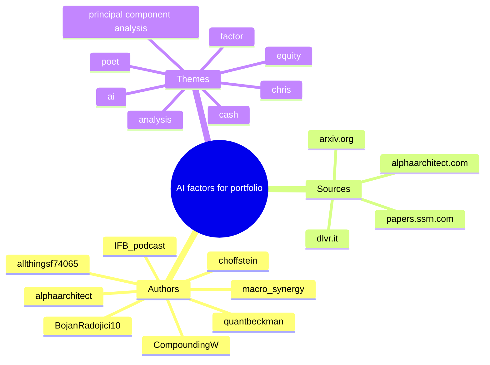

# Synthesis report — AI factors for portfolio

## Mindmap

## The Role of AI in Portfolio Management

AI technologies are increasingly helping investors identify and optimize portfolio factors, improving decision-making processes. (see: [tweet:2023667079086223871](https://x.com/macro_synergy/status/2023667079086223871))

Quantitative analysis and AI are pivotal in understanding systematic and latent risk factors, which can affect overall portfolio performance. (see: [tweet:1933498442128527368](https://x.com/quantscience_/status/1933498442128527368))

## Quantitative Risk Factors

The application of principal component analysis in portfolios aids in deciphering complex risk relationships and enhances factor identification. (see: [tweet:2041905406994207212](https://x.com/iblanco_finance/status/2041905406994207212))

Latent asset risk factors detected through AI can provide new insights into portfolio adjustments and risk management. (see: [tweet:2026360980054126983](https://x.com/PtrPomorski/status/2026360980054126983))

## Key Trends in Factor Investing

Factor investing is evolving with AI, enabling more robust and diversified portfolio constructions. (see: [tweet:2042614992214651329](https://x.com/alphaarchitect/status/2042614992214651329))

The blend of machine learning techniques with traditional factor models is becoming a standard approach in modern portfolio management. (see: [tweet:2043581702052688237](https://x.com/macro_synergy/status/2043581702052688237))

## Top entities
- BojanRadojici10
- quantbeckman
- macro_synergy
- alphaarchitect
- choffstein
- CompoundingW
- IFB_podcast
- alphaarchitect.com
- arxiv.org
- medium.com
- cash
- equity
- ai
- analysis
- factor
- principal component analysis

## Clusters

### Cluster: AI factors for portfolio
- keyword:AI factors (no matching hit)
- keyword:portfolio management (no matching hit)
- keyword:quantitative analysis (no matching hit)
- keyword:systematic risk (no matching hit)
- keyword:latent asset risk (no matching hit)

### Cluster: Quantitative Risk
- keyword:principal component analysis (no matching hit)
- keyword:risk factors (no matching hit)

### Cluster: Factor Investing Trends
- keyword:factor investing (no matching hit)
- keyword:machine learning (no matching hit)
